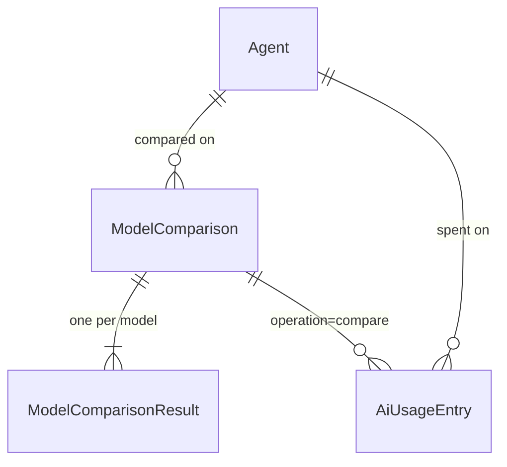

# Comparar modelos num agente

> Plan this with **tlc-plan** (`.claude/skills/tlc-plan`).
> Decisions below carry the literal shape - copy them, do not re-derive them.

## Situation

- Project: in active construction — agentes entregues (PR #2, #4), verificação 31/44; W1 e W2 só plano.
- Decision: committed by Luis Soares, 2026-09-22, nesta discovery (veredito confirmado).
- In flight: `.specs/features/observabilidade-agente/plan.md` (W1) — S1 absorvido aqui; `.specs/features/conversas-agente/plan.md` (W2) — passa para depois; agentes finding 13 (endpoints sem teste HTTP) — fechar junto com B1, mesma área.
- At stake: costly — duas tabelas novas + coluna em `AiAgents` (migrations) e mudança de `LlmRequest`/`LlmResponse`, contrato que os 3 `ILlmService` e os testes implementam.

## Problem

Construção. A paridade Foundry prometia agentes configuráveis; hoje o modelo é um só, global
(`Ai:Llm:Model`, `AgentContracts.cs:62`), temperatura fixa 0.2 (`AiContracts.cs:8`), e nada mede
custo (`NoOpAiUsageTracker`, `AiModule.cs:26`; só `total_tokens` lido, `OpenRouterLlmService.cs:47`).
O admin do tenant não tem como saber qual modelo serve um agente nem quanto custa: a alternativa hoje
é trocar a config global à mão, reiniciar e comparar de cabeça, sem números de custo. Sem modelo por
agente, qualquer comparação não tem onde ser aplicada. Porquê agora e não depois de W2: W1 S1 já ia
mexer em `LlmResponse` e na tabela de usage; fazer o comparador depois obrigaria a reabrir o mesmo
contrato duas vezes, e W8 (evaluations) precisa de um registo de runs × modelos que isto cria.

Validação vs Foundry (estado actual):

| Foundry | Aqui |
|---|---|
| Agentes (instruções + tools) | ✅ CRUD, 4 tools, allowlist, tenant |
| Modelo/parâmetros por agente | ❌ → B1 |
| Catálogo de modelos | ❌ → B2 |
| Playground / compare | ❌ → B3/B4 |
| Uso e custo | ❌ (no-op) → B2 |
| Knowledge / file search | ⚠️ texto ≤100k via tool, sem RAG — fora |
| Threads | ❌ W2 — depois |
| Tracing GenAI | ❌ W1 S2 — depois |
| Evaluations | ❌ W8 — depois, reutiliza `ModelComparison` |

## Evidence

- OpenRouter devolve `usage.prompt_tokens`, `usage.completion_tokens` e `usage.cost` (USD) em todo response, automático — invalida a premissa de W1 "nenhum provider devolve preço".
- `GET https://openrouter.ai/api/v1/models` devolve `pricing.prompt`/`pricing.completion` (USD/token), `context_length`, `architecture.input_modalities`, `supported_parameters` — catálogo sem tabela própria.
- Provider MicrosoftAgentFramework (OpenAI directo) não devolve custo — fora do comparador (decisão).
- Volume de uso real: não medido (tracker no-op). Não é finding sobre tamanho; é B2 que passa a medir.
- `docs/paridade-foundry.md` e `docs/plano-agentes.md`, citados como fonte pelos 3 planos, não existem no repo.

## Journey

Admin abre `/ai/compare` → escolhe agente (pré-preenche o modelo actual do agente) → escreve prompt,
anexa até 3 ficheiros de texto → escolhe 2–4 modelos do catálogo → Executar → vê colunas por modelo
(resposta, tokens in/out, custo USD, latência, iterações, erro) → "Aplicar ao agente" num deles.

Estados:
- Sem histórico → lista vazia `Nenhuma comparação ainda`.
- < 2 modelos seleccionados → Executar desactivado.
- Um modelo falha / 429 / timeout 60s → coluna mostra erro; os outros seguem; run gravado.
- Todos falham → run gravado, `200`, todas as colunas em erro (não `500`).
- Utilizador sai a meio → run corre até ao fim e fica no histórico (não usa `RequestAborted`).
- Reexecutar → abre run antigo, "Executar de novo" pré-preenche o formulário; novo run.
- Sem `ai.agent.manage` → vê histórico, sem botão Executar/Aplicar (POST `403`).
- Flag `EnableAI` off → `404` e item de nav escondido (`AiAvailability`).
- Provider ≠ OpenRouter (e não stub) → `409` `Comparação requer o provider OpenRouter`.
- Agente inactivo/inexistente → `404`.
- Catálogo OpenRouter indisponível → `GET /models` `503`; ecrã mostra `Tentar de novo`.
- Aplicar modelo que saiu do catálogo → `400` em `PUT /agents/{id}`.
- Custo ausente num response → coluna mostra `—`, nunca `0`.

## Verdict

build — sem comparador, escolher modelo é trocar config global às cegas e o dinheiro já corre sem
medição; o custo é 4 blocos num módulo que já existe, reutilizando `AgentLoop`. Confirmed by Luis Soares, 2026-09-22.

Cheaper paths considered: OpenRouter Chatroom (compara modelos lado a lado) — descartado: não corre
o nosso agente com tools e dados do tenant, e o admin do tenant não tem conta OpenRouter.
Só comparação sem W5 — descartado: resolve metade, resultado não tem onde ser aplicado.

## Success

- Worked if: admin compara ≥2 modelos num agente real, vê custo USD por modelo vindo de `usage.cost`, e aplica um — em produção até ao fim do próximo ciclo.
- Early signal: primeiros runs com `Cost` não-nulo em todas as colunas OpenRouter; se `Cost` vier nulo, o parsing ou o provider está errado.
- Review: após 20 runs reais — Luis Soares olha a tabela `AiModelComparisons` (modelos mais testados, % falhas).
- Estrutural: W8 começa usando `ModelComparison` sem migration nova.

## Boundary

In: modelo por agente, catálogo de modelos (OpenRouter), tokens in/out + custo por chamada e ledger de usage (W1 S1), runs de comparação persistidos, ecrãs compare + histórico.
Out: multimodal (imagem/PDF nativo) — muda `LlmMessage`, só modelos com visão; PDF→texto no servidor — pacote novo, fica em Open; teto de custo por run — estimar output é impreciso; streaming; temperatura/parâmetros editáveis — comparação justa usa o mesmo 0.2; W2 conversas; W1 S2/S3 (spans, ecrã de uso); W8 evaluations; provider MAF no comparador.

## Prior art

- Foundry playground / OpenRouter Chatroom / promptfoo — forma que repete: matriz prompt × modelos, célula = resposta + tokens + custo + latência, run guardado. Tomamos a célula tal e qual.
- Falha reportada: comparar com parâmetros diferentes torna o resultado inútil → temperatura fixa e igual para todos (já 0.2).
- Falha reportada: 429 de um provider mata o run inteiro → falha por coluna, não por run.
- Foundry evaluations (datasets, juízes) argumentam por jobs async — condição deles (lotes de centenas de linhas) não temos; 1 prompt × ≤4 modelos cabe num request.
- Foundry: não re-lido nesta sessão (de memória); OpenRouter: docs lidas (Sources).

## Shape

Aposta: comparação síncrona — um `POST` corre o `AgentLoop` em paralelo, um scope DI filho por
modelo, espera todos (timeout 60s cada), grava run + resultados e devolve. Mudar para async depois
custa um endpoint novo + worker, mas o modelo de dados (`ModelComparison` + resultados) não muda.

### Adds

- `Features/Ai/ModelComparison.cs` — agregado `ModelComparison` (TenantId, AgentId, Prompt, Attachments JSON, CreatedByUserId, CreatedAt) + owned `ModelComparisonResult` (Model, Status, Reply, InputTokens, OutputTokens, Cost, LatencyMs, IterationsUsed, ErrorCode) + `IModelComparisonRepository` + EF config (`AiModelComparisons`, `AiModelComparisonResults`).
- `Features/Ai/AiUsageEntry.cs` — ledger append-only (W1 S1 door 1) + coluna `Cost`.
- `Features/Ai/ModelCatalog.cs` — `IModelCatalog` + `OpenRouterModelCatalog` (IMemoryCache 1h) + `StubModelCatalog`.
- Slices: `ListModels.cs`, `CompareModels.cs`, `ListModelComparisons.cs`, `GetModelComparison.cs`.
- Rotas: `GET /api/v1/ai/models`, `POST /api/v1/ai/comparisons`, `GET /api/v1/ai/comparisons`, `GET /api/v1/ai/comparisons/{comparisonId}`.
- Migration em `src/Api/Shared/Migrations`: `AiAgents.Model`, `AiUsageEntries`, `AiModelComparisons`, `AiModelComparisonResults`.
- Front: `src/web/src/app/features/ai/compare.ts` (`/ai/compare`, `/ai/compare/:comparisonId`), `comparisons-list.ts` (`/ai/comparisons`), nav `Comparar` (`data-testid="nav-ai-compare"`).
- Testes: `tests/Api.Tests/Ai/CompareModelsTests.cs`, `ListModelsTests.cs`, `AiUsageTests.cs`; `compare.spec.ts`, `comparisons-list.spec.ts`.

### Changes

- `LlmRequest` → `+ string? Model = null`; providers usam `request.Model ?? options.Model`.
- `LlmResponse` → `+ int InputTokens = 0, int OutputTokens = 0, decimal? Cost = null` (W1 door 3 + Cost).
- `OpenRouterUsage` → lê `prompt_tokens`, `completion_tokens`, `cost`.
- `MicrosoftAgentFrameworkLlmService` → preenche in/out, `Cost = null`.
- `StubLlmService` → ecoa o modelo, `Cost = 0m`.
- `AgentLoop.RunAsync` → `+ string? model`; `AgentResult` → `+ InputTokens, OutputTokens, Cost` (soma; `Cost` nulo se alguma chamada nulo).
- `Agent` → `+ string? Model` (≤200); `Create`/`Update` aceitam; `CreateAgent`/`UpdateAgent` validam contra `IModelCatalog`.
- `ChatAiHandler` → usa `agent.Model ?? options.Model`; tracker grava `AiUsageEntry`.
- `AiUsageRecord` → `+ Guid AgentId, int InputTokens, int OutputTokens, decimal? Cost`.
- `AiModule` → `AddScoped<IAiUsageTracker, AiUsageTracker>` (sai `NoOpAiUsageTracker`), registos do catálogo e repo.
- `agent-form.ts` → selector de modelo (catálogo); `ai.contracts.ts` → tipos novos.
- `features.json`, `src/Api/openapi.json` (regenerar), `Features/Ai/AGENTS.md`, `docs/security/RBAC_MATRIX.md`.
- `.specs/features/observabilidade-agente/plan.md` → S1 absorvido, exclusão de custo removida.

### Leaves

- `ChatAi` contrato HTTP (`reply`, `iterationsUsed`) inalterado; `history` no cliente (W2).
- W1 S2 spans, S3 `/ai/usage`; W2; W8; multimodal; PDF; streaming; MAF no comparador.

Heavier alternative: run assíncrono (`202` + `comparisonId`, worker, polling/SSE por coluna) — ganha
quando um run passa do timeout HTTP ou quando há lotes (datasets W8). Hoje: 1 prompt × ≤4 modelos em
paralelo, teto 60s. Não sobrevive a: >4 modelos, datasets, streaming — é aí que o rewrite entra
(endpoint + worker; tabelas ficam).

Also in the field: integrar Foundry Agent Service directamente — removido pela RFC Q1 (agentes em Postgres, sem cliente Foundry).

## Roadmap

| Block | Delivers | Clarity |
|---|---|---|
| B1 Modelo por agente | `Agent.Model`, `LlmRequest.Model`, chat usa modelo do agente, selector no form, + testes HTTP do finding 13 | clear |
| B2 Catálogo + uso/custo | `GET /ai/models`, `LlmResponse` in/out/cost, `AiUsageEntry` gravado por chat | clear |
| B3 Comparação API | `POST/GET /ai/comparisons`, execução paralela por scope, persistência | clear |
| B4 Ecrãs compare + histórico | `/ai/compare`, `/ai/comparisons`, aplicar ao agente | clear — padrão actual (Material, `agents-list`/`agent-form`), decidido 2026-09-22 |

## Decisions

| Decision | Choice | Why this | Alternative, and what would make it win | Reversibility |
|---|---|---|---|---|
| Modelo por agente | `Agent.Model string?` (max 200), nulo → `Ai:Llm:Model` | seeds e agentes existentes continuam sem migração de dados | coluna obrigatória — se todos os agentes tivessem de fixar modelo | costly (migration) |
| Override no contrato LLM | `LlmRequest(..., string? Model = null)`; OpenRouter usa `request.Model ?? options.Model`; MAF ignora `request.Model` (cliente preso a `llm.Model` na construção, `MicrosoftAgentFrameworkLlmService.cs:30`) e o catálogo MAF só oferece `Ai:Llm:Model` | `ILlmService` é singleton; um cliente por modelo não é necessário | `ILlmServiceFactory.Create(model)` — se providers precisassem de clientes distintos por modelo | reversible |
| Uso e custo no LLM | `LlmResponse(string Text, int TotalTokens, IReadOnlyList<ToolCall>? ToolCalls = null, int InputTokens = 0, int OutputTokens = 0, decimal? Cost = null)` | OpenRouter devolve `usage.cost`; nulo ≠ zero | tabela de preços em config — se MAF entrasse no comparador | costly |
| Ledger | W1 door 1 tal e qual + `Cost decimal(18,8) null`; `Operation` ∈ {`chat`, `compare`}; `AgentId` sem FK | reutiliza desenho já revisto | — | one-way |
| Catálogo | `GET /api/v1/ai/models` → `[{ id, name, contextLength, inputPricePerToken, outputPricePerToken }]`, só modelos com `"tools"` em `supported_parameters`; cache 1h; `Ai:Llm:AllowedModels` opcional filtra; `503` via nova `ServiceUnavailableException` (Kernel → `ExceptionHandlerExtensions`) se OpenRouter falhar; provider MAF → catálogo = `Ai:Llm:Model` ∪ `AllowedModels`, sem preços; policy `AiAgentsRead` | agente usa tools; modelo sem tools falharia no loop | catálogo em config só — se OpenRouter bloquear `/models` | reversible |
| Agregado | `ModelComparison` + owned `ModelComparisonResult`; tabelas `AiModelComparisons`, `AiModelComparisonResults`; FK `AgentId` restrict; query filter tenant | repo por agregado (AGENTS.md); agentes são soft-delete | results como agregado próprio — se W8 precisar de actualizar células isoladas | one-way |
| Status do resultado | `Succeeded` \| `Failed` \| `TimedOut` | falha por coluna | — | costly |
| Endpoint de execução | `POST /api/v1/ai/comparisons` body `{ agentId, prompt, models: string[], attachments: [{ name, content }] }` → `201` `ComparisonOutput`; policy `AiAgentsManage`; flag `EnableAI` | gastar dinheiro = manage | `202` async — ver Shape | costly |
| Limites | `models` 2–4 distintos, no catálogo; `prompt` ≤4000; `attachments` ≤3, total ≤100 000 chars, nome ≤200 | igual a chat e `AgentFile` | teto de custo — se houver abuso medido | reversible |
| Anexos | injectados no user prompt como blocos `--- {name} ---\n{content}` iguais para todos os modelos; guardados no run | comparação justa; sem mudar `LlmMessage` | multimodal — fora | reversible |
| Paralelismo | `Task.WhenAll`, um `IServiceScopeFactory.CreateScope()` por modelo; `TenantContext.SetTenant` copiado (padrão `DevBootstrapSeeder.cs:20-24`); `IAgentRuntimeContext.Set(agentId)` no scope; timeout 60s por modelo via `CancelAfter`; **não** usa `RequestAborted` | `AppDbContext` não aceita concorrência; user via `IHttpContextAccessor` já atravessa scopes | sequencial — se 429 do OpenRouter virar regra | reversible |
| Provider | comparação só com provider `OpenRouter` ou stub; senão `409` `Comparação requer o provider OpenRouter` | único com custo real | tabela de preços para MAF | reversible |
| Leitura | `GET /api/v1/ai/comparisons` (paginado, `createdAt` desc) e `GET /{comparisonId}`; policy `AiAgentsRead`; visível a todo o tenant | ferramenta de admin, como agentes | só do autor — se prompts tiverem dados sensíveis por utilizador | reversible |
| Aplicar | sem endpoint novo: front chama `PUT /api/v1/ai/agents/{agentId}` com `model`. `PUT` é substituição total (`UpdateAgent.cs:37`): `model` ausente/nulo = default, logo `agent-form.ts` tem de enviar `model` no mesmo deploy | reutiliza `UpdateAgent` | `POST /comparisons/{id}/apply` — se precisar de auditoria da origem | reversible |

## Open

1. PDF → texto — default: fora deste round; front aceita `.txt .md .csv .json` lidos no browser.
2. Retenção de comparações (contêm prompt e respostas) — default: sem purge, como o ledger; rever com W2 Q1 (90 dias).
3. Tools com efeito colateral correm N vezes — default: tools actuais são só leitura; gotcha em `Features/Ai/AGENTS.md`.
4. Ordem de colunas — default: ordem de selecção.

## Sources

- https://openrouter.ai/docs/use-cases/usage-accounting — `usage.cost` automático, `prompt_tokens`/`completion_tokens`.
- https://openrouter.ai/docs/api/api-reference/models/get-models — `pricing.prompt`/`completion`, `supported_parameters`.
- `src/Api/Features/Ai/AiContracts.cs:5-63`, `AgentLoop.cs:10-61`, `ChatAi.cs:31-79`, `OpenRouterLlmService.cs:22-123`, `Agent.cs:9-152`, `AiModule.cs:12-58` — estado actual.
- `src/Api/Shared/Platform.cs:16-32`, `Host/Seeders/DevBootstrapSeeder.cs:20-24`, `Shared/CurrentUserAccessor.cs:13-15` — tenant em scope filho.
- `.specs/features/observabilidade-agente/plan.md` — doors 1, 3, 6 reutilizadas.
