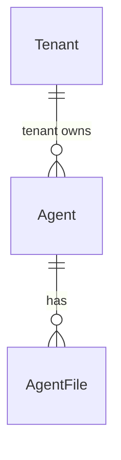

# Agentes — plano (CRUD + chat + LLM real + ficheiros)

tlc-spec-lean · profile **ui** · budget 150k · um plano, não um catálogo de classes.

Grounding: `origin/main` `56fe7e3` (pós-[#1](https://github.com/luiszkm/Feature.template/pull/1)). Checkout local pode estar em `7c5824f` — não tratar o working tree pré-#1 como autoridade.

## Sources

- [levantamento-agentes.md](levantamento-agentes.md) — problema, boundary, journey, slices Tenants, **não construir**; RFCs Q1–Q5 congelados por luiszkm em 2026-09-15
- conversa — as cinco respostas literais (não re-derivar)
- `origin/main` `src/Api/Features/Ai/*` — `ILlmService`, `StubLlmService`, `AgentLoop`, `ChatAi`, tools
- `src/Api/Features/Tenants/{Create,List,Get,Update,Deactivate}Tenant.cs` — o CRUD a espelhar
- `docs/security/RBAC_MATRIX.md` · `PermissionCatalog` · `SecurityPolicies` em `Api.Shared`
- `src/Api/Shared/Infrastructure.cs` — `AppDbContext` único (I5 fica)
- **binding for the interface:** ecrãs `tenants-list`, `tenant-form`, `chat`, `list-state`, `confirm`; copy e arranjo vêm daí, não de um ficheiro de design. O levantamento marcou lista/form/picker como “Needs design”; este plano congela o análogo Tenants + o chat que já existe.

## Decisions (copiadas — não reabrir)

Do levantamento, já fechadas pelo repo + pedido:

| Decision | Choice |
| --- | --- |
| Módulo | Fica em `Features/Ai` |
| Forma do CRUD | Espelho Tenants: Create / List / Get / Update / Deactivate |
| Tools | Allowlist de nomes sobre `ITool` já registados em DI. Tools novas continuam código |
| Runtime | `AgentLoop` in-process. O template continua a ser o host |
| Flag | CRUD, chat e ficheiros atrás de `EnableAI` |
| Tenant | `Agent` (e ficheiros) filtrados pelo tenant do contexto |
| Chat sem `agentId` | Default seed do tenant |
| Soft-delete do agente | `DeactivateAgent` + `IsActive`, como Tenant |
| Correr o chat | Policy `Authenticated`; manage é que aperta |
| Rota | `/api/v1/ai/agents` (não `/api/v1/agents`) |
| I5 | Uma `AppDbContext`; migration em `src/Api/Shared/Migrations/` |
| #1 / Docker | Não reabrir desacoplamento nem B1 |

Congeladas por luiszkm (overrides marcados):

| RFC | Choice |
| --- | --- |
| Q1 | Definição no Postgres do template. **Não** cliente Foundry |
| Q2 | Sem versões imutáveis. `Update` muta a linha |
| Q3 | Admin do tenant cria na UI. **Há CRUD** |
| Q4 | LLM **real** neste round (override do stub) |
| Q5 | Knowledge / ficheiros **no v1** (override de fora) — outro agregado, não vector store |

## Problem

Só existe um agente, e a definição vive em `AgentSystemPrompt.Text` + `AiModule` (`AddScoped<ITool, …>`). Quem gera um produto daqui edita C#, faz redeploy, ou sai para o portal Foundry. Dois agentes distintos no mesmo tenant, sem commit, são impossíveis. O chat (`POST /api/v1/ai/chat`) não escolhe agente: o loop usa o prompt fixo e **todas** as tools do `ToolRegistry`.

Evidência do levantamento (literal): 1 slice Ai, 0 agregado EF, 2 tools compile-time, flag `EnableAI` default `false`, policy `Authenticated`, history no cliente, `IAiUsageTracker` = no-op, LLM = `StubLlmService`. Número de agentes distintos em runtime: **não medido**.

Quando isto shipped: um admin do tenant cria um segundo agente na UI; o chat corre-o por `agentId`; o loop fala com um LLM real quando a chave existe; o agente pode ler ficheiros de texto do próprio tenant — sem clonar a Foundry.

**Cut:** um plano / um conjunto de obrigações (default tlc-plan + um ficheiro pedido). É grande: migration + várias portas + UI. Costuras visíveis, não uma divisão imposta: (1) CRUD `Agent` + seed, (2) `ChatAi` com `agentId`, (3) UI lista/form/picker, (4) `ILlmService` real — bloqueado pelo provider, (5) agregado de ficheiros. (1) não pode ir a produção sem a tabela; (5) precisa de (1); (4) espera a chave.

## Out of scope

| Excluded | Why |
| --- | --- |
| Cliente da Foundry Agents API | Q1 congelado: Postgres |
| Versões imutáveis, draft/release, `version_selector`, split de tráfego | Q2 congelado |
| Hosted agents (zip, container, identity Entra, autoscaling) | já somos o runtime in-process |
| Vector stores, file search Foundry, Bing, Azure AI Search, code interpreter | Q5 é ficheiros locais, não a plataforma Azure |
| Toolbox MCP versionado; tools coladas pelo utilizador (OpenAPI, código, MCP remoto) | catálogo continua a ser `ITool` em C# |
| Threads/runs persistidos | history fica no browser |
| Publish Teams / M365 / Agent Registry; evaluations; tracing tipo App Insights | Foundry, não o próximo slice |
| Workflow agents | Foundry retira em 2026-12-01; levantamento recusou copiar |
| Espelhar REST Foundry 1:1 (`x-ms-agent-name`, multipart zip, agent card A2A) | clone recusado |
| Campo `model` no agregado `Agent` | catálogo de modelos Foundry ficou fora; o modelo vive na config do `ILlmService` |
| SDK Azure fingido (`AzureOpenAI*` que devolve texto encanado) | Q4 pede LLM real, não teatro |
| Blob / S3 / Azure Storage / containers hospedados para ficheiros | Q5 é agregado na mesma BD |
| Reabrir #1, Docker/B1, segundo `DbContext` | I5 fica; B1 fora |
| Streaming token-a-token | `ChatAi` já devolve a resposta completa; o plano web-frontend também deixou isto fora |

## Assumptions

| Assumption | Chosen default | Rationale | Confirmed? |
| --- | --- | --- | --- |
| Provider LLM | Switch em config: `Ai:Llm:Provider` = `MicrosoftAgentFramework` **ou** `OpenRouter` (default `OpenRouter`). Chave `Ai:Llm:ApiKey` / env `AI_LLM_API_KEY`. Modelo `Ai:Llm:Model`. `Ai:Llm:BaseUrl`: OpenRouter default `https://openrouter.ai/api/v1`; Agent Framework = endpoint OpenAI-compatível do `IChatClient`. Pacote `Microsoft.Agents.AI` (+ `Microsoft.Extensions.AI.OpenAI` como backing do `IChatClient`). **Não** HTTP-genérico único, **não** Azure.AI.OpenAI SDK-only, **não** stub com nome Azure | luiszkm 2026-09-15 (última pergunta LLM) | y |
| Testes / `Testing` / `EnableAI=false` | Continuam no `StubLlmService` | Os handler tests de hoje asserem a resposta do stub; Production é que falha sem chave | n |
| Conteúdo dos ficheiros | Texto (nome + corpo) na mesma Postgres; DELETE remove a linha | Não há `IFormFile`, blob, nem embeddings. Binário/PDF/OCR seria outra plataforma | n |
| Como o loop usa ficheiros | `ITool` em código (`list_agent_files`, `read_agent_file`); o agente só as vê se estiverem na allowlist | Tools novas continuam código; stuffing de todos os ficheiros no prompt rebenta o limite de 4000 do chat | n |
| Permissões de ficheiros | As mesmas `ai.agent.read` / `ai.agent.manage` | Ficheiros são parte do recurso agente, não um módulo novo | n |
| Nome do agente | Único por tenant; `DisplayName` máx. 200 (como `Tenant.DisplayName`); `Instructions` máx. 4000 (como `ChatAi.Message`) | Único CRUD de recurso no repo; não copiar o name≤63 da Foundry | n |
| Último agente activo | `Deactivate` do último activo no tenant → `409` `BusinessRuleException` | Chat sem `agentId` precisa do seed; catálogo vazio parte o chat | n |
| Troca de agente a meio do chat | A `history` no cliente fica; o próximo POST leva o `agentId` novo e o histórico antigo | O levantamento deixou isto em design; o chat já persiste history só no browser | n |
| Seed | Um agente default por tenant, instruções = `AgentSystemPrompt.Text`, allowlist = as duas tools actuais; corre no bootstrap e em `CreateTenant` | Journey: catálogo vazio parte o chat | n |
| Ordenação da lista | Default API `createdAt` desc, estável por `Id`; cabeçalhos só campos que `ApplySort` aceitar | AD-006 | y (project decision) |
| Copy da UI | pt-PT, análogo Tenants / chat existente (tabela abaixo nas ACs) | profile ui; sem ficheiro de design | n |

**Open questions:** nenhuma. A pergunta 1 (protocolo do LLM real) ficou congelada por luiszkm: switch `Ai:Llm:Provider` entre **Microsoft Agent Framework** e **OpenRouter**. Não HTTP-genérico-only. Não Azure SDK-only. Sem secrets no git.

Não perguntar Q1–Q5 outra vez. Não perguntar onde viver o schema (I5) nem se há CRUD (Q3).

## Q4 — LLM real (o que o repo prova)

Interface já existente, em `AiContracts.cs`:

`ILlmService.CompleteAsync(LlmRequest) → LlmResponse`

`LlmRequest` já leva `UserPrompt`, `SystemPrompt`, `Temperature`, `History`, `Tools`. `AgentLoop` já depende só desta interface.

Hoje: `AiModule` faz `AddSingleton<ILlmService, StubLlmService>`. O stub devolve texto encanado ou tool calls simuladas (`get_users_summary` / `get_tenant_info`). `ChatAiHandler` grava usage com `Provider: "stub"`, `Model: "stub"` — hardcoded, não lê config.

O comentário do stub fala em `Ai:LlmProvider`. **Essa chave não existe**: não está em `appsettings.json`, `appsettings.Development.json`, `compose.env.example`, nem no fail-fast. `csproj` não referencia Azure.AI, OpenAI, SemanticKernel nem `Microsoft.Extensions.AI`. `docs/guides/getting-started.md` diz só «Azure OpenAI opcional».

O que este round faz:

- Duas implementações reais de `ILlmService`, escolhidas por `Ai:Llm:Provider`:
  1. `MicrosoftAgentFramework` — `Microsoft.Agents.AI` (`ChatClientAgent` / `IChatClient`); backing OpenAI-compatível via `Microsoft.Extensions.AI.OpenAI`. Completions devolvem tool calls ao `AgentLoop` (declarações, sem `FunctionInvokingChatClient` a executar tools).
  2. `OpenRouter` — `POST {BaseUrl}/chat/completions` (default `https://openrouter.ai/api/v1`), Authorization Bearer, tools no formato OpenAI.
- Fail-fast no arranque, no mesmo espírito de `Jwt:Secret`: se `EnableAI=true` fora de Testing/Development-sem-chave, e a API key está vazia, `InvalidOperationException` cujo message contém `Ai:Llm:ApiKey`. Placeholder em `compose.env.example`; valor em `compose.env` (gitignored) + user-secrets; **não** commitar o valor.
- `IAiUsageTracker` passa a receber o `Provider` e `Model` da config, não o literal `"stub"`.
- Testes InMemory / environment `Testing` **e** Development sem chave ficam no `StubLlmService` (os testes actuais dependem da frase do stub).
- **Não** criar uma classe `AzureOpenAI*` que ainda devolve canned text. Isso não cumpre Q4.

Chaves: `Ai:Llm:Provider`, `Ai:Llm:ApiKey` (`AI_LLM_API_KEY`), `Ai:Llm:Model`, `Ai:Llm:BaseUrl`.

## Q5 — Ficheiros (o que isto é, e o que não é)

É outro agregado no módulo Ai, filho de `Agent`, filtrado por tenant: um agente tem N ficheiros de texto. Persistidos na **mesma** `AppDbContext` (I5). Listar / criar / ler / apagar por HTTP. O loop não faz RAG: uma tool em C# lê o corpo quando o modelo a chama.

Não é: vector store Foundry, file search alojado, hosted containers, toolbox MCP, embeddings, chunking, citation cards, upload multipart zip.

## Criteria

### S1: Segundo agente no tenant, sem alterar C# (P1)

**Acceptance Criteria**

1. WHEN um utilizador com `ai.agent.manage` envia `POST /api/v1/ai/agents` com `name`, `instructions` e `toolNames` que existem no `ToolRegistry` THEN the system SHALL persistir um `Agent` no Postgres do tenant corrente e responder `201` com `agentId`, `name`, `instructions`, `toolNames`, `isActive: true`.
2. WHEN `GET /api/v1/ai/agents` corre com a policy `AiAgentsRead` THEN the system SHALL devolver a página (`pageNumber` default `1`, `pageSize` default `20`) só de agentes do tenant corrente, ordenada por `createdAt` desc e `Id` na ausência de `sortBy`.
3. IF `POST /api/v1/ai/agents` repetir um `name` já usado no mesmo tenant THEN the system SHALL responder `409` com ProblemDetails title `Business rule violation` e não criar segunda linha.
4. WHEN `PUT /api/v1/ai/agents/{agentId}` corre THEN the system SHALL mutar a mesma linha (`name`, `instructions`, `toolNames`) e responder `200` — sem criar recurso de versão.
5. WHEN `DELETE /api/v1/ai/agents/{agentId}` corre sobre um agente que não é o último activo do tenant THEN the system SHALL responder `204` e `GET` do mesmo id SHALL devolver `isActive: false`.
6. IF o `{agentId}` não existir neste tenant THEN `GET`/`PUT`/`DELETE` SHALL responder `404` com title `Not found`.
7. IF `toolNames` contiver um nome que o `ToolRegistry` não conhece THEN the system SHALL responder `400` com title `Validation failed`.
8. WHERE `FeatureFlags:EnableAI` é `false` the system SHALL responder `404` com title `Feature disabled` em todos os verbos `/api/v1/ai/agents`.
9. IF o caller está autenticado mas sem `ai.agent.read` THEN `GET` SHALL responder `403`; IF sem `ai.agent.manage` THEN `POST`/`PUT`/`DELETE` SHALL responder `403`.
10. WHEN o tenant `dev` (e um tenant criado via `CreateTenant`) arranca THEN the system SHALL ter exactamente um agente default activo cujas `instructions` são o texto actual de `AgentSystemPrompt.Text` e cujas tools são `get_users_summary` e `get_tenant_info`.
11. IF `DELETE` visar o último agente activo do tenant THEN the system SHALL responder `409` e deixar a linha activa.

**Independent test:** `Api.Tests/Ai/CreateAgentTests` cria um segundo agente no tenant de teste; `ListAgents` devolve dois; nenhum ficheiro C# de tool/prompt foi editado para o segundo existir.

### S2: Chat corre o agente pedido (P1)

**Acceptance Criteria**

12. WHEN `POST /api/v1/ai/chat` leva `agentId` de um agente activo do tenant THEN `AgentLoop` SHALL usar as `instructions` e só as tools da allowlist desse agente — não o prompt constante e não o `ToolRegistry` completo.
13. WHEN o body omite `agentId` THEN the system SHALL correr o agente default do tenant (o seed) e responder `200` com `reply` e `iterationsUsed`.
14. IF `agentId` é desconhecido neste tenant OU `isActive` é `false` THEN the system SHALL responder `404` com title `Not found` e SHALL NOT cair no default em silêncio.
15. IF o modelo pedir uma tool fora da allowlist do agente THEN `ToolRegistry` SHALL não a executar (resposta de tool `{"error":"…"}` ou equivalente já usado hoje para nome desconhecido) e o loop SHALL continuar.
16. The system SHALL manter `POST /api/v1/ai/chat` na policy `Authenticated` (não `AiAgentsManage`).
17. WHERE `EnableAI` é `false` the system SHALL responder `404` title `Feature disabled` no chat, igual ao CRUD.
18. The system SHALL continuar a aceitar `history` no body e a não persistir threads no servidor.

**Independent test:** criar agente A só com `get_tenant_info`; `POST /ai/chat` com esse `agentId` e mensagem que no stub dispara users — a tool `get_users_summary` não corre.

### S3: Admin configura na UI; utilizador escolhe no chat (P1)

Ecrãs (profile ui). Arranjo: igual a Tenants — header com h1 + acção primária à direita; `mat-form-field` Pesquisar; `app-list-state`; tabela `mat-table` + `mat-sort` + `mat-paginator`. Chat: o `mat-card` actual ganha um picker **acima** do histórico, à largura do card.

**Acceptance Criteria**

19. WHEN `/ai/agents` abre com `ai.agent.read` e `totalCount` é `0` THEN the system SHALL mostrar o estado vazio com a copy exacta `Nenhum agente` e a acção `Criar agente` a apontar a `/ai/agents/new`.
20. WHILE a lista de agentes está `loading` the system SHALL mostrar `mat-progress-bar` (`data-testid="list-loading"`) e manter o paginator desactivado.
21. IF a lista devolver `500` THEN the system SHALL mostrar o `title` do ProblemDetails e o botão `Tentar de novo`.
22. WHEN o utilizador confirma Desativar no diálogo (`title` `Desativar agente`, `confirmLabel` `Desativar`) THEN the system SHALL chamar `DELETE /api/v1/ai/agents/{agentId}` e marcar a linha `isActive: false`; IF cancelar THEN zero HTTP.
23. WHEN `/ai/agents/new` submete com nome e instruções THEN the system SHALL `POST /api/v1/ai/agents` e, com `201`, navegar para `/ai/agents`.
24. IF `POST`/`PUT` devolver `400` `ValidationProblemDetails` THEN the system SHALL mostrar cada `errors[campo]` fora de `<mat-error>`, como o tenant-form.
25. IF o utilizador abre `/ai/agents` sem `ai.agent.read` THEN the system SHALL renderizar o ecrã `forbidden` com `Sem permissão para esta operação`.
26. WHERE `AiAvailability` aprendeu que a flag está off (404 `Feature disabled`) the system SHALL ocultar os links de nav `AI` e `Agentes`, como hoje oculta `AI`.
27. WHEN `/ai` está disponível THEN the system SHALL mostrar um picker de agentes activos (label `Agente`) e o `POST /api/v1/ai/chat` SHALL incluir o `agentId` seleccionado; o default do picker é o agente seed.
28. WHILE o chat não tem mensagens the system SHALL manter a copy `Faça uma pergunta`; WHILE `pending` the system SHALL manter `A escrever…`.
29. The system SHALL expor clientes planos em `src/web/src/app/features/ai/` (`agents-list.ts`, `agent-form.ts`, `chat.ts` passa a mandar `agentId`) — zero pastas de camada.

**Independent test:** Vitest MSW no `agents-list` (vazio, loading, desactivar com confirm) + `chat` a enviar `agentId`; `architecture.spec.ts` verde para as rotas novas de `features.json`.

### S4: Chat deixa de ser stub em runtime configurado (P1)

**Acceptance Criteria**

30. WHERE `Ai:Llm:ApiKey` está preenchido, o ambiente não é `Testing`, e `Ai:Llm:Provider` é `MicrosoftAgentFramework` ou `OpenRouter` the system SHALL resolver `ILlmService` para essa implementação — `CompleteAsync` SHALL emitir um pedido HTTP ao `BaseUrl` do provider (OpenRouter: `{BaseUrl}/chat/completions`; Agent Framework: o endpoint do `IChatClient`), não o ramo encanado de `StubLlmService`.
31. WHERE o ambiente é `Testing` OU a chave está vazia em Development the system SHALL continuar a registar `StubLlmService`.
32. IF `EnableAI=true` em Production e a API key está vazia THEN o host SHALL falhar no arranque com `InvalidOperationException` cujo message contém o nome da chave (espelho de `Jwt:Secret`).
33. WHEN o chat corre no provider real THEN `IAiUsageTracker.TrackAsync` SHALL gravar o `Provider` e `Model` da config, não os literais `stub`/`stub`.
34. IF o HTTP do LLM falhar THEN the system SHALL deixar o exception handler existente responder `500` title `Unexpected error` (sem inventar circuit breaker).

**Independent test:** teste de DI/fail-fast (como `FailFastConfigurationTests` para JWT) + um teste do cliente HTTP com handler fake que assere o POST ao BaseUrl; os `ChatAiHandlerTests` actuais continuam verdes no stub.

### S5: Ficheiros de conhecimento por agente (P1)

**Acceptance Criteria**

35. WHEN um manage faz `POST /api/v1/ai/agents/{agentId}/files` com `name` e `content` (texto) THEN the system SHALL persistir um `AgentFile` ligado a esse agente e ao tenant corrente e responder `201` com `fileId`, `name`.
36. WHEN `GET /api/v1/ai/agents/{agentId}/files` corre THEN the system SHALL listar só os ficheiros daquele agente no tenant corrente.
37. IF `{agentId}` não for do tenant THEN ficheiros SHALL responder `404`, não vazar outro tenant.
38. WHEN `DELETE /api/v1/ai/agents/{agentId}/files/{fileId}` corre THEN the system SHALL remover a linha e um `GET` posterior SHALL responder `404`.
39. WHERE o agente tem `list_agent_files` e `read_agent_file` na allowlist e o LLM pede `read_agent_file` THEN the tool SHALL devolver o `content` persistido desse `fileId` e só desse agente.
40. The system SHALL NOT criar vector store, embedding, container hospedado, nem endpoint MCP para estes ficheiros.

**Independent test:** criar agente + ficheiro no `Api.Tests`; o repositório devolve o corpo; um agente de outro tenant não o vê.

## Traceability

| ID | Slice | Criteria | Status |
| --- | --- | --- | --- |
| AGENT-01 | S1 | 1–11 | Implemented |
| AGENT-02 | S2 | 12–18 | Implemented |
| AGENT-03 | S3 | 19–29 | Implemented |
| AGENT-04 | S4 | 30–34 | Implemented |
| AGENT-05 | S5 | 35–40 | Implemented |

## Observable

| Surface | Decision | Landing |
| --- | --- | --- |
| screen `agents-list` | empty state | AC 19 |
| screen `agents-list` | loading | AC 20 |
| screen `agents-list` | error | AC 21 |
| screen `agents-list` | unauthorised | AC 25 |
| screen `agents-list` | density and ordering | existing - tabela Tenants + AD-006 (`createdAt` desc) |
| screen `agents-list` | destructive confirm | AC 22 |
| screen `agent-form` | empty / create | AC 23 |
| screen `agent-form` | loading | existing - o tenant-form carrega o GET e mostra o form; o mesmo padrão |
| screen `agent-form` | error validation | AC 24 |
| screen `agent-form` | unauthorised | AC 25 (guard `ai.agent.manage` no `/new`; `ai.agent.read` no `/:id`) |
| screen `agent-form` | destructive confirm | n/a - desactivar vive na lista, como Tenants |
| screen `chat` | empty | AC 28 |
| screen `chat` | loading | AC 28 (`A escrever…`) |
| screen `chat` | error | existing - `chat.ts` já mostra `problem.detail` em `data-testid="chat-error"` |
| screen `chat` | unauthorised | existing - interceptor `403` → ecrã `forbidden` |
| screen `chat` | picker / default | AC 27 |
| screen `chat` | flag off | AC 26 + existing `O chat AI não está ativo neste ambiente` |
| API `POST /api/v1/ai/agents` | error shape and codes | AC 3, 7, 8, 9 — `400`/`403`/`404`/`409` via exception handler / feature gate / policy |
| API `POST /api/v1/ai/agents` | who may call | AC 9 |
| API `POST /api/v1/ai/agents` | versioning | n/a - Q2 recusou versões; o contrato é `/api/v1` como o resto |
| API `POST /api/v1/ai/agents` | rate limit | n/a - só login/refresh/register/logout têm `RequireRateLimiting` hoje |
| API `GET /api/v1/ai/agents` | error shape and codes | AC 8, 9 |
| API `GET /api/v1/ai/agents` | who may call | AC 9 |
| API `GET /api/v1/ai/agents` | versioning | n/a - igual ao POST, contrato `/api/v1` |
| API `GET /api/v1/ai/agents` | rate limit | n/a - sem limiter nesta rota, como ListTenants |
| API `GET /api/v1/ai/agents/{agentId}` | error shape and codes | AC 6, 8 |
| API `GET /api/v1/ai/agents/{agentId}` | who may call | AC 9 |
| API `GET /api/v1/ai/agents/{agentId}` | versioning | n/a - contrato `/api/v1` |
| API `GET /api/v1/ai/agents/{agentId}` | rate limit | n/a - sem limiter, como GetTenant |
| API `PUT /api/v1/ai/agents/{agentId}` | error shape and codes | AC 4, 6, 7 |
| API `PUT /api/v1/ai/agents/{agentId}` | who may call | AC 9 |
| API `PUT /api/v1/ai/agents/{agentId}` | versioning | n/a - Q2, mutação da linha |
| API `PUT /api/v1/ai/agents/{agentId}` | rate limit | n/a - sem limiter, como UpdateTenant |
| API `DELETE /api/v1/ai/agents/{agentId}` | error shape and codes | AC 5, 6, 11 |
| API `DELETE /api/v1/ai/agents/{agentId}` | who may call | AC 9 |
| API `DELETE /api/v1/ai/agents/{agentId}` | versioning | n/a - soft-delete, não versão |
| API `DELETE /api/v1/ai/agents/{agentId}` | rate limit | n/a - sem limiter, como DeactivateTenant |
| API `POST /api/v1/ai/chat` | error shape and codes | AC 14, 17, 34 |
| API `POST /api/v1/ai/chat` | who may call | AC 16 |
| API `POST /api/v1/ai/chat` | versioning | n/a - mesmo `/api/v1/ai/chat`; `agentId` é campo novo, não versão de API |
| API `POST /api/v1/ai/chat` | rate limit | n/a - ChatAi hoje não tem limiter |
| API `POST /api/v1/ai/agents/{agentId}/files` | error shape and codes | AC 35, 37 |
| API `POST /api/v1/ai/agents/{agentId}/files` | who may call | AC 9 (manage) |
| API `POST /api/v1/ai/agents/{agentId}/files` | versioning | n/a - contrato `/api/v1` |
| API `POST /api/v1/ai/agents/{agentId}/files` | rate limit | n/a - sem limiter novo |
| API `GET /api/v1/ai/agents/{agentId}/files` | error shape and codes | AC 36, 37 |
| API `GET /api/v1/ai/agents/{agentId}/files` | who may call | AC 9 (read) |
| API `GET /api/v1/ai/agents/{agentId}/files` | versioning | n/a - contrato `/api/v1` |
| API `GET /api/v1/ai/agents/{agentId}/files` | rate limit | n/a - sem limiter |
| API `GET …/files/{fileId}` | error shape and codes | AC 37, 38 |
| API `GET …/files/{fileId}` | who may call | AC 9 (read) |
| API `GET …/files/{fileId}` | versioning | n/a - contrato `/api/v1` |
| API `GET …/files/{fileId}` | rate limit | n/a - sem limiter |
| API `DELETE …/files/{fileId}` | error shape and codes | AC 38 |
| API `DELETE …/files/{fileId}` | who may call | AC 9 (manage) |
| API `DELETE …/files/{fileId}` | versioning | n/a - hard delete da linha |
| API `DELETE …/files/{fileId}` | rate limit | n/a - sem limiter |
| collection agentes | grouping / naming / ordering / duplicates | AC 2, 3 — tenant, `name` único, `createdAt` desc |
| collection ficheiros | grouping / naming / ordering / duplicates | AC 36 — por `agentId`; duplicado de `name` no mesmo agente: último write não especificado, assume-se nomes livres (reversível no diff) |
| command / scheduled task | n/a | n/a - nenhum comando novo |
| document / copy | structure and next action | AC 19–28 — copy literal nos ecrãs; RBAC_MATRIX e `Features/Ai/AGENTS.md` actualizam-se no mesmo PR (existing review rule da matriz) |

## Swept

Landings para `checks.md` (ainda não escrito). Dimensão → sítio, sem emprestar critério de outra dimensão.

- validation: AC 7 (toolNames), AC 24 (400 no form); bounds de `name`/`instructions` nas Assumptions
- failure and partial failure: AC 34 (LLM HTTP → 500); `IUnitOfWork.SaveChangesAsync` como Tenants — nada persistido se o handler rebenta antes do save
- idempotency, retry, duplicates: AC 3 (nome único → 409). Retry de `Create` com o mesmo nome não cria segunda linha por causa do índice único (door 3). Chat e Update não são idempotentes — igual a Tenants
- authorization and rate limits: AC 9, 16; rate limit `n/a` — não há limiter nestas rotas hoje, não se inventa um
- concurrency and ordering: last-write-wins no `Update`, como `UpdateTenant` (sem ETag). Dois `Create` paralelos com o mesmo `name`: o índice único (door 3) faz um deles falhar na BD
- data lifecycle: AC 5, 10, 11 (soft-delete + seed + último activo); AC 38 (DELETE do ficheiro remove a linha). Sem TTL
- external-dependency failure: AC 34. Sem fallback silencioso para o stub em Production quando a chave existe
- state transitions: activo → inactivo via `Deactivate` (AC 5); inactivo não volta a ser default do chat (AC 14). Sem reactivar neste round — `UpdateTenant` também não reactiva
- observability: AC 33 (usage provider/model). Logs `LogInformation`/`LogError` do `ChatAiHandler` já existem. Sem métrica nova de p95

## Flow

Reusa o módulo `Ai` (exists): `AgentLoop`, `ToolRegistry`, `ILlmService`, flag `EnableAI`, exception handler, `ListState`/`ConfirmService` no front. Não se duplica o loop nem se abre um host Foundry.

1. Pedido HTTP entra -> `Host`/`Shared` (exists) - JWT, tenant (`X-Tenant`), `RequireFeature(EnableAI)`, policy
2. CRUD -> `Ai` (exists) - handlers VSA persistem `Agent` (door 1) via `AppDbContext` (exists, I5)
3. Ficheiros -> `Ai` (exists) - persistem `AgentFile` (door 4) pendurados no `Agent`
4. `POST /ai/chat` -> `Ai` (exists) - resolve `agentId` ou default; filtra `ToolRegistry` pela allowlist; `AgentLoop.RunAsync` com as instruções do agregado
5. `AgentLoop` -> `ILlmService` (exists; door 5 troca o stub por Microsoft Agent Framework **ou** OpenRouter conforme `Ai:Llm:Provider`)
6. Tools em código (exists) + tools de ficheiro (door 4) -> contratos Shared `IUserDirectory` / `ITenantDirectory` (exists, #1) — Features ↛ Features
7. out: JSON `201`/`200`/`204` e clientes Angular em `features/ai/` (exists; ficheiros planos novos no mesmo sítio)

## Relations

One-way constraints: `Agent` pertence a um tenant (door 1); `name` único por tenant (door 3); no máximo um default por tenant (seed, AC 10); `AgentFile` não existe sem `Agent` (door 4); `Update` não cria versão (door 2). Sem colunas nesta secção.

## Surface

| Route | In | Out | Status |
| --- | --- | --- | --- |
| `POST /api/v1/ai/agents` | `name`, `instructions`, `toolNames` | `agentId` · `name` · `instructions` · `toolNames` · `isActive` | `201`, `400`, `401`, `403`, `404`, `409` |
| `GET /api/v1/ai/agents` | `pageNumber`, `pageSize`, `searchTerm`, `sortBy`, `sortDirection` | página de agentes | `200`, `401`, `403`, `404` |
| `GET /api/v1/ai/agents/{agentId}` | `agentId` | um agente | `200`, `401`, `403`, `404` |
| `PUT /api/v1/ai/agents/{agentId}` | `name`, `instructions`, `toolNames` | agente actualizado | `200`, `400`, `401`, `403`, `404`, `409` |
| `DELETE /api/v1/ai/agents/{agentId}` | `agentId` | vazio | `204`, `401`, `403`, `404`, `409` |
| `POST /api/v1/ai/chat` | `message`, `history`, `agentId` (opcional) | `reply` · `iterationsUsed` | `200`, `401`, `404`, `500` |
| `POST /api/v1/ai/agents/{agentId}/files` | `name`, `content` | `fileId` · `name` | `201`, `400`, `401`, `403`, `404` |
| `GET /api/v1/ai/agents/{agentId}/files` | `agentId` | lista de ficheiros | `200`, `401`, `403`, `404` |
| `GET /api/v1/ai/agents/{agentId}/files/{fileId}` | ids | `fileId` · `name` · `content` | `200`, `401`, `403`, `404` |
| `DELETE /api/v1/ai/agents/{agentId}/files/{fileId}` | ids | vazio | `204`, `401`, `403`, `404` |

Policies: CRUD read `AiAgentsRead` (`ai.agent.read` ou role `Admin`); CRUD write + files write `AiAgentsManage` (`ai.agent.manage` ou `Admin`); chat `Authenticated`. Flag: `EnableAI` em todas. Seed das permissões em `PermissionCatalog` + `Permissions` no front. Matriz RBAC no mesmo PR.

## Slices sugeridos

Nomes no padrão do repo. Não editar `Program.cs`. Testes `tests/Api.Tests/Ai/{Slice}Tests.cs`. Front: ficheiros planos. `features.json` + `UPDATE_OPENAPI=1 dotnet test tests/E2ETests`.

| Slice | Rota | Policy | Flag |
| --- | --- | --- | --- |
| `CreateAgent` | `POST /api/v1/ai/agents` | `AiAgentsManage` | `EnableAI` |
| `ListAgents` | `GET /api/v1/ai/agents` | `AiAgentsRead` | `EnableAI` |
| `GetAgent` | `GET /api/v1/ai/agents/{agentId}` | `AiAgentsRead` | `EnableAI` |
| `UpdateAgent` | `PUT /api/v1/ai/agents/{agentId}` | `AiAgentsManage` | `EnableAI` |
| `DeactivateAgent` | `DELETE /api/v1/ai/agents/{agentId}` | `AiAgentsManage` | `EnableAI` |
| `ChatAi` (change) | `POST /api/v1/ai/chat` | `Authenticated` | `EnableAI` |
| `CreateAgentFile` | `POST /api/v1/ai/agents/{agentId}/files` | `AiAgentsManage` | `EnableAI` |
| `ListAgentFiles` | `GET /api/v1/ai/agents/{agentId}/files` | `AiAgentsRead` | `EnableAI` |
| `GetAgentFile` | `GET /api/v1/ai/agents/{agentId}/files/{fileId}` | `AiAgentsRead` | `EnableAI` |
| `DeleteAgentFile` | `DELETE /api/v1/ai/agents/{agentId}/files/{fileId}` | `AiAgentsManage` | `EnableAI` |

Substantivos: `Agent.cs`, `AgentFile.cs` (repo + EF config em cada um). LLM real **não** é slice HTTP — é substituição de `ILlmService` em `AiModule` + fail-fast + testes. Policies novas em `AiModule.AddAiModulePolicies`; constantes em `Api.Shared.SecurityPolicies` (pós-#1). Migration única no grafo partilhado.

UI (profile ui): rotas `/ai` (chat + picker), `/ai/agents`, `/ai/agents/new`, `/ai/agents/:agentId`. Nav: `AI` (flag) + `Agentes` (`ai.agent.read`). Form de agente inclui a lista/criação de ficheiros de texto no mesmo ecrã (não um módulo à parte).

## Landing

| One-way door | Literal shape | Alternative rejected |
| --- | --- | --- |
| 1. Definição persistida cá | Agregado `Agent` + `IAgentRepository` + `IEntityTypeConfiguration` no módulo Ai; tabela no `AppDbContext` partilhado; query filter por `TenantId` como `User` | Cliente Foundry Agents API — Q1 recusou; segundo DbContext — I5 recusou |
| 2. Update mutável | `UpdateAgent` chama `agent.Update(…)` na mesma linha, como `Tenant.Update` | Versões imutáveis / `CreateAgentVersion` — Q2 recusou neste round |
| 3. Unicidade do nome | Índice único por tenant + `name` (o mecanismo que faz AC 3 e o create concorrente) | Nomes livres estilo git — dois “Suporte” no mesmo tenant partem o picker |
| 4. Knowledge local | Agregado `AgentFile` no mesmo `AppDbContext`, corpo texto, tools `list_agent_files` / `read_agent_file` em C# | Vector store / file search Foundry / MCP toolbox / blob — Q5 recusou a plataforma; stuffing no system prompt — rebenta o máx. 4000 do chat |
| 5. LLM real | Switch `Ai:Llm:Provider` = `MicrosoftAgentFramework` \| `OpenRouter` (default `OpenRouter`); `Ai:Llm:ApiKey` / `AI_LLM_API_KEY`; `Ai:Llm:Model`; `Ai:Llm:BaseUrl`; fail-fast se `EnableAI` em Production sem chave; usage deixa de hardcodar `stub`; NuGet `Microsoft.Agents.AI` justificado no PR | HTTP Chat Completions-genérico único — pergunta 1 recusou; Azure.AI.OpenAI SDK como único caminho — recusado; manter só `StubLlmService` — Q4 override; classe com nome Azure que ainda stubba — teatro |
| 6. Contrato do chat | `ChatAiRequest.agentId` opcional (`Guid?`); omitido = default do tenant; desconhecido/inactivo = `404` | Query string / header de agente — o body já leva `message`+`history`; cair no default em silêncio — a journey recusou |
| 7. RBAC do catálogo | Permissões `ai.agent.read` / `ai.agent.manage`; policies `AiAgentsRead` / `AiAgentsManage`; chat fica `Authenticated` | Tudo `Authenticated` — o levantamento recusou CRUD só com login; exigir manage para falar com o bot — Open #5 do levantamento |

- Nada mais nesta mudança é difícil de reverter. Nomes de ficheiros Angular, comprimento exacto das colunas EF, e o texto do snackbar decidem-se no diff.

## Impact

| Front | What changes |
| --- | --- |
| domain | termo novo: `Agent` — definição persistida de um prompt agent (instruções + allowlist de tools), vive em `Features/Ai`. Quem ramifica hoje: ninguém — o loop é anónimo |
| domain | termo novo: `AgentFile` — ficheiro de texto de um agente, vive em `Features/Ai` |
| domain | termo existente: “o agente” no chat deixa de ser a constante `AgentSystemPrompt` e passa a ser uma linha. Callers: `ChatAiHandler`, `AgentLoop`, `chat.ts` |
| domain | `ILlmService` deixa de significar “sempre stub em DI”. Callers: `AiModule`, `AgentLoop`, `ChatAiHandler` (usage `Provider: stub`) |
| stored data | nada a migrar — zero linhas Ai hoje. Seed cria o default. Uma migration nova em `Shared/Migrations` no mesmo `AppDbContext` (I5). Permissões novas entram no `PermissionCatalog` (dev bootstrap) |
| contract | `features.json` + `openapi.json` ganham as rotas da tabela Surface; `ChatAiRequest` ganha `agentId`. Front sem cliente → `npm test` vermelho |
| docs | `Features/Ai/AGENTS.md`, `RBAC_MATRIX.md`, gotcha do stub passa a “real quando a chave existe” |

## Não construir (ainda)

A lista do levantamento mantém-se, com os dois overrides já aplicados acima. Em concreto este plano **não** entrega: hosted, MCP, versões, clone Foundry, vector store, publish, threads no servidor, tools definidas pelo utilizador, segundo DbContext, fake Azure.

## Success (do levantamento)

Worked if: segundo agente no mesmo tenant, criado pela API/UI, visível no chat, **sem** alterar C# depois do CRUD merge. Early signal: seed + um `CreateAgent` de teste. Está a correr mal se o chat ignorar `agentId` ou se todas as tools forem para todos os agentes.
