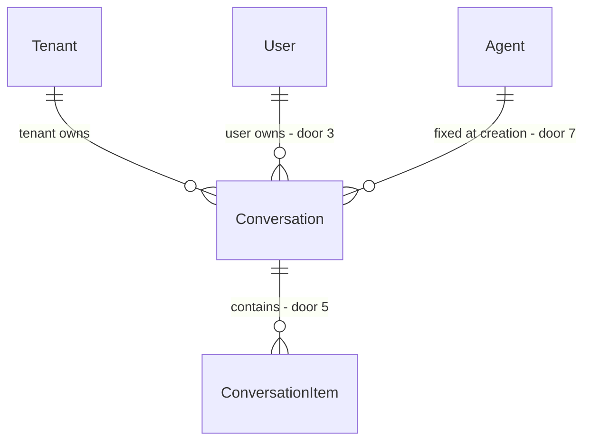

# Conversas persistidas (threads/runs)

tlc-spec-lean · profile **ui** · budget 150k · plano apenas — sem `checks.md` e sem código.

Grounding: `origin/main` `113d893` (#2, #3, #4 fundidos). **Rebase 2026-09-22** sobre `feat/comparar-modelos` `9b0db04` (depois de `comparar-modelos` e `guardrails-agente`): ver `## Rebase` no fim.

## Sources

- `docs/paridade-foundry.md` §W2 — âmbito, tabela de perturbação e o buraco de confiança do `history`. **Não re-derivar**
- `docs/plano-agentes.md` — decisões congeladas (Q1–Q5, I5, VSA, sem clone Foundry). **Não reabrir**
- `src/Api/Features/Ai/*` — `ChatAi.cs`, `AgentLoop.cs`, `Agent.cs`, `AgentFile.cs`, `AiModule.cs`, `AiContracts.cs`
- `src/Api/Shared/CurrentUserAccessor.cs` · `src/Api/Shared/Infrastructure.cs` (`AppDbContext`, `IUnitOfWork`, `ITenantQueryFilterConfigurator`)
- `src/Api/Features/Identity/IdentityAuthorization.cs` — `SelfOrPermissionRequirement`, o único precedente de "dono" no repo
- `.specs/STATE.md` — AD-003 (contrato), AD-004 (clientes à mão), AD-006 (ordenação das listas)
- **binding for the interface:** ecrãs `chat` (`src/web/src/app/features/ai/chat.ts`), `agents-list.ts`, `shared/list-state.ts`, `shared/confirm` — a copy e o arranjo dos ecrãs novos saem daí, não de um ficheiro de design

## Problem

O servidor aceita o `history` que o browser manda e passa-o ao `AgentLoop` sem o validar: `ChatAiValidator`
valida só `Message`. Qualquer caller autenticado pode fabricar turnos de `assistant` e saídas de `tool` e
injectá-los no prompt do agente do seu tenant — incluindo saídas de tools que nunca correram, que o modelo
lê como facto verificado. Não é escalada entre tenants; é o utilizador a mentir ao agente que o tenant
publicou, e o servidor a assinar a mentira.

Evidência, literal de `paridade-foundry.md`: «O servidor confia no `history` do cliente. `ChatAiValidator`
valida só `Message`; o `History` do request vai directo ao `AgentLoop`.» O mesmo documento acrescenta o que
a falta de posse custa a seguir: «Sem conversas persistidas não há dataset, não há histórico auditável, e
refrescar a página perde tudo.» Volume de tráfego de chat hoje: **não medido** — W1 é que mede.

Quem paga: quem publica um produto a partir deste template e acredita que as instruções do agente e a
allowlist de tools limitam o que o agente diz. E o utilizador que perde a conversa ao recarregar a página.

Quando isto shipped: o servidor é dono do transcript. O chat aceita `conversationId` em vez de `history`,
devolve o `conversationId` da conversa criada, guarda cada turno (`user`, `assistant`, `tool`) por ordem,
e cada utilizador vê e apaga só as suas conversas. Recarregar a página retoma onde ficou. A retenção é
configurável e apagar apaga mesmo.

**Cut:** um plano para o workstream inteiro. Costuras visíveis: (S1) o servidor passa a ser dono,
(S2) ler e apagar as minhas conversas, (S3) UI, (S4) retenção e limites. S1 não pode ir a produção sem
as tabelas; S3 não compila contra um contrato que S1 não mudou; S4 é o que torna o template distribuível.

## Out of scope

| Excluded | Why |
| --- | --- |
| Leitura de conversas de outros utilizadores por Admin / auditor | Dimensão nova de privacidade: um `manage` de catálogo não deve passar a ler conteúdo privado por omissão. Question 2 abaixo; default é não |
| Retenção por tenant (override) | Exige um store de definições por tenant que o template não tem. Fica a global de config |
| Chave de idempotência (`clientMessageId`) e deduplicação de POST | Nada no template é idempotente hoje (`Create*` repetido cria outra linha) e o front não faz retry automático de um POST que chegou ao handler |
| Renomear, arquivar, fixar ou partilhar conversas | Nada disto fecha o buraco de confiança; é produto, não posse |
| Exportar conversas / datasets / evaluations | W8, e depende de W1 |
| Sumarização ou memória de conversas longas | Exige embeddings e um segundo modelo — `paridade-foundry.md` pôs Memory em "nunca" |
| Persistir `AiUsageRecord` com `conversationId` | W1. Aqui o `conversationId` entra no log estruturado, não numa tabela de usage |
| Streaming token-a-token | Continua fora, como em `plano-agentes.md` |
| Rate limit / quota no chat | W7. Nenhuma rota Ai tem limiter hoje e não se inventa um a meio de outro workstream |
| Cosmos, BYO thread storage, conversation items fora da `AppDbContext` | I5: uma `AppDbContext`. `paridade-foundry.md` chama a Cosmos "detalhe de implementação deles" |
| `/api/v2/ai/chat` a coexistir com a v1 | Door 2: uma rota, uma semântica. Ver alternativa rejeitada |

## Assumptions

| Assumption | Chosen default | Rationale | Confirmed? |
| --- | --- | --- | --- |
| Como quebrar o contrato do chat | `history` continua a existir no corpo aceite, mas passa a ser **rejeitado** com `400` que nomeia o campo; `conversationId` entra, opcional; a resposta passa a devolver `conversationId` | Um `400` que nomeia o campo é a forma de a mudança quebrante ser lida por quem gerou um produto do template. Ignorar em silêncio fecharia o buraco e deixaria o cliente a acreditar que ainda conduz o contexto | n |
| Conversa nova | `conversationId` omitido = o servidor cria a conversa e devolve o id na resposta | Sem isto, a primeira mensagem exigia dois round-trips e uma rota `POST /conversations` que mais ninguém usa | n |
| Quem é o dono | `TenantId` **e** `UserId` do JWT, fixados na criação; sem transferência de posse | É a dimensão nova que `paridade-foundry.md` nomeia. `ai.agent.read` é permissão de catálogo e é tenant-wide | n |
| Como se nega o acesso | `404 Not found`, igual ao id inexistente — nunca `403` | Um `403` confirma que a conversa existe e de quem é. O repo já usa `404` para "não é deste tenant" |  n |
| Onde vive a regra de posse | No `IConversationRepository`: toda a query leva `TenantId` (query filter) **e** `UserId == ICurrentUserAccessor.UserId` | Uma policy decide por route values; o dono não está na rota. Ver door 3 | n |
| O que é persistido | Os três roles — `user`, `assistant` (incluindo os turnos com tool calls) e `tool` — pela ordem em que o loop os produziu | O loop já os constrói em memória; é este transcript que torna auditoria e dataset possíveis. Guardar só o par pergunta/resposta deixaria de fora exactamente o que hoje é forjável | n |
| O que é reenviado ao modelo | Só os últimos `HistoryWindow` (20) itens `user` e `assistant`, do mais antigo ao mais recente; os itens `tool` ficam guardados e não são reenviados | Uma janela que corta entre um `assistant` com tool calls e o `tool` que lhe responde produz um pedido que os providers OpenAI-compatíveis recusam. Reenviar só texto não tem esse emparelhamento | n |
| Tamanho do conteúdo `tool` | Guardado inteiro, sem truncar | Um transcript truncado deixa de ser o registo que a auditoria e o dataset precisam. O crescimento controla-se com `MaxItems` e retenção, não com cortes silenciosos | n |
| Limite por conversa | `MaxItems` = 200 itens; chegar ao limite responde `409` e pede conversa nova | É a maior tabela do template. Um limite explícito é preferível a uma conversa que cresce até ao limite do contexto do modelo | n |
| Retenção | **No âmbito**, configurável: `Ai:Conversations:RetentionDays` default `90`, `0` desliga; purge a cada `PurgeIntervalHours` (24) | Question 2 de `paridade-foundry.md`: este repositório é template distribuído, logo conteúdo de utilizador persistido vira obrigação legal de quem o publica, herdada de nós. Um default documentado e ligado é a única forma de a herança não ser uma surpresa | n |
| Apagar | Hard delete da conversa e dos itens em cascata | Soft-delete numa tabela de conteúdo de utilizador é a resposta errada a um pedido de apagamento — e deixava a maior tabela a crescer para sempre | n |
| Agente da conversa | Fixado na criação; um POST com outro `agentId` responde `409` | Trocar a meio misturaria dois system prompts no mesmo transcript e atribuiria turnos a um agente que não os produziu. Fecha a pergunta que `plano-agentes.md` tinha deixado em aberto | n |
| Ordenação da lista | Default da API `lastActivityAt` desc, estável por `Id`; cabeçalhos só `title` e `lastActivityAt` | AD-006 diz que a lista usa o default da API e só oferece o que o `ApplySort` aceita. Uma lista de conversas por `createdAt` enterra aquela que se acabou de usar | n |
| Prova da door 4 (unicidade de `sequence`) | O índice único fica; a prova InMemory é da tradução do erro em `409`, não da BD | `Api.Tests` e `E2ETests` correm InMemory (`Database:UseInMemory=true`), que não aplica índices únicos. É o mesmo tipo de buraco que `paridade-foundry.md` assinala em W4 — declarado, não escondido | n |
| Rotas do front | `/ai` (conversa nova), `/ai/conversations` (lista), `/ai/conversations/:conversationId` (conversa aberta) | Espelha `users/:userId/edit` a montar o mesmo componente com um id. Mantém `/ai` como está para quem tem o link | n |
| Copy da UI | pt-PT, análoga a `agents-list` e ao `chat` actual (literal nas ACs de S3) | profile ui, sem ficheiro de design | n |
| Mensagem num POST falhado (rebase) | Sai da lista e volta ao campo de entrada (AC 30) — substitui o "mantém no histórico" de `guardrails-agente` AC 24 | O servidor não gravou nada; mostrá-la no histórico seria mentira, e ao recarregar desapareceria | y |
| Conteúdo gravado nos itens `tool` (rebase) | Exactamente o que o `AgentLoop` entregou ao modelo: delimitado em `<tool_output>`, truncado, e já substituído quando o guard bloqueou | A auditoria reproduz o prompt tal como foi; conteúdo bloqueado nunca chega à base | y |
| Itens `assistant` só com tool calls na janela (rebase) | Ficam gravados (AC 10) mas a janela de histórico salta os `assistant` de conteúdo vazio | Sem os `tool` que lhes respondem, um `assistant` vazio é um turno sem nada; os providers OpenAI-compatíveis rejeitam `assistant` sem conteúdo nem tool calls | n |
| Mensagem bloqueada, quota ou rate limit (rebase) | Nada é persistido — nem conversa nova nem item — tal como na AC 9 | São recusas antes de o turno existir; um item `user` órfão seria reenviado ao modelo no turno seguinte | n |

**Open questions**

| # | Kind | Question | Until answered |
| --- | --- | --- | --- |
| 1 | blocks go-live | Que retenção por omissão assume o produto que sair deste template, e quem a aprova? O default de 90 dias é uma escolha nossa, não uma decisão legal de ninguém | Ship com `RetentionDays: 90` documentado em `getting-started.md`; quem publicar tem de a rever antes de servir utilizadores reais |
| 2 | open | Um admin do tenant (ou um auditor) pode ler as conversas dos outros? | Fica em `Out of scope`: o filtro de dono não abre excepção para `Admin` (AC 22). Abrir isto depois é acrescentar uma policy e uma rota, não mexer no schema |

## Criteria

### S1: O servidor passa a ser dono do histórico (P1)

**Acceptance Criteria**

1. WHEN um caller autenticado envia `POST /api/v1/ai/chat` sem `conversationId` THEN the system SHALL criar uma `Conversation` do tenant corrente e do `userId` do JWT e responder `200` com `conversationId`, `reply` e `iterationsUsed`.
2. WHEN esse turno termina sem erro THEN the system SHALL persistir a conversa e todos os itens do turno num único `SaveChangesAsync`.
3. WHEN o body leva um `conversationId` do próprio caller THEN the system SHALL acrescentar os itens novos a seguir ao maior `sequence` existente e responder `200` com o mesmo `conversationId`.
4. WHEN um turno corre sobre uma conversa com itens THEN the system SHALL construir o histórico entregue ao `AgentLoop` a partir dos itens persistidos — os últimos `Ai:Conversations:HistoryWindow` (default `20`) itens de role `user` e `assistant`, do mais antigo para o mais recente — e SHALL não usar nenhum conteúdo do corpo do pedido como turno anterior.
5. IF o body de `POST /api/v1/ai/chat` trouxer o campo `history` THEN the system SHALL responder `400` com title `Validation failed` e a chave `history` em `errors`, sem chamar o `ILlmService` e sem persistir qualquer item.
6. IF o `conversationId` não existir no tenant corrente OU pertencer a outro utilizador THEN the system SHALL responder `404` com title `Not found` e o mesmo corpo nos dois casos.
7. IF o `agentId` do pedido for diferente do agente fixado na conversa THEN the system SHALL responder `409` com title `Business rule violation` e não acrescentar itens.
8. IF o agente fixado na conversa estiver `isActive: false` THEN the system SHALL responder `404` com title `Not found` e não correr o loop.
9. IF o `AgentLoop` lançar THEN the system SHALL deixar a contagem de itens da conversa igual à de antes do pedido — e não criar conversa nenhuma quando o `conversationId` vinha omitido — e deixar o handler de excepções responder `500` com title `Unexpected error`.
10. WHEN o loop executa tools THEN the system SHALL persistir os turnos `assistant` que trazem tool calls e os turnos `tool` que lhes respondem, pela ordem em que o loop os produziu, com `sequence` a crescer de um em um.
11. WHEN um item é acrescentado THEN the system SHALL actualizar `lastActivityAt` da conversa para o instante desse append.
12. WHEN a conversa é criada THEN the system SHALL derivar o `title` dos primeiros 80 caracteres da primeira mensagem do utilizador, terminados em `…` quando a mensagem é maior.
13. IF a conversa já tiver `Ai:Conversations:MaxItems` (default `200`) itens THEN the system SHALL responder `409` com title `Business rule violation`, sem chamar o `ILlmService`.
14. IF dois pedidos concorrentes calcularem o mesmo `sequence` na mesma conversa THEN the system SHALL falhar o segundo write com `409` title `Business rule violation` e não sobrescrever o item já gravado.
15. WHERE `FeatureFlags:EnableAI` é `false` the system SHALL responder `404` com title `Feature disabled` em `POST /api/v1/ai/chat` e em todas as rotas `/api/v1/ai/conversations`.
16. WHEN um pedido de chat termina, com sucesso ou com erro, THEN the system SHALL escrever uma linha de log que nomeia `tenantId`, `agentId` e `conversationId`.
42. IF o `IContentGuard` bloquear a mensagem (`400`, chave `Message`) ou a quota diária responder `429` THEN the system SHALL não criar conversa nem acrescentar item nenhum. *(rebase)*
43. WHEN o loop executa uma tool THEN the system SHALL gravar no item `tool` o conteúdo exacto entregue ao LLM — começa por `<tool_output>\n` e termina em `\n</tool_output>`. *(rebase)*
44. WHEN a janela de histórico é construída THEN the system SHALL excluir os itens `assistant` cujo `content` é vazio. *(rebase)*

**Independent test:** `POST /ai/chat` sem `conversationId`, depois um segundo POST com o id devolvido; o repositório mostra quatro itens pela ordem do loop, e um terceiro POST com `history` no corpo responde `400` sem tocar no `ILlmService`.

### S2: Cada utilizador vê e apaga só as suas conversas (P1)

**Acceptance Criteria**

17. WHEN `GET /api/v1/ai/conversations` corre THEN the system SHALL devolver a página (`pageNumber` default `1`, `pageSize` default `20`) só das conversas do tenant corrente cujo dono é o caller, ordenada por `lastActivityAt` desc e `Id` na ausência de `sortBy`.
18. WHEN `GET /api/v1/ai/conversations/{conversationId}` corre sobre uma conversa do caller THEN the system SHALL devolver os itens de role `user` e `assistant` por `sequence` crescente.
19. WHERE `includeToolItems=true` the system SHALL incluir também os itens de role `tool`, com o `content` tal como foi gravado.
20. IF a conversa for de outro utilizador do mesmo tenant THEN `GET` e `DELETE` SHALL responder `404` com title `Not found`, e nunca `403`.
21. WHEN `DELETE /api/v1/ai/conversations/{conversationId}` corre sobre uma conversa do caller THEN the system SHALL apagar a linha e todos os seus itens e responder `204`, e um `GET` seguinte do mesmo id SHALL responder `404`.
22. The system SHALL filtrar toda a leitura e escrita de conversas por `TenantId` e por `UserId`, sem excepção para o role `Admin`.
23. The system SHALL manter `POST /api/v1/ai/chat` e as três rotas de conversas na policy `Authenticated`, sem exigir `ai.agent.read` nem `ai.agent.manage`.
24. IF o caller não estiver autenticado THEN as rotas de conversas SHALL responder `401`.

**Independent test:** dois utilizadores no mesmo tenant; cada um cria uma conversa; o `GET` de cada um devolve uma linha, e o `GET` e o `DELETE` do id do outro respondem `404`.

### S3: O chat retoma do servidor e existe um ecrã de conversas (P1)

Ecrãs (profile ui). Arranjo de `conversations-list`: igual a `agents-list` — `header` com `h1` + acção
primária à direita, `mat-form-field` Pesquisar, `app-list-state`, `mat-table` + `mat-sort` +
`mat-paginator`. Arranjo do `chat`: o `mat-card` actual mantém-se; o picker `Agente` e o botão
`Nova conversa` passam a partilhar a linha acima do histórico, picker à esquerda e botão à direita.

**Acceptance Criteria**

25. WHEN `/ai` abre sem `conversationId` na rota THEN the system SHALL mostrar a copy `Faça uma pergunta`, o picker `Agente` activo e o botão `Nova conversa` desactivado.
26. WHEN `/ai/conversations/{conversationId}` abre THEN the system SHALL carregar os itens por `GET /api/v1/ai/conversations/{conversationId}`, mostrar `mat-progress-bar` (`data-testid="chat-loading"`) enquanto o pedido corre, e renderizar só os turnos `user` e `assistant`.
27. IF esse `GET` responder `404` THEN the system SHALL mostrar a copy `Conversa não encontrada` e continuar numa conversa nova, sem `conversationId`.
28. WHEN a resposta do primeiro `POST /api/v1/ai/chat` de uma conversa nova chega THEN the system SHALL guardar o `conversationId` devolvido e navegar para `/ai/conversations/{conversationId}` sem recarregar o histórico já em ecrã.
29. WHILE a conversa aberta tem pelo menos um item the system SHALL manter o picker `Agente` desactivado, e `Nova conversa` SHALL levar a `/ai` com o picker outra vez activo.
30. IF `POST /api/v1/ai/chat` falhar THEN the system SHALL remover da lista o turno optimista do utilizador, mostrar `problem.detail` em `data-testid="chat-error"` e repor a mensagem no campo de entrada.
31. WHEN `/ai/conversations` abre e `totalCount` é `0` THEN the system SHALL mostrar o estado vazio com a copy `Nenhuma conversa` e a acção `Nova conversa` a apontar para `/ai`.
32. WHILE a lista de conversas está `loading` the system SHALL mostrar `mat-progress-bar` (`data-testid="list-loading"`) e manter o paginator desactivado.
33. IF a lista devolver `500` THEN the system SHALL mostrar o `title` do ProblemDetails e o botão `Tentar de novo`.
34. WHEN o utilizador confirma o diálogo `Apagar conversa` (mensagem `Apagar {título}? Esta ação não pode ser anulada.`, `confirmLabel` `Apagar`) THEN the system SHALL chamar `DELETE /api/v1/ai/conversations/{conversationId}` e remover a linha da tabela; IF o utilizador cancelar THEN the system SHALL não emitir nenhum pedido HTTP.
35. WHERE `AiAvailability` aprendeu que a flag está off the system SHALL ocultar os links de navegação `AI`, `Agentes` e `Conversas`.
36. The system SHALL manter os clientes em ficheiros planos — `src/web/src/app/features/ai/conversations-list.ts` novo e `chat.ts` alterado — sem pastas de camada, e `chat.ts` SHALL deixar de enviar `history` e de guardar o histórico só em memória.

**Independent test:** Vitest + MSW: `conversations-list` vazio, a carregar, em erro e a apagar com confirm; `chat` a abrir `/ai/conversations/:id`, a receber os itens do servidor e a enviar `{ message, conversationId, agentId }` sem `history`.

### S4: Retenção e apagamento configuráveis (P2)

**Acceptance Criteria**

37. WHERE `Ai:Conversations:RetentionDays` é maior que `0` the system SHALL apagar, em cada passagem do purge, as conversas cujo `lastActivityAt` é anterior a `now - RetentionDays`, e com elas todos os seus itens.
38. WHERE `Ai:Conversations:RetentionDays` é `0` the system SHALL não apagar nenhuma conversa por idade.
39. WHEN o purge corre THEN the system SHALL percorrer as conversas de todos os tenants ignorando os query filters e escrever uma linha de log com o número de conversas apagadas.
40. IF uma passagem do purge lançar THEN the system SHALL registar o erro e manter o host a arrancar e as passagens seguintes agendadas, no intervalo `Ai:Conversations:PurgeIntervalHours` (default `24`).
41. The system SHALL trazer o bloco `Ai:Conversations` em `appsettings.json` com `HistoryWindow: 20`, `MaxItems: 200`, `RetentionDays: 90` e `PurgeIntervalHours: 24`.

**Independent test:** semear duas conversas, uma com `lastActivityAt` de há 100 dias e outra de hoje, invocar o purge com `RetentionDays: 90` e ver a antiga e os seus itens desaparecerem; repetir com `RetentionDays: 0` e ver as duas sobreviverem.

## Traceability

| ID | Slice | Criteria | Status |
| --- | --- | --- | --- |
| CONV-01 | S1 | 1–16, 42–44 | Pending |
| CONV-02 | S2 | 17–24 | Pending |
| CONV-03 | S3 | 25–36 | Pending |
| CONV-04 | S4 | 37–41 | Pending |

**ID format:** `CATEGORY-NUMBER`. **Status:** Pending → In checks → Implementing → Verified.

## Observable

| Surface | Decision | Landing |
| --- | --- | --- |
| screen `chat` | empty state | AC 25 |
| screen `chat` | loading | AC 26 (histórico) e existing - `A escrever…` em `data-testid="chat-typing"` durante o POST |
| screen `chat` | error | AC 30; AC 27 para a conversa que já não existe |
| screen `chat` | unauthorised | existing - o interceptor renova no `401` e manda para `forbidden` no `403`; a conversa de outro dono é `404`, tratado na AC 27 |
| screen `chat` | density and ordering | AC 26 - itens por `sequence` crescente, o mais recente em baixo, como o `chat` já renderiza |
| screen `chat` | destructive action confirms | n/a - o ecrã de conversa não apaga nada; apagar vive na lista, como Desativar vive em `agents-list` |
| screen `conversations-list` | empty state | AC 31 |
| screen `conversations-list` | loading | AC 32 |
| screen `conversations-list` | error | AC 33 |
| screen `conversations-list` | unauthorised | n/a - a rota não tem `permissionGuard`; sem sessão o `authGuard` manda para `/login` e `403` não é possível (AC 20 devolve `404`) |
| screen `conversations-list` | density and ordering | AC 17 - `lastActivityAt` desc por omissão; colunas `Título`, `Atualizada`, acções |
| screen `conversations-list` | destructive action confirms | AC 34 |
| API `POST /api/v1/ai/chat` | response shape | AC 1 - `conversationId` · `reply` · `iterationsUsed` |
| API `POST /api/v1/ai/chat` | error shape and codes | AC 5, 6, 7, 8, 9, 13, 14, 15 |
| API `POST /api/v1/ai/chat` | who may call | AC 23 - `Authenticated`; a posse é por linha (AC 22) |
| API `POST /api/v1/ai/chat` | versioning | AC 5 - a rota fica em `/api/v1` e a quebra é explícita com `400`; ver door 2 |
| API `POST /api/v1/ai/chat` | rate limit | existing - policy `ai` por tenant e quota diária (`guardrails-agente` C18, C21); AC 42 garante que um `429` da quota não persiste nada *(rebase)* |
| API `GET /api/v1/ai/conversations` | response shape | AC 17 - página de `conversationId` · `title` · `agentId` · `lastActivityAt` · `itemCount` |
| API `GET /api/v1/ai/conversations` | error shape and codes | AC 15, 24 |
| API `GET /api/v1/ai/conversations` | who may call | AC 22, 23 |
| API `GET /api/v1/ai/conversations` | versioning | n/a - rota nova, nasce em `/api/v1` como o resto |
| API `GET /api/v1/ai/conversations` | rate limit | n/a - sem limiter, como `ListAgents` |
| API `GET /api/v1/ai/conversations/{conversationId}` | response shape | AC 18, 19 |
| API `GET /api/v1/ai/conversations/{conversationId}` | error shape and codes | AC 15, 20, 24 |
| API `GET /api/v1/ai/conversations/{conversationId}` | who may call | AC 20, 22 |
| API `GET /api/v1/ai/conversations/{conversationId}` | versioning | n/a - rota nova em `/api/v1` |
| API `GET /api/v1/ai/conversations/{conversationId}` | rate limit | n/a - sem limiter, como `GetAgent` |
| API `DELETE /api/v1/ai/conversations/{conversationId}` | response shape | AC 21 - `204` sem corpo |
| API `DELETE /api/v1/ai/conversations/{conversationId}` | error shape and codes | AC 15, 20, 24 |
| API `DELETE /api/v1/ai/conversations/{conversationId}` | who may call | AC 20, 22 |
| API `DELETE /api/v1/ai/conversations/{conversationId}` | versioning | n/a - rota nova; o apagamento é definitivo, não versionado |
| API `DELETE /api/v1/ai/conversations/{conversationId}` | rate limit | n/a - sem limiter, como `DeleteAgentFile` |
| scheduled task purge de retenção | output format and verbosity | AC 39 - uma linha de log por passagem com o número de conversas apagadas |
| scheduled task purge de retenção | every flag and its default | AC 41 - `RetentionDays: 90`, `PurgeIntervalHours: 24`; AC 38 para o `0` |
| scheduled task purge de retenção | exit codes | n/a - é um `IHostedService` no processo da API, como o `LlmStartupGuard`; não há processo com código de saída |
| scheduled task purge de retenção | what it prints when it fails halfway | AC 40 |
| collection conversas | grouping, naming, ordering, duplicates | AC 12, 17 - agrupadas por tenant e dono, nome derivado da primeira mensagem, ordenadas por `lastActivityAt`; títulos repetidos são permitidos, porque dois dias iguais fazem a mesma pergunta e um índice único aqui seria uma regra de produto inventada |
| document / copy | structure and next action | `docs/security/RBAC_MATRIX.md` (três rotas novas + a nota de posse), `src/Api/Features/Ai/AGENTS.md` (agregados, slices, gotchas) e `docs/guides/getting-started.md` (bloco `Ai:Conversations` e o que fazer antes de servir utilizadores reais) actualizam-se no mesmo PR — existing review rule da matriz |

## Swept

Onde cada dimensão aterra. Os números são ACs; os checks derivam-se depois, em `checks.md`.

- **Validation and bounds:** AC 5 (`history` rejeitado), AC 12 (título 80), AC 13 (`MaxItems`), e o `MaximumLength(4000)` que `ChatAiValidator` já aplica a `Message`
- **Failure and partial failure:** AC 2 e AC 9 — um único `SaveChangesAsync` por turno, logo um loop que rebenta não deixa um turno `user` órfão que o replay seguinte reenviaria ao modelo; AC 40 para o purge a meio
- **Idempotency, retry, duplicates:** n/a - sem chave de deduplicação nesta ronda (ver `Out of scope`): um POST repetido é um turno novo, como um `Create*` repetido é uma linha nova. O que a door 4 impede é colisão de `sequence`, e isso é concorrência — emprestá-lo aqui seria fingir cobertura
- **Authorization and rate limits:** AC 20, 22, 23, 24. Rate limit: n/a - não existe limiter em nenhuma rota Ai e W7 é que o traz
- **Concurrency and ordering:** AC 10 e AC 14 — `sequence` monótono por conversa, com o índice único `(ConversationId, Sequence)` (door 4) a decidir quem perde quando dois appends chegam juntos
- **Data lifecycle:** AC 21 (apagamento pelo dono, em cascata), AC 37–39 (retenção), AC 41 (config). Um utilizador desactivado por `DeleteUser` mantém as conversas: o `DeleteUser` é soft-delete e não há apagamento definitivo de utilizador no template — é o purge por idade que as remove
- **External-dependency failure:** AC 9 — falha do `ILlmService` devolve `500` pelo handler existente e não persiste nada. Sem circuit breaker e sem fallback para o stub, como em `plano-agentes.md`
- **State transitions:** conversa criada → itens acrescentados → apagada (definitivo). Agente fixado na criação (AC 7) e agente desactivado trava o turno (AC 8). Não há estado "arquivada" e não há reabrir uma conversa apagada
- **Observability:** AC 16 (log com `conversationId`) e AC 39 (log do purge). Persistir usage por conversa é W1, e está em `Out of scope`

## Flow

Reusa o que já existe no módulo `Ai`: o `AgentLoop`, o `ToolRegistry`, o `ILlmService`, a flag `EnableAI`,
o exception handler, o `AppDbContext` partilhado (I5) e, no front, o `ListStore`, o `ListState` e o
`ConfirmService`. Não se duplica o loop, não se abre um segundo `DbContext` e não se escreve um segundo
sítio que decide posse — o repositório é esse sítio.

1. `POST /api/v1/ai/chat` entra -> `Host` + `Shared` (exists) — JWT, tenant por `X-Tenant`, `RequireFeature(EnableAI)`, policy `Authenticated`
2. `Ai` (exists) — `ChatAiValidator` recusa `history` (door 2) antes de qualquer trabalho
3. `Ai` (exists) — `ChatAiHandler` resolve o agente e a `Conversation` (door 1) pelo `IConversationRepository` (door 3), ou cria uma conversa nova fixada no agente pedido (door 7)
4. `Ai` (exists) — reconstrói a janela de histórico a partir de `ConversationItem` (door 1), por `sequence` (door 4)
5. `AgentLoop` (exists, **alterado no rebase**) -> `ILlmService` (exists) + `ToolRegistry` (exists) — o `AgentResult` passa a trazer as mensagens que o turno produziu (`assistant` com tool calls, `tool` delimitados), pela ordem; nada mais muda no loop
6. `Ai` (exists) — acrescenta os itens do turno e `lastActivityAt` num `SaveChangesAsync` do `IUnitOfWork` (exists)
7. out: `200 { conversationId, reply, iterationsUsed }`; `chat.ts` (exists) guarda só o `conversationId` e navega
8. `GET`/`DELETE` de `/api/v1/ai/conversations` -> `Ai` (exists) — slices novos sobre o mesmo repositório com filtro de dono (door 3); apagar leva os itens em cascata (door 5)
9. `ConversationRetentionService` (door 6) no `AiModule` (exists) — corre fora do pedido, ignora os query filters e apaga por idade

## Relations

Constraints one-way: `Conversation` pertence a um tenant **e** a um utilizador, ambos fixados na criação
(door 1, door 3); `(ConversationId, Sequence)` único (door 4); `ConversationItem` desaparece com a
conversa, em cascata (door 5); o agente da conversa não muda (door 7). Sem colunas e sem tipos aqui.

## Surface

| Route | In | Out | Status |
| --- | --- | --- | --- |
| `POST /api/v1/ai/chat` | `message`, `conversationId` (opcional), `agentId` (opcional); `history` passa a recusado | `conversationId` · `reply` · `iterationsUsed` | `200`, `400`, `401`, `404`, `409`, `429`, `500` |
| `GET /api/v1/ai/conversations` | `pageNumber`, `pageSize`, `searchTerm`, `sortBy`, `sortDirection` | página de `conversationId` · `title` · `agentId` · `lastActivityAt` · `itemCount` | `200`, `400`, `401`, `404` |
| `GET /api/v1/ai/conversations/{conversationId}` | `conversationId`, `includeToolItems` (default `false`) | `conversationId` · `title` · `agentId` · `createdAt` · `lastActivityAt` · itens (`itemId` · `role` · `content` · `sequence` · `createdAt`) | `200`, `400`, `401`, `404` |
| `DELETE /api/v1/ai/conversations/{conversationId}` | `conversationId` | vazio | `204`, `400`, `401`, `404` |

Policies: as quatro rotas ficam em `Authenticated`, com a posse decidida por linha — não há `403` em
nenhuma delas, e nenhuma permissão nova entra no `PermissionCatalog`. Flag `EnableAI` em todas, com o
`404 Feature disabled` já existente. Slices: `ChatAi` (alterado), `ListConversations`, `GetConversation`,
`DeleteConversation`; substantivos `Conversation.cs` e `ConversationItem.cs`, no padrão de
`Agent.cs` / `AgentFile.cs`. `features.json` ganha três entradas e
`UPDATE_OPENAPI=1 dotnet test tests/E2ETests` regenera o contrato (AD-003).

## Landing

| One-way door | Literal shape | Alternative rejected |
| --- | --- | --- |
| 1. Transcript persistido no Postgres do template | `Conversation` (agregado, `TenantId`, `UserId`, `AgentId`, `Title`, `LastActivityAt`) + `ConversationItem` (`ConversationId`, `Sequence`, `Role` em `user`/`assistant`/`tool`, `Content`), ambos com `IEntityTypeConfiguration` no módulo Ai, tabelas `AiConversations` e `AiConversationItems` na `AppDbContext` partilhada, query filter por `TenantId` como `Agent` | Cosmos / BYO thread storage — I5 e `paridade-foundry.md` recusam; transcript como JSON numa coluna do `Agent` — uma linha que cresce sem limite, sem retenção por item e sem paginação |
| 2. Contrato do chat quebra em `/api/v1` | `history` continua no corpo aceite e o `ChatAiValidator` responde `400` `Validation failed` com a chave `history`; `conversationId` opcional entra; `ChatAiResponse` ganha `conversationId` | Ignorar `history` em silêncio — o buraco fecha sem ninguém saber e o cliente antigo continua a acreditar que conduz o contexto; `/api/v2/ai/chat` a coexistir — duas semânticas de chat num template cujo `openapi.json` é a autoridade, e a v1 insegura a ficar viva |
| 3. Posse por linha, decidida no repositório | `IConversationRepository` acrescenta `UserId == ICurrentUserAccessor.UserId` a **todas** as queries e devolve `null`, que o handler converte em `NotFoundException` → `404` | Permissão nova (`ai.conversation.read`) ou `ai.agent.read` — uma permissão é tenant-wide e não exprime dono; query filter global com `CurrentUserId` no `AppDbContext` — punha uma dimensão de utilizador em Shared que todos os módulos herdavam e que o purge teria de se lembrar de contornar; `403` — confirma que a conversa existe e de quem é |
| 4. Ordem do transcript | `Sequence` inteiro por conversa, a começar em `1`, com índice único `(ConversationId, Sequence)`; leitura sempre `OrderBy(Sequence)` | Ordenar por `CreatedAt` — dois itens gravados na mesma iteração do loop partilham o instante à resolução do `DateTime.UtcNow` e o transcript reordena-se sozinho |
| 5. Apagar apaga | FK de `ConversationItem` para `Conversation` com `OnDelete(DeleteBehavior.Cascade)` (ao contrário do `Restrict` do `AgentFile`) e `DELETE` que remove a linha, sem `IsActive` | Soft-delete com `IsDeleted` — a maior tabela do template a crescer para sempre, e um pedido de apagamento respondido com uma flag; `Restrict` — obrigaria o purge e o `DELETE` a apagar filhos à mão, e um esquecimento deixa itens órfãos |
| 6. Retenção ligada por omissão | `ConversationRetentionService : BackgroundService` registado em `AiModule` (como o `LlmStartupGuard`), a correr a cada `Ai:Conversations:PurgeIntervalHours` (24) e a apagar conversas com `lastActivityAt < now - Ai:Conversations:RetentionDays` (90; `0` desliga), com `IgnoreQueryFilters()` | Não ter retenção — um template distribuído passaria a cada produto que dele nasce um armazém de conteúdo de utilizador sem prazo; retenção só documentada — um default que ninguém aplica não é retenção; apagar na leitura (lazy) — quem nunca mais abre a conversa nunca a apaga, que é exactamente o caso que a retenção existe para resolver |
| 7. Um agente por conversa | `Conversation.AgentId` fixado na criação; um POST com outro `agentId` responde `409` `Business rule violation` | Trocar de agente a meio — o transcript passava a misturar dois system prompts e o replay atribuía turnos a um agente que nunca os produziu; ignorar o `agentId` quando já há conversa — a UI oferecia uma escolha sem efeito |

- Nada mais aqui é difícil de reverter: `HistoryWindow`, `MaxItems`, o texto do título, os nomes dos ficheiros Angular e o desenho da tabela decidem-se no diff.
- As doors 1, 2, 3 e 6 passam para além desta feature e vão a `.specs/STATE.md` `## Decisions` quando o plano for aprovado.

## Impact

| Front | What changes |
| --- | --- |
| domain | termo novo: `Conversation` — transcript de um tenant **e** de um utilizador, fixado num agente, vive em `Features/Ai`. Quem ramifica nele hoje: ninguém |
| domain | termo novo: `ConversationItem` — um turno (`user`, `assistant` ou `tool`) com o seu lugar na ordem, em `Features/Ai` |
| domain | termo existente: `history` deixa de significar "o que o cliente manda" e passa a significar "o que o servidor tem gravado". Quem ramifica nele hoje: `ChatAiRequest`/`ChatAiCommand`, `ChatAiHandler`, o parâmetro `history` de `AgentLoop.RunAsync`, `chat.ts` e `chat.spec.ts`, `src/Api/openapi.json`, e qualquer cliente já gerado a partir do template — nenhum deles aparece no diff desta feature por acidente |
| domain | termo existente: `IAgentRuntimeContext` passa a valer durante um turno de uma conversa, não de um pedido anónimo. Callers: `ChatAiHandler`, `ListAgentFilesTool`, `ReadAgentFileTool` |
| stored data | nada a migrar: duas tabelas novas e vazias. O histórico de hoje vive no browser e não é importado — quem tinha uma conversa aberta recomeça. Uma migration nova em `src/Api/Shared/Migrations` no grafo partilhado (I5) |
| stored data | passa a existir conteúdo de utilizador persistido, incluindo o `content` completo dos turnos `tool` (que podem trazer o corpo de um `AgentFile`). É o que a retenção (door 6) e o apagamento (door 5) controlam |
| contract | `features.json` e `openapi.json` ganham três rotas; `POST /ai/chat` muda de forma nos dois sentidos. Sem cliente no front, `npm test` fica vermelho (AD-003, AD-004) |
| config | bloco `Ai:Conversations` novo em `appsettings.json` (`HistoryWindow`, `MaxItems`, `RetentionDays`, `PurgeIntervalHours`). Nenhum segredo, logo nada em `compose.env.example` |
| docs | `src/Api/Features/Ai/AGENTS.md` (agregados, slices, gotchas de posse e de purge), `docs/security/RBAC_MATRIX.md` (três rotas + a nota de que a posse não é uma policy) e `docs/guides/getting-started.md` (retenção) |
| tests | `Api.Tests` e `E2ETests` correm InMemory, que não aplica índices únicos: a door 4 fica provada ao nível da tradução do erro, não ao nível da base de dados |

## Rebase

2026-09-22, sobre `9b0db04`. O plano original foi escrito antes de `comparar-modelos` (AD-009) e de
`guardrails-agente` (AD-010). O que mudou no código e como o plano o absorve:

| Mudança no código desde `113d893` | Efeito aqui |
| --- | --- |
| `ChatAiValidator` valida o `history` item a item (`guardrails-agente` S1) | AC 5 substitui-o: o `history` inteiro é recusado. Os checks C1–C5 de `guardrails-agente` e os seus testes saem — o `Impact` desse plano já o previa |
| `chat.ts` mantém a mensagem no histórico num `429` (`guardrails-agente` AC 24, C26) | AC 30 manda tirá-la e repô-la no campo — decisão do utilizador neste rebase; o teste de C26 muda de expectativa |
| `AgentLoop` delimita, trunca e filtra saídas de tool | AC 43: o item `tool` guarda o que o modelo viu |
| `ChatAiHandler` grava `AiUsageEntry`, aplica quota e guard antes do loop | AC 42; o log de AC 16 soma-se à linha de usage, não a substitui |
| Chat com `RequireRateLimiting` e `429` | Surface e Observable actualizados |
| `AgentLoop` construía o histórico só em memória | Flow hop 5: o `AgentResult` expõe as mensagens do turno |
