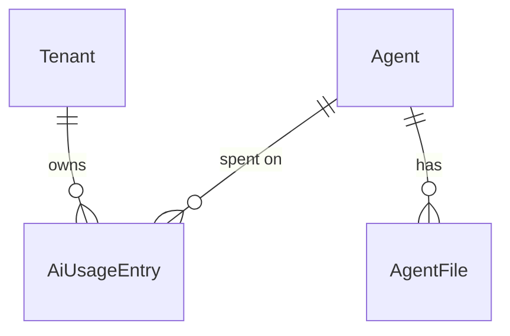

# Observabilidade do loop do agente (W1)

tlc-spec-lean · profile **ui** · budget 150k · plano só — sem `checks.md` e sem código.

Grounding: `origin/main` `113d893` (pós-#2/#3/#4). Cada afirmação sobre o repo abaixo foi lida no
código, não nos docs.

## Sources

- `docs/paridade-foundry.md` (store do projeto) §[W1] — âmbito, veredicto "construir", e os três
  buracos verificados. Lido, não re-derivado
- `docs/plano-agentes.md` (store do projeto) — decisões congeladas (Q1–Q5, I5, portas 1–7). Não reabrir
- `origin/main` — `Features/Ai/AiContracts.cs:38-59` (`AiUsageRecord`, `NoOpAiUsageTracker`),
  `ChatAi.cs:41-78` (o `finally` que monta o registo), `AgentLoop.cs:22-61`,
  `ToolRegistry.cs:20-34`, `AiModule.cs:26` (`AddSingleton<IAiUsageTracker, NoOpAiUsageTracker>`),
  `Host/Configurations/ObservabilityConfiguration.cs`, `appsettings.json` (`OpenTelemetry`,
  `Ai:Llm`), `src/Api/Api.csproj` (OTel 1.17.0, **sem** pacote de exportador)
- `.specs/STATE.md` `## Decisions` — AD-001 (ficheiro plano no front), AD-003 (`openapi.json` é a
  autoridade), AD-004 (clientes à mão), AD-006 (ordenação vem do default da API)
- OpenTelemetry GenAI semantic conventions — vocabulário dos spans, consultado neste round:
  [gen-ai-spans](https://github.com/open-telemetry/semantic-conventions/blob/v1.41.0/docs/gen-ai/gen-ai-spans.md) ·
  [gen-ai-agent-spans](https://github.com/open-telemetry/semantic-conventions-genai/blob/main/docs/gen-ai/gen-ai-agent-spans.md) ·
  [registry/gen-ai](https://github.com/open-telemetry/semantic-conventions-genai/blob/main/docs/registry/attributes/gen-ai.md).
  Estabilidade `development` em todos os atributos `gen_ai.*`
- **binding for the interface:** ecrãs `agents-list`, `list-state`, `shell` do front actual — a copy
  e o arranjo do ecrã de S3 saem daí, não de um ficheiro de design

## Problem

O LLM é real e gasta dinheiro desde o #3, e nada do que ele fez sobrevive ao pedido.
`ChatAiHandler` monta um `AiUsageRecord` completo — provider, modelo, tokens, latência, sucesso,
`errorCode` — num `finally`, e `AiModule` registra `NoOpAiUsageTracker`, que devolve
`Task.CompletedTask` e descarta o registo. O OpenTelemetry está instalado
(`OpenTelemetry.Extensions.Hosting` 1.17.0 + `Instrumentation.AspNetCore`) e desligado
(`EnableTraces: false`, `EnableMetrics: false`), com **zero** `ActivitySource` em todo o `src/Api`:
um chat que corre até 5 iterações e executa N tools é, no melhor dos casos, um único span HTTP sem
nada por dentro.

Quem paga: quem publica um produto gerado deste template. Hoje não consegue responder a nenhuma
destas perguntas, nem com acesso à base de dados: quanto é que um tenant gastou, que agente gastou,
quantas chamadas falharam e com que erro, que tool o modelo chamou, e em que iteração o loop se
perdeu. A tabela de paridade classifica as duas capacidades como **construir** e custo **S** —
"tracing server-side (OTel + GenAI semconv)" e "métricas por agente (persistir + expor)" — e a
recomendação põe o W1 em primeiro porque "o dinheiro já corre e ninguém o mede" e porque o número
que decide W2/W3/W8 — quantos agentes distintos em runtime — continua **não medido**.

Quando isto shipped: cada execução do chat deixa uma linha imutável por tenant e por agente com
provider, modelo, tokens, latência e erro; com `EnableTraces` ligado, o mesmo pedido produz um
trace com um span do agente, um span por chamada ao LLM e um span por tool, no vocabulário GenAI
que qualquer backend de OTel já entende.

## Out of scope

| Excluded | Why |
| --- | --- |
| Conversas/threads persistidas, `conversationId` | É o W2; o `history` continua no cliente |
| Versões do agente, rollback, diff de prompt | É o W3, e reverteria a porta 2 de `plano-agentes.md` |
| Avaliações, datasets, modelo juiz | É o W8 e depende de W1+W2 |
| Moderação, rate limit no chat, quota por consumidor | É o W7. O `429` e o limiter não entram aqui |
| Modelo por agente (coluna `Model`) | Antecipado em `.design/comparar-modelos.md` B1 (AD-009) |
| Custo em dinheiro (€/$ por chamada) | ~~Nenhum provider devolve preço~~ — premissa errada: OpenRouter devolve `usage.cost` em todo response. Custo entra em `.design/comparar-modelos.md` B2 (`LlmResponse.Cost`, `AiUsageEntry.Cost`); tabela de preços para o provider MAF continua fora |
| Exportador OTLP / App Insights / collector no compose | Pacote novo + endpoint por ambiente; ver pergunta aberta 1 |
| Métricas OTel (`gen_ai.client.token.usage`, `gen_ai.client.operation.duration`) | Os mesmos números ficam na tabela de usage; `EnableMetrics` fica como está |
| Conteúdo nos spans (`gen_ai.input.messages`, `gen_ai.output.messages`, argumentos e resultados de tools) | `opt_in` na convenção e são dados do tenant |
| Sampling configurável, `max_hourly_runs`, continuous evaluation | Sem tráfego não há amostra |
| Dashboard alojado, ecrã de trace, timeline de spans | O trace vive no backend de OTel de quem faz deploy, não na UI do template |
| p95/p99, SLO de latência, alertas | Nenhuma execução única satisfaz ou falha um percentil; o que fica é a latência por linha |
| Streaming token-a-token | Continua fora, como em `plano-agentes.md` |
| Segundo `DbContext`, editar `Program.cs`, clone da Foundry, hosted/MCP/vector store | I5 e as recusas congeladas ficam |

## Assumptions

| Assumption | Chosen default | Rationale | Confirmed? |
| --- | --- | --- | --- |
| Exportador de traces | Não adicionar `OpenTelemetry.Exporter.OpenTelemetryProtocol` neste round; os spans ficam em processo e provam-se com `ActivityListener` nos testes | Pacote novo exige justificação (`agent-boundaries`) e o endpoint do collector é config de deployment, não do template. Ver pergunta aberta 1 | n |
| `OpenTelemetry:EnableTraces` | Continua `false` em `appsettings.json`; ligar é decisão de ambiente | A metade que responde ao custo (a tabela) não depende de traces; ligar por omissão mudaria o comportamento de quem já corre o template | n |
| `TenantId` nos spans | Não vai como atributo de span | A convenção GenAI não tem atributo de tenant; inventar um namespace próprio espalha-o por backends que não o esperam. A correlação faz-se pela linha de usage e pelo `TraceId` do pedido HTTP | n |
| `UserId` na linha de usage | Não guardar | "Quem gastou" por utilizador é quota, e quota é W7. Guardar identidade acrescenta obrigação de retenção que metadados de custo não têm | n |
| Retenção das linhas | Sem TTL e sem purge; a tabela é append-only | Nenhuma linha é conteúdo de utilizador, o volume hoje é zero, e um purge por idade é um slice reversível quando houver tráfego | n |
| Nome da fonte de spans | `Api.Features.Ai` (o namespace do módulo) | É o que um collector filtra, e evita um nome de marketing que não corresponde a código | n |
| Rótulo `gen_ai.provider.name` | Minúsculas do rótulo que `LlmServiceResolver.UsageLabels` já produz: `openrouter`, `microsoft.agent_framework`, `stub` | A convenção aceita valor custom quando nenhum bem-conhecido se aplica, e usar o mesmo rótulo do usage permite juntar span e linha | n |
| Ecrã de uso (S3) | Escrito como P2, atrás de S1+S2, e cortável sem tocar neles | O mínimo do W1 é explicitamente zero rotas novas; a tabela de paridade é que pede "persistir **+ expor**". Ver pergunta aberta 2 | n |
| Permissão da leitura de uso | Reutilizar `ai.agent.read` / policy `AiAgentsRead` | Precedente do próprio módulo: os ficheiros do agente reutilizam as permissões do agente. Uma permissão nova arrasta `PermissionCatalog`, matriz RBAC e `Permissions` no front sem separar nada que o tenant queira separar | n |
| Ordenação da lista de uso | Default da API: `totalTokens` desc, estável por `agentId`; sem cabeçalhos ordenáveis e sem caixa de pesquisa | AD-006 — a UI não oferece campos que o servidor ignora; e `createdAt` não existe numa linha agregada | y (project decision AD-006) |
| Medição da latência | `DateTime.UtcNow` no `finally`, como hoje | É o mecanismo que já está em `ChatAiHandler`; trocar por `Stopwatch` decide-se no diff | n |
| Copy dos ecrãs | pt-PT, análogo a `agents-list` (`app-list-state`, `Tentar de novo`, header com h1) | profile ui e sem ficheiro de design: o binding é o ecrã que já existe | n |

**Open questions:** duas ficaram abertas — nenhuma impede escrever os checks de S1 e S2.

| # | Kind | Question | Until answered |
| --- | --- | --- | --- |
| 1 | blocks go-live | Exportador de traces: OTLP (pacote novo + endpoint por ambiente) ou spans só em processo? | Os spans de S2 existem em testes e em debug local, e não chegam a nenhum backend. A metade "tracing" do W1 não fica utilizável em produção; a metade do custo (S1) fica |
| 2 | open | A leitura do uso (S3) entra neste round, ou o W1 fica em zero rotas novas? | S1+S2 são o âmbito garantido; S3 fica escrito, com critérios próprios, e corta-se sem tocar nos outros. Entretanto assume-se que entra como P2 |

## Criteria

### S1: O custo de cada chat fica registado (P1)

> **Absorvido por `.design/comparar-modelos.md` bloco B2 (AD-009).** AC 1–9 e doors 1, 3 e 6 são
> reutilizados lá tal e qual, mais `Cost decimal?` em `LlmResponse` e `AiUsageEntry`, e
> `Operation` ∈ {`chat`, `compare`}. Não implementar S1 a partir deste plano.

**Acceptance Criteria**

1. WHEN `POST /api/v1/ai/chat` responde `200` THEN the system SHALL gravar exactamente uma linha de `AiUsageEntry` no tenant corrente com `agentId` igual ao agente que o handler resolveu, `provider` e `model` iguais ao par que `LlmServiceResolver.UsageLabels` devolve para a config activa, `totalTokens` igual a `AgentResult.TotalTokens`, `success = true` e `errorCode = null`.
2. IF `AgentLoop.RunAsync` lançar uma excepção THEN the system SHALL gravar uma linha com `success = false`, `errorCode` igual ao nome do tipo da excepção e `totalTokens` nulo.
3. IF `AgentLoop.RunAsync` lançar uma excepção THEN the system SHALL propagar essa mesma excepção ao caller, sem a substituir por uma falha de gravação.
4. IF a gravação da linha falhar (`DbUpdateException`, base indisponível) THEN the system SHALL escrever um `LogError` e SHALL NOT lançar a partir do `finally` de `ChatAiHandler`.
5. WHILE o `ILlmService` resolvido é `StubLlmService` (ambiente `Testing`, ou `Development` sem `Ai:Llm:ApiKey`) the system SHALL gravar a linha com `provider = "stub"` e `model = "stub"`, para que as execuções de teste sejam distinguíveis das pagas.
6. The system SHALL gravar em cada linha só metadados — `tenantId`, `agentId`, `provider`, `model`, `module`, `operation`, tokens, latência, `success`, `errorCode` — e SHALL NOT gravar a mensagem do utilizador, a `history`, os argumentos ou resultados de tools, nem a resposta do modelo.
7. The system SHALL expor o agregado `AiUsageEntry` como append-only: o repositório SHALL oferecer adicionar e consultar, e nenhum método de alterar ou apagar.
8. WHEN qualquer slice lê linhas de `AiUsageEntry` THEN the system SHALL devolver só linhas do tenant corrente, pelo query filter registado em `AiTenantQueryFilters`.
9. WHEN dois chats do mesmo tenant corram em paralelo, ou o cliente repetir o mesmo pedido, THEN the system SHALL gravar uma linha por execução, sem chave de deduplicação.

**Independent test:** `Api.Tests/Ai/ChatAiUsageTests` — um chat no stub grava uma linha com `provider = "stub"` e `agentId` do seed; um `ILlmService` que lança grava uma linha `success = false` com o nome do tipo em `errorCode` e a excepção sobe ao caller.

### S2: O loop e as tools ficam visíveis num trace (P1)

**Acceptance Criteria**

10. WHERE `OpenTelemetry:EnableTraces` é `true`, WHEN um chat corre, the system SHALL registar um span `invoke_agent {nome do agente}` com `gen_ai.operation.name = invoke_agent`, `gen_ai.provider.name` igual ao rótulo do provider em minúsculas, `gen_ai.request.model` igual a `Ai:Llm:Model`, `gen_ai.agent.id` igual ao id do agente resolvido e `gen_ai.agent.name` igual ao nome desse agente.
11. WHEN o `AgentLoop` chama `ILlmService.CompleteAsync` THEN the system SHALL registar um span filho `chat {modelo}` por chamada — incluindo a chamada de resumo que corre depois das 5 iterações — com `gen_ai.operation.name = chat`, `gen_ai.request.model`, `gen_ai.usage.input_tokens` e `gen_ai.usage.output_tokens`.
12. WHEN o `ToolRegistry` executa uma tool THEN the system SHALL registar um span filho `execute_tool {nome da tool}` com `gen_ai.operation.name = execute_tool`, `gen_ai.tool.name` e `gen_ai.tool.call.id`.
13. IF o modelo pedir uma tool fora da allowlist do agente, ou um nome que o `ToolRegistry` não conhece, THEN o span `execute_tool` SHALL levar `error.type = tool_not_found` — a resposta `{"error":"Tool '…' not found."}` e a continuação do loop ficam como já são hoje.
14. IF a chamada ao LLM ou a execução de uma tool lançar THEN o span dessa operação SHALL levar `error.type` igual ao nome do tipo da excepção e estado `Error`.
15. IF o chat falhar por qualquer razão THEN o span `invoke_agent` SHALL levar `error.type` igual ao nome do tipo da excepção que subiu.
16. The system SHALL NOT registar `gen_ai.tool.call.arguments`, `gen_ai.tool.call.result`, `gen_ai.input.messages` nem `gen_ai.output.messages` em nenhum span.
17. WHERE `OpenTelemetry:EnableTraces` é `true` the system SHALL ter o span `invoke_agent` como filho do span HTTP do ASP.NET Core, no mesmo `TraceId`.
18. WHERE `OpenTelemetry:EnableTraces` é `false` the system SHALL registar zero spans da fonte `Api.Features.Ai`.
19. WHERE `OpenTelemetry:EnableTraces` é `false` the system SHALL manter a resposta de `POST /api/v1/ai/chat` inalterada — `200` com `reply` e `iterationsUsed`.

**Independent test:** um `ActivityListener` sobre a fonte `Api.Features.Ai` num teste de handler: um chat com tool no stub produz `invoke_agent Default` → `chat openai/gpt-4o-mini` → `execute_tool get_tenant_info`, com os atributos acima e sem nenhum atributo de conteúdo; sem listener, `StartActivity` devolve `null` e o chat responde igual.

### S3: Quem paga vê o gasto por agente (P2 — decisão explícita, cortável)

Ecrã novo `/ai/usage` (profile ui). Arranjo: igual a `agents-list` — header com `h1` `Uso do AI`,
`app-list-state`, `mat-table` + `mat-paginator`. Sem acção primária no header, sem caixa de
pesquisa, sem cabeçalhos ordenáveis.

**Acceptance Criteria**

20. WHEN um utilizador com `ai.agent.read` chama `GET /api/v1/ai/usage` THEN the system SHALL responder `200` com uma página de linhas agregadas por agente do tenant corrente, cada uma com `agentId`, `agentName`, `calls`, `failures`, `inputTokens`, `outputTokens`, `totalTokens` e `lastUsedAt`.
21. WHEN `GET /api/v1/ai/usage` corre sem parâmetros THEN the system SHALL ordenar por `totalTokens` desc, estável por `agentId`, com `pageNumber` `1` e `pageSize` `20`.
22. WHERE `from` e `to` são enviados the system SHALL contar só linhas cujo `createdAt` cai dentro desse intervalo, fronteiras incluídas.
23. IF `from` for posterior a `to` THEN the system SHALL responder `400` com title `Validation failed`.
24. IF o caller está autenticado e sem `ai.agent.read` THEN `GET /api/v1/ai/usage` SHALL responder `403`.
25. WHERE `FeatureFlags:EnableAI` é `false` the system SHALL responder `404` com title `Feature disabled` em `GET /api/v1/ai/usage`.
26. WHEN `/ai/usage` abre com `ai.agent.read` e `totalCount` é `0` THEN the system SHALL mostrar o estado vazio do `app-list-state` com a copy exacta `Sem utilização registada`.
27. WHILE a lista de uso está `loading` the system SHALL mostrar o `mat-progress-bar` com `data-testid="list-loading"` e manter o paginator desactivado.
28. IF `GET /api/v1/ai/usage` devolver `500` THEN the system SHALL mostrar o `title` do ProblemDetails e o botão `Tentar de novo` do `app-list-state`.
29. IF o utilizador abrir `/ai/usage` sem `ai.agent.read` THEN the system SHALL renderizar o ecrã `forbidden` com a copy `Sem permissão para esta operação`.
30. WHERE a flag está disponível e o caller tem `ai.agent.read` the shell SHALL mostrar o item de navegação `Uso` com `data-testid="nav-ai-usage"`, escondido pelo `AiAvailability` quando a flag responde `404`, como já acontece com `Agentes`.
31. The system SHALL expor o cliente do uso como ficheiro plano em `src/web/src/app/features/ai/usage.ts` (AD-001, AD-004), sem pastas de camada.

**Independent test:** Vitest + MSW em `usage.spec.ts` — vazio, loading, erro com retry, e `forbidden` sem permissão; `architecture.spec.ts` verde com a rota nova em `features.json`.

## Traceability

| ID | Slice | Criteria | Status |
| --- | --- | --- | --- |
| OBS-01 | S1 | 1–9 | Implementing |
| OBS-02 | S2 | 10–19 | Implementing |
| OBS-03 | S3 | 20–31 | Implementing |

**ID format:** `CATEGORY-NUMBER`. **Status:** Pending → In checks → Implementing → Verified.

## Observable

Cada item de cada superfície que esta feature expõe. `n/a` leva razão.

| Surface | Decision | Landing |
| --- | --- | --- |
| screen `usage` | empty state | AC 26 |
| screen `usage` | loading | AC 27 |
| screen `usage` | error | AC 28 |
| screen `usage` | unauthorised | AC 29 |
| screen `usage` | density and ordering | AC 21, 31 — default da API, sem sort nem pesquisa (AD-006) |
| screen `usage` | destructive action confirms | n/a - o ecrã é só leitura e a tabela é append-only (AC 7) |
| screen `usage` | navegação (ordem e membro novo) | AC 30 |
| screen `chat` | qualquer estado | existing - `chat.ts` não muda; S1 e S2 correm no servidor e a resposta fica igual (AC 19) |
| screen `agents-list` | qualquer estado | n/a - nenhum ecrã de agentes muda nesta feature |
| API `GET /api/v1/ai/usage` | response shape | AC 20 |
| API `GET /api/v1/ai/usage` | error shape and codes | AC 23, 24, 25 |
| API `GET /api/v1/ai/usage` | who may call | AC 24 — policy `AiAgentsRead`, flag `EnableAI` |
| API `GET /api/v1/ai/usage` | versioning | n/a - rota nova em `/api/v1` como o resto do módulo; não versiona nada existente |
| API `GET /api/v1/ai/usage` | rate limit | n/a - `RequireRateLimiting` só existe em Identity hoje; o limiter é W7 e inventá-lo aqui seria outra feature |
| API `POST /api/v1/ai/chat` | response shape | AC 19 — contrato inalterado |
| API `POST /api/v1/ai/chat` | error shape and codes | existing - `404`/`500` pelo feature gate e pelo exception handler; AC 3 garante que o registo de usage não muda o que sobe |
| API `POST /api/v1/ai/chat` | who may call | existing - policy `Authenticated`, inalterada |
| API `POST /api/v1/ai/chat` | rate limit | n/a - W7; o chat continua sem limiter |
| command / scheduled task | output, flags, exit codes | n/a - nenhum comando ou job novo; o purge das linhas está em Out of scope |
| collection linhas de usage | grouping / ordering / duplicates | AC 8, 9, 21 — agrupadas por tenant e agente, uma linha por execução, sem dedup |
| collection linhas de usage | a excepção que não encaixa | AC 5 — as linhas do stub ficam na mesma tabela e distinguem-se pelo rótulo `stub` |
| document / copy | structure and next action | `Features/Ai/AGENTS.md` ganha a linha do tracker e da fonte de spans; `RBAC_MATRIX.md` só se S3 entrar (rota nova sob `AiAgentsRead`) — mesma regra de revisão do plano anterior |

## Swept

As nove dimensões. Em `checks.md` cada linha passa a citar um número de check; aqui cita a AC.

- **validation and bounds:** AC 23 (intervalo inválido → `400`), AC 21 (`pageSize` default pela paginação partilhada). Para S1 o registo não vem de input do utilizador — os limites de coluna de `provider`/`model`/`errorCode` decidem-se no diff
- **failure and partial failure:** AC 2, 3, 4 — a linha é gravada no `finally`, com `SaveChangesAsync` do próprio tracker (o `ChatAiHandler` não grava nada hoje); uma falha na gravação não substitui o resultado do chat
- **idempotency, retry, duplicates:** AC 9 — sem chave de deduplicação, de propósito: uma repetição gastou tokens outra vez e tem de aparecer como segunda linha
- **authorization and rate limits:** AC 24, 25 (leitura sob `AiAgentsRead` + flag); rate limit `n/a` — nenhuma rota do módulo Ai tem limiter hoje e o limiter é W7
- **concurrency and ordering:** AC 9 — append-only, sem índice único e sem contenção; nenhuma linha é actualizada, logo não há last-write-wins a decidir. A ordem dos spans irmãos dentro de uma iteração não é garantida e nada depende dela
- **data lifecycle:** AC 7 (append-only) + a assumption de retenção — sem TTL, sem purge, sem backfill; a tabela nasce vazia e nenhuma linha é conteúdo de utilizador (AC 6)
- **external-dependency failure:** AC 2, 14 — a falha do LLM fica registada na linha (`success = false`) e no span (`error.type`); sem circuit breaker e sem fallback silencioso, como `plano-agentes.md` AC 34
- **state transitions:** `n/a` - uma linha de usage não tem estados: é escrita uma vez e nunca muda (AC 7). O agregado `Agent` não ganha nem perde transições nesta feature
- **observability:** é a feature. AC 10–19 (spans), AC 1–9 (linha por execução), AC 4 (`LogError` quando a própria gravação falha). Sem métricas OTel e sem percentis — ambos em Out of scope, e nenhuma execução única prova um p95

## Flow

Reusa o que já existe em vez de duplicar: o `AiUsageRecord` que o `ChatAiHandler` já monta no
`finally`, os rótulos de `LlmServiceResolver.UsageLabels`, a `AppDbContext` única (I5) com
`AiTenantQueryFilters`, o `AddObservability` do `Host` que já configura OTel, e no front o
`app-list-state` + `ListStore` + `AiAvailability` dos ecrãs de agentes. Não se cria loop novo,
nem segundo `DbContext`, nem `TracerProvider` próprio.

1. `POST /api/v1/ai/chat` entra -> `Host` + `Shared` (exists) — JWT, tenant, `RequireFeature(EnableAI)`, policy `Authenticated`; com traces ligados, a instrumentação ASP.NET Core abre o span raiz
2. `ChatAiHandler` (exists) — resolve o agente, abre o span `invoke_agent` na `ActivitySource` do módulo (door 4) e corre o loop
3. `AgentLoop` (exists) — um span `chat {modelo}` por chamada a `ILlmService` (exists), com tokens de entrada e saída do `LlmResponse` (door 3)
4. `ToolRegistry` (exists) — um span `execute_tool {tool}` por execução, filho do span do loop; o nome fora da allowlist mantém a resposta de erro de hoje e marca `error.type`
5. `finally` do handler -> `IAiUsageTracker` (exists; implementação substituída, door 6) — grava um `AiUsageEntry` (door 1) na `AppDbContext` (exists, I5) e chama `SaveChangesAsync` ele próprio; falha só faz `LogError`
6. out: resposta do chat inalterada (`reply`, `iterationsUsed`) — zero mudança de contrato em S1+S2
7. S3: `GET /api/v1/ai/usage` -> `Ai` (exists) — slice de leitura agrega as linhas por agente (door 7) -> out: página JSON consumida por `features/ai/usage.ts` no front (exists, mesma pasta plana)

## Relations

One-way constraints: `AiUsageEntry` pertence sempre a um tenant e filtra por ele (door 1); cada
linha aponta o `Agent` que correu **sem chave estrangeira** para `AiAgents`, para o histórico de
custo sobreviver ao agente (door 1); a linha é escrita uma vez e nunca alterada nem apagada
(door 1, AC 7); não há restrição de unicidade — duas execuções idênticas são duas linhas (AC 9).
Sem colunas e sem tipos nesta secção.

## Surface

S1 e S2 não acrescentam nem mudam rota nenhuma. A única linha abaixo é a de S3, e é o que a
pergunta aberta 2 decide.

| Route | In | Out | Status |
| --- | --- | --- | --- |
| `GET /api/v1/ai/usage` | `from`, `to`, `pageNumber`, `pageSize` | página de `agentId` · `agentName` · `calls` · `failures` · `inputTokens` · `outputTokens` · `totalTokens` · `lastUsedAt` | `200`, `400`, `401`, `403`, `404` |

Policy `AiAgentsRead` (`ai.agent.read` ou role `Admin`), flag `EnableAI` — as mesmas do resto do
módulo. Entra em `features.json` como slice `GetAiUsage` e em `src/Api/openapi.json` por
`UPDATE_OPENAPI=1 dotnet test tests/E2ETests` (AD-003); sem cliente no front,
`architecture.spec.ts` falha.

## Landing

| One-way door | Literal shape | Alternative rejected |
| --- | --- | --- |
| 1. Ledger de usage persistido | Agregado `AiUsageEntry` em `Features/Ai/AiUsageEntry.cs` (domínio + `IAiUsageRepository` + `IEntityTypeConfiguration`), tabela append-only no `AppDbContext` partilhado (I5), query filter por `TenantId` em `AiTenantQueryFilters`, `AgentId` sem FK, migration nova em `src/Api/Shared/Migrations` | FK com cascade para `AiAgents` — apagar a linha do agente levaria o histórico de custo que a feature promete; e um sink de log (ficheiro/Serilog) em vez de tabela — não é consultável por tenant nem agregável por agente |
| 2. `AgentId` no registo de usage | `AiUsageRecord(string Service, string Provider, string Model, string Module, string Operation, Guid TenantId, Guid AgentId, int? TokensUsed, TimeSpan Latency, bool Success, string? ErrorCode)` | `Guid? AgentId = null` no fim da lista — um agregado "por agente" com nulos agrupa desconhecidos e mente sobre quem gastou |
| 3. Tokens de entrada e saída no contrato do LLM | `LlmResponse(string Text, int TotalTokens, IReadOnlyList<ToolCall>? ToolCalls = null, int InputTokens = 0, int OutputTokens = 0)`; OpenRouter lê `prompt_tokens`/`completion_tokens`, Agent Framework lê `response.Usage.InputTokenCount`/`OutputTokenCount` | Um atributo custom `gen_ai.usage.total_tokens` — não existe no registry da convenção (só `input_tokens`, `output_tokens`, cache e reasoning), logo nenhum backend o leria |
| 4. Primeira `ActivitySource` do repo | `public const string ActivitySourceName = "Api.Features.Ai"` no módulo Ai + `tracing.AddSource(AiTelemetry.ActivitySourceName)` em `Host/Configurations/ObservabilityConfiguration.cs` (a mesma direcção Host → Features que `AddAiModule` já usa) | Um `TracerProvider` próprio dentro de `AiModule` — duas configurações de exportador e o span do ASP.NET Core deixa de ser pai do do agente |
| 5. Vocabulário GenAI dos spans | `gen_ai.operation.name` ∈ {`invoke_agent`, `chat`, `execute_tool`}; nomes `invoke_agent {gen_ai.agent.name}`, `chat {gen_ai.request.model}`, `execute_tool {gen_ai.tool.name}`; `gen_ai.provider.name` ∈ {`openrouter`, `microsoft.agent_framework`, `stub`}; `error.type` = nome do tipo da excepção. Atributos `gen_ai.*` estão em estabilidade `development` | Nomes próprios (`ai.chat`, `ai.tool`) — um collector ou dashboard que já entende GenAI semconv deixaria de os ler, e a Foundry constrói evaluations sobre este mesmo vocabulário; e `openai` como provider do Agent Framework — o endpoint é configurável, logo o valor bem-conhecido afirmaria um provider que não sabemos qual é |
| 6. Usage deixa de ser opcional | `services.AddScoped<IAiUsageTracker, AiUsageTracker>()` em `AiModule`, a substituir `AddSingleton<IAiUsageTracker, NoOpAiUsageTracker>`; a classe no-op sai do código | Manter o no-op e registar o real só em Production — os testes deixariam de cobrir exactamente o caminho que esta feature existe para provar; e Singleton com `IServiceScopeFactory` — dependência cativa disfarçada por uma factory, sem ganho |
| 7. Contrato de leitura do uso (só se S3 entrar) | `GET /api/v1/ai/usage` agregado por agente, policy `AiAgentsRead`, flag `EnableAI`, statuses da tabela Surface, entrada `GetAiUsage` em `features.json` + `openapi.json` | Expor as linhas cruas em vez do agregado — uma tabela que cresce por chamada não é uma lista útil e arrastaria filtros que ninguém pediu; e permissão nova `ai.usage.read` — os ficheiros do agente já reutilizam as permissões do agente |

- Nada mais nesta mudança é difícil de reverter. Nomes de colunas e comprimentos, nome exacto do
  ficheiro do tracker, nome do componente Angular e formato dos números na tabela decidem-se no diff.

## Impact

| Front | What changes |
| --- | --- |
| domain | termo novo: `AiUsageEntry` — uma linha imutável por execução do chat (tenant, agente, provider, modelo, tokens, latência, sucesso, erro), vive em `Features/Ai`. Quem ramifica nela hoje: ninguém |
| domain | termo existente: `IAiUsageTracker` deixava de significar "no-op em DI" e passa a gravar. Quem ramifica hoje: `AiModule` (registo), `ChatAiHandler` (único produtor). O registo passa de `AddSingleton` para `AddScoped` — o tracker real depende da `AppDbContext`, que é Scoped, e um Singleton seria dependência cativa |
| domain | termo existente: `AiUsageRecord` ganha `AgentId` (door 2) — quem o constrói hoje é só `ChatAiHandler`; um produto gerado do template que o construa deixa de compilar até acrescentar o id |
| domain | termo existente: `LlmResponse` ganha tokens de entrada e saída (door 3) — callers: `AgentLoop`, os três `ILlmService` (`StubLlmService`, `OpenRouterLlmService`, `MicrosoftAgentFrameworkLlmService`), `LlmServiceTests` e o `RecordingLlmService` dos testes |
| stored data | nada a migrar: a tabela nasce vazia e nenhuma linha existente é tocada. Uma migration nova no grafo partilhado (I5), aplicada na mesma `AppDbContext`. A tabela cresce uma linha por chamada de chat, sem TTL neste round |
| contract | S1+S2: zero. S3: `features.json` + `openapi.json` ganham `GET /api/v1/ai/usage` (AD-003) e o front tem de ter cliente, senão `architecture.spec.ts` falha |
| config | `OpenTelemetry:EnableTraces` deixa de ligar só a instrumentação ASP.NET Core e passa a ligar também os spans do módulo Ai. Sem pacote de exportador no `csproj`, os spans ficam em processo (pergunta aberta 1). Nenhuma chave nova |
| docs | `src/Api/Features/Ai/AGENTS.md` — infra do módulo (tracker real, fonte de spans) e o gotcha de que o usage já não é no-op; `docs/security/RBAC_MATRIX.md` só se S3 entrar |
| ops | os nomes de span e os atributos `gen_ai.*` passam a ser vocabulário externo no momento em que um collector os lê (door 5), e a convenção está em estabilidade `development` — uma renomeação futura da convenção obriga a renomear aqui |

## Rebase

2026-09-23, sobre `dc21725`. S1 foi absorvido por `comparar-modelos`. `guardrails-agente` passou a
apanhar as excepções de tool no `AgentLoop`, por isso o span `execute_tool` abre-se lá e não no
`ToolRegistry` (AC 12–14 inalterados no que observam). `conversas-agente` trouxe o `conversationId`:
o span `invoke_agent` passa a levar `gen_ai.conversation.id` (C34). A resposta do chat tem
`conversationId` (AC 19). Pergunta aberta 1 sem resposta: default do plano — spans em processo,
sem exportador; pergunta 2: S3 entra.

