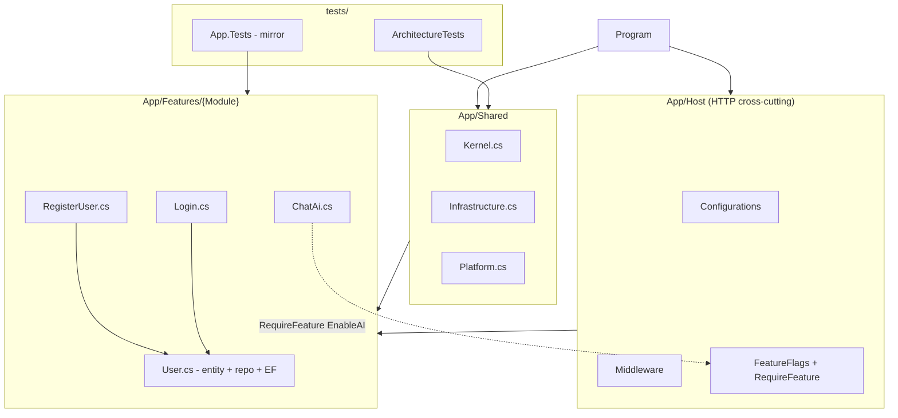

# Product.Template v2 — Design

**Spec:** `.specs/features/v2-template/spec.md`  
**Status:** Draft  
**Architecture version:** v2.1

---

## Architecture Overview

Monolith modular com **Vertical Slice Architecture** em projeto único `App` (Sdk.Web). Cross-cutting HTTP em `Host/`, cross-cutting domain/infra em `Shared/`, casos de uso em `Features/{Module}/{Slice}.cs`.

Feature flags operam em **runtime** (Microsoft.FeatureManagement). Deploy seletivo por Class Library é **fase evolutiva**, não MVP.



---

## Project Structure (v2.1)

```
Product.template/
├── .specs/                           # TLC spec-driven
├── AGENTS.md
├── features.json
├── nuget.config
├── src/App/                          # Sdk.Web — host + app
│   ├── Program.cs                    # ≤40 lines orchestration
│   ├── GlobalUsings.cs
│   ├── Host/
│   │   ├── FeatureFlags.cs
│   │   ├── Configurations/
│   │   │   ├── FeatureFlagsConfiguration.cs
│   │   │   ├── SecurityConfiguration.cs
│   │   │   ├── SerilogConfiguration.cs
│   │   │   ├── HealthCheckConfiguration.cs
│   │   │   └── OpenApiConfiguration.cs
│   │   ├── Middleware/
│   │   │   ├── TenantMiddleware.cs
│   │   │   ├── RequestLoggingMiddleware.cs
│   │   │   └── RequestDeduplicationMiddleware.cs
│   │   └── Extensions/
│   │       ├── EndpointExtensions.cs      # RequireFeature()
│   │       └── WebApplicationExtensions.cs # UseHostPipeline()
│   ├── Shared/
│   │   ├── Kernel.cs
│   │   ├── Infrastructure.cs
│   │   └── Platform.cs                    # IEndpoint, MediatR, ITenantContext
│   └── Features/
│       ├── Identity/
│       │   ├── User.cs
│       │   ├── RegisterUser.cs
│       │   └── Login.cs
│       ├── Authorization/
│       ├── Tenants/
│       └── Ai/
│           └── ChatAi.cs                    # .RequireFeature(EnableAI)
└── tests/
    ├── App.Tests/{Module}/{Slice}Tests.cs
    ├── ArchitectureTests/
    └── E2ETests/                            # M3
```

---

## Code Reuse Analysis

### From v1 (referência opcional — reutilizar padrões, não estrutura)

v2 é um **template novo**. O v1 não é origem de migração; use-o apenas para comparar comportamento e copiar ideias comprovadas.

| Component | v1 Location | v2 Target |
|-----------|-------------|-----------|
| Feature flags config | `src/Api/Configurations/FeatureFlagsConfiguration.cs` | `Host/Configurations/` |
| FeatureGate filter logic | `src/Api/Filters/FeatureGateActionFilter.cs` | `Host/Extensions/RequireFeature()` |
| Flag constants | `src/Api/Attributes/FeatureGateAttribute.cs` | `Host/FeatureFlags.cs` |
| RegisterUser logic | `Identity.Application/Handlers/User/` | `Features/Identity/RegisterUser.cs` |
| User entity | `Identity.Domain/Entities/User.cs` | `Features/Identity/User.cs` |
| JWT/Security | `Api/Configurations/SecurityConfiguration.cs` | `Host/Configurations/SecurityConfiguration.cs` |
| RBAC matrix | `docs/security/RBAC_MATRIX.md` | Manter atualizado conforme endpoints v2 |

### Already implemented in v2 pilot

| Component | Location |
|-----------|----------|
| RegisterUser slice | `src/App/Features/Identity/RegisterUser.cs` |
| User + repo + EF | `src/App/Features/Identity/User.cs` |
| IEndpoint discovery | `src/App/Shared/Platform.cs` |
| Tests mirror | `tests/App.Tests/Identity/RegisterUserTests.cs` |

---

## Component Design

### 1. `{Slice}.cs` — vertical slice unit

| Aspect | Detail |
|--------|--------|
| Purpose | Um caso de uso completo |
| Location | `src/App/Features/{Module}/{Slice}.cs` |
| Contains | Command/Query, Validator, Handler, Response DTOs, `IEndpoint` |
| Max size | ~150 lines; split endpoint if exceeded |
| Namespace | `App.Features.{Module}` |

### 2. `{Entity}.cs` — module shared domain

| Aspect | Detail |
|--------|--------|
| Purpose | Entity + repository + EF config compartilhados |
| Location | `src/App/Features/{Module}/{Entity}.cs` |
| Naming | Substantivo (User, Role, Tenant) — sem verbo |
| Visibility | Repository `internal`; interface public if needed |

### 3. `Shared/` — global cross-cutting

| File | Responsibility |
|------|----------------|
| `Kernel.cs` | Entity base, Email, exceptions |
| `Infrastructure.cs` | AppDbContext, UoW, AddInfrastructure() |
| `Platform.cs` | MediatR, FluentValidation pipeline, IEndpoint, TenantContext |

**Rule:** Kernel e Platform SHALL NOT reference `App.Features.*` (enforced by ArchitectureTests).

### 4. `Host/` — HTTP cross-cutting

| Component | Responsibility |
|-----------|----------------|
| `FeatureFlagsConfiguration` | `AddFeatureManagement` |
| `WebApplicationExtensions.UseHostPipeline()` | Conditional middleware by flag |
| `EndpointExtensions.RequireFeature()` | Endpoint filter → 404 |
| `SecurityConfiguration` | JWT, CORS, policies |
| `TenantMiddleware` | Resolve X-Tenant-Id |

### 5. Feature Flags — two layers

```
Layer 1 — Runtime (MVP):
  appsettings → IFeatureManager → .RequireFeature() / UseHostPipeline conditions

Layer 2 — Deploy-time (future, NOT MVP):
  MSBuild EnabledModules → conditional ProjectReference → omit DLL
  Requires: Modules/Identity/Identity.csproj separate from App host
```

**Decision:** MVP = Layer 1 only. Document Layer 2 in STATE.md as deferred.

---

## Endpoint Auto-Discovery

```csharp
// Platform.cs — already implemented
public interface IEndpoint { void Map(IEndpointRouteBuilder app); }

// Program.cs — target
app.MapEndpointsFromAssembly();
```

Each slice implements `RegisterUserEndpoint : IEndpoint` in same file or partial.

---

## Feature Flag Integration

```csharp
// Host/Extensions/EndpointExtensions.cs
public static RouteHandlerBuilder RequireFeature(
    this RouteHandlerBuilder builder, string featureName)
{
    return builder.AddEndpointFilter(async (context, next) =>
    {
        var fm = context.HttpContext.RequestServices.GetRequiredService<IFeatureManager>();
        if (!await fm.IsEnabledAsync(featureName))
            return Results.NotFound(/* ProblemDetails */);
        return await next(context);
    });
}

// Features/Ai/ChatAi.cs
app.MapPost("/api/v1/ai/chat", ...)
   .RequireFeature(FeatureFlags.EnableAI);
```

Middleware gating (from v1):

```csharp
// Host/Extensions/WebApplicationExtensions.cs
if (config.GetValue<bool>("FeatureFlags:EnableAdvancedLogging", true))
    app.UseMiddleware<RequestLoggingMiddleware>();
```

---

## Test Strategy

| Type | Location | Scope |
|------|----------|-------|
| Unit/Integration per slice | `tests/App.Tests/{Module}/{Slice}Tests.cs` | Validator + Handler |
| Architecture | `tests/ArchitectureTests/` | Namespace boundaries, IEndpoint |
| E2E HTTP | `tests/E2ETests/` (M3) | Full HTTP flows |

**Mirror rule:** `src/App/Features/{M}/{S}.cs` → `tests/App.Tests/{M}/{S}Tests.cs`

**Handler tests:** Direct handler injection (avoid MediatR license in test DI).

---

## Module Boundaries

| Rule | Enforcement |
|------|-------------|
| `Features.Identity` ↛ `Features.Tenants` direct reference | NetArchTest |
| `Shared.Kernel/Platform` ↛ `Features` | NetArchTest |
| `Infrastructure` → `Features` (DbSet only) | Allowed |
| Cross-module communication | MediatR IQuery/ICommand only |

---

## LLM Token Budget (design constraint)

| Operation | Max files | Max path depth |
|-----------|-----------|----------------|
| Add field to slice | 3 | 5 (`src/App/Features/Identity/RegisterUser.cs`) |
| New slice | 2 (+ features.json) | 5 |
| New module entity | +1 (`User.cs`) | 5 |
| HTTP infra change | Host/ only | 4 |

---

## Greenfield Implementation Strategy

v2 nasce como template independente. Novos slices são **implementados do zero** no padrão VSA; o v1 orienta requisitos e testes de referência quando útil.

1. **Por slice:** Definir contrato HTTP + regras de negócio → implementar Command/Validator/Handler/`IEndpoint` em `{Slice}.cs`
2. **Entidade:** Modelar domínio + repo + EF config em `{Entity}.cs`
3. **Teste:** Validator + handler em `{Slice}Tests.cs` (espelho plano)
4. **Verificar:** Comparar comportamento com critérios de aceite (v1 como referência opcional)
5. **Registrar:** Atualizar `features.json` e `RBAC_MATRIX.md` quando aplicável

**Ordem sugerida (bootstrap do template):** Identity → Authorization → Tenants → AI → Host hardening → E2E → CI

---

## Open Design Questions

| # | Question | Recommendation | Status |
|---|----------|----------------|--------|
| 1 | Api + App split vs unified Sdk.Web | Unified (v2.1) | **Decided** |
| 2 | CL per module for deploy selectivity | Defer to M4+ | **Decided** |
| 3 | Scalar vs Swagger | Scalar (v1 parity) | Pending M2 |
| 4 | MediatR in tests vs direct handler | Direct handler | **Decided** |

---

## Approval

- [x] Spec approved (2026-08-03)
- [x] Design approved (2026-08-03)
- [x] M1 scope: Feature Flags included; AI deferred to P3
- [x] Ready for Execute
