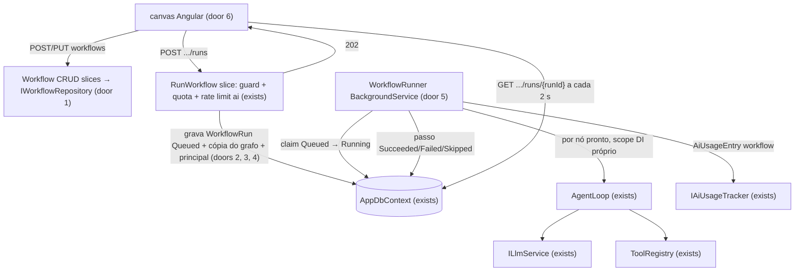
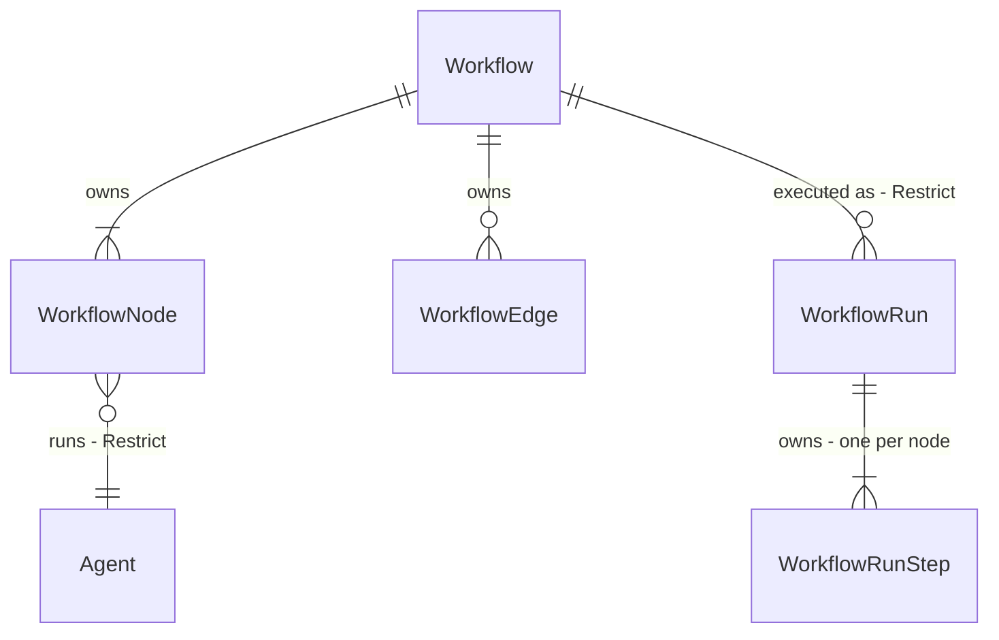

# Workflows de agentes

Sources:

- conversation (2026-09-23) - "implementar workflow de agentes, esteira de execução caso necessário, canvas que dê o fluxo"; execução **assíncrona** e grafo **DAG sem condições** decididos pelo utilizador nesta conversa
- `src/Api/Features/Ai/CompareModels.cs` - padrão reutilizado: um scope DI por execução de agente, tenant e `IAgentRuntimeContext` postos à mão, token desligado do pedido, uso gravado por execução
- `src/Api/Features/Ai/ConversationRetentionService.cs` - padrão reutilizado: `BackgroundService` com `RunOnceAsync` testável e `IgnoreQueryFilters`
- sem design binding - não existe mockup; a cópia e o arranjo dos ecrãs ficam decididos nas AC deste plano

## Problem

Hoje um agente responde sozinho a um pedido. Quem quer encadear trabalho - um agente que extrai,
outro que classifica, um terceiro que redige - tem de copiar a resposta de um chat, colá-la no
próximo, e repetir à mão por cada caso. Não fica registo do encadeamento, não se vê o custo total,
e nada corre enquanto a pessoa não está a olhar: `POST /ai/chat` e `POST /ai/comparisons` são
síncronos e cada um corre **um** agente (`AgentLoop.RunAsync`, até 5 chamadas ao LLM). A fonte
não dá volume nem pedido de cliente; é construção do template, como `comparar-modelos`.

Quando isto sair, o admin do tenant desenha num canvas uma esteira de agentes (nós ligados por
setas), grava-a, executa-a com um input, e vê cada nó mudar de estado até o fim - com a saída,
tokens e custo de cada passo, e o histórico de execuções.

## Out of scope

| Excluded | Why |
| --- | --- |
| Nós de decisão (if/switch), loops, aprovação humana entre passos | decisão do utilizador: V1 é DAG sem condições; exigem run pausável e máquina de estados maior |
| Cancelar uma execução em curso | o custo de um run está limitado por 10 nós × timeout por passo; cancelar pede sinal entre instâncias - slice seguinte |
| Gatilhos (agenda, webhook, evento) | V1 só executa por pedido explícito na UI/API |
| Retenção/purga de execuções | `ModelComparison` também não tem; entra com a mesma decisão para os dois |
| Versionamento de workflows (histórico de edições) | a execução guarda uma cópia do grafo (door 4), o que basta para ler runs antigos |
| Nós que não são agentes (HTTP, código, transformação) | V1: todo o nó é um agente existente do tenant |
| Streaming de tokens por nó | o canvas mostra estado por nó via polling; texto ao vivo é outra feature |
| Biblioteca de canvas de terceiros | ver Assumptions; o canvas usa `@angular/cdk` que já é dependência |

## Assumptions

| Assumption | Chosen default | Rationale | Confirmed? |
| --- | --- | --- | --- |
| Execução síncrona ou assíncrona | assíncrona: `POST .../runs` devolve `202` e um worker executa | uma esteira de N agentes passa dos 60s de `CompareTimeoutSeconds` e o canvas precisa de progresso por nó | y |
| Forma do grafo | DAG sem condições; ciclo recusado com `400` | escolha do utilizador | y |
| Permissões | reutilizar `AiAgentsRead` (ler workflows e runs) e `AiAgentsManage` (criar, editar, desactivar, executar) | um workflow é composição de agentes; uma permissão nova obriga a seed, RBAC_MATRIX e UI de roles sem diferença de poder real | y |
| Visibilidade | workflows e runs são do tenant (como comparações), não do utilizador | é configuração partilhada do tenant, não conversa privada | y |
| Input de cada nó | nó raiz recebe o input do run; nó com predecessores recebe input do run + saída de cada predecessor, delimitadas, pela ordem dos nós | é o contrato mais simples que um DAG sem condições permite, e o modelo vê de onde veio cada parte | y |
| Instrução do nó | texto opcional (≤ 2000) acrescentado antes do input do nó, sem mudar as instruções do agente | permite reutilizar um agente genérico em papéis diferentes sem duplicar agentes | y |
| Falha de um nó | o nó fica `Failed`; os seus descendentes ficam `Skipped`; ramos independentes seguem; o run termina `Failed` | não se deita fora trabalho já pago noutro ramo; um run com qualquer falha não é sucesso | y |
| Paralelismo | nós cujos predecessores terminaram correm em paralelo, até `Ai:Workflows:MaxParallelSteps` (3) | ramos independentes são a razão de ser um DAG; o limite protege o rate limit do provider | y |
| Limites | nome ≤ 200; 1 a 10 nós; ≤ 30 arestas; input ≤ 4000; timeout por passo `Ai:Workflows:StepTimeoutSeconds` (120) | alinhado com `Prompt` ≤ 4000 do comparador; 10 nós × 120s mantém o pior caso sequencial em 20 min | y |
| Identidade das tools no worker | o run guarda na criação o `UserId`, os roles e os códigos de permissão de quem executou; o worker corre as tools com esse principal | `ToolAuthorization` lê `ICurrentUserAccessor.User`, que no worker não tem `HttpContext`; sem isto toda a tool com permissão devolve `permission_denied` | y |
| Run interrompido (processo morreu) | um run `Running` com `StartedAt` há mais de `Ai:Workflows:MaxRunMinutes` (30) é marcado `Failed` com `errorCode` `Interrupted`, e os seus passos `Pending`/`Running` ficam `Skipped` | sem heartbeat; o pior caso legítimo (20 min) fica abaixo do limite | y |
| Quota | verificada no `POST .../runs` (`429`) e antes de cada passo no worker (passo `Failed`, `errorCode` `QuotaExceeded`) | um run longo não pode furar a quota diária só porque arrancou abaixo dela | y |
| Canvas | SVG próprio + `@angular/cdk/drag-drop` (já em `package.json`); sem dependência nova | não confirmei compatibilidade de `ngx-vflow`/`@foblex/flow` com Angular 22; uma dependência de canvas é door e pode entrar depois sem mudar o contrato | y |
| Workflow desactivado | `DELETE` desactiva (`IsActive=false`), como agentes; runs existentes continuam legíveis; executar um desactivado → `404` | runs referem o workflow; apagar partia o histórico | y |
| Agente desactivado depois de gravado no workflow | gravar valida que cada agente existe e está activo (`400`); na execução, um agente já inactivo faz o passo `Failed` com `errorCode` `AgentUnavailable` | o `DeactivateAgent` não sabe de workflows e não deve passar a saber | y |

**Open questions:** none - all resolved or logged above.

## Criteria

### S1: Criar e editar um workflow pela API (P1)

**Acceptance Criteria**

1. WHEN um utilizador com `ai.agent.manage` faz `POST /api/v1/ai/workflows` com `name`, `nodes` (cada um `key`, `agentId`, `instruction?`, `x`, `y`) e `edges` (cada uma `from`, `to`) válidos THEN the system SHALL responder `201` com `Location: /api/v1/ai/workflows/{workflowId}` e o corpo `workflowId` · `name` · `description` · `isActive=true` · `nodes` · `edges` · `createdAt` · `updatedAt`
2. IF as arestas formam um ciclo (incluindo `from == to`) THEN the system SHALL responder `400` com erro de validação na chave `edges`
3. IF uma aresta refere uma `key` que não existe em `nodes` THEN the system SHALL responder `400` com erro na chave `edges`
4. IF duas `nodes` partilham a mesma `key` THEN the system SHALL responder `400` com erro na chave `nodes`
5. IF `nodes` tem 0 ou mais de 10 elementos, `edges` mais de 30, uma aresta repetida, `name` vazio ou com mais de 200 caracteres, ou uma `instruction` com mais de 2000 THEN the system SHALL responder `400` com erro na chave correspondente
6. IF um `agentId` não existe no tenant ou está inactivo THEN the system SHALL responder `400` com erro na chave `nodes`
7. WHEN um utilizador com `ai.agent.manage` faz `PUT /api/v1/ai/workflows/{workflowId}` com um corpo válido THEN the system SHALL substituir nome, descrição, nós e arestas por inteiro e responder `200` com o workflow gravado e `updatedAt` posterior ao anterior
8. WHEN `GET /api/v1/ai/workflows` THEN the system SHALL devolver uma página de `workflowId` · `name` · `nodeCount` · `isActive` · `updatedAt`, só dos workflows activos do tenant, ordenada por `updatedAt` desc
9. WHEN `GET /api/v1/ai/workflows/{workflowId}` THEN the system SHALL devolver o workflow com `nodes` e `edges` e as posições `x`/`y` exactamente como gravadas
10. WHEN `DELETE /api/v1/ai/workflows/{workflowId}` THEN the system SHALL marcar `isActive=false`, responder `204` e deixar de o listar
11. IF o `workflowId` não existe no tenant do pedido (incluindo um de outro tenant) THEN the system SHALL responder `404` em `GET`, `PUT`, `DELETE` e `POST .../runs`
12. IF quem chama não tem `ai.agent.manage` THEN the system SHALL responder `403` em `POST`, `PUT`, `DELETE` de workflows e em `POST .../runs`; IF não tem `ai.agent.read` THEN `403` nos `GET`
13. WHERE `FeatureFlags:EnableAI` é `false` the system SHALL responder `404` em todas as rotas de workflows

**Independent test:** `POST` um workflow A→B, `GET` devolve os dois nós nas mesmas posições; `PUT` com ciclo B→A dá `400`.

### S2: Executar um workflow em segundo plano (P1)

**Acceptance Criteria**

14. WHEN um utilizador com `ai.agent.manage` faz `POST /api/v1/ai/workflows/{workflowId}/runs` com `input` THEN the system SHALL gravar um run `Queued` com um passo `Pending` por nó, e responder `202` com `Location: /api/v1/ai/workflows/{workflowId}/runs/{runId}` e o corpo do run, sem esperar por nenhuma chamada ao LLM
15. IF `input` está vazio ou tem mais de 4000 caracteres THEN the system SHALL responder `400` na chave `input`
16. IF o `IContentGuard` bloqueia o `input` THEN the system SHALL responder `400` e não gravar run nenhum
17. IF a quota diária de tokens do tenant está esgotada no momento do `POST` THEN the system SHALL responder `429` e não gravar run nenhum
18. The system SHALL aplicar a policy de rate limit `ai` ao `POST .../runs` e declarar `429` no contrato
19. WHEN o worker apanha um run `Queued` THEN the system SHALL passá-lo a `Running` com `startedAt`, e correr cada nó só depois de todos os seus predecessores estarem `Succeeded`
20. WHEN dois nós têm todos os predecessores `Succeeded` THEN the system SHALL corrê-los em simultâneo, nunca mais de `Ai:Workflows:MaxParallelSteps` (3) ao mesmo tempo
21. The system SHALL dar a um nó raiz como mensagem `instruction` (se houver) seguida do `input` do run, e a um nó com predecessores o mesmo seguido de um bloco `--- {key do predecessor} ---` com a saída de cada predecessor, pela ordem dos nós no workflow
22. WHEN um passo termina com sucesso THEN the system SHALL gravar no passo `status=Succeeded`, `output`, `inputTokens`, `outputTokens`, `cost`, `latencyMs`, `iterationsUsed`, `startedAt` e `finishedAt`, antes de arrancar os passos que dependem dele
23. WHEN todos os passos terminam `Succeeded` THEN the system SHALL marcar o run `Succeeded` com `finishedAt`
24. IF um passo lança ou excede `Ai:Workflows:StepTimeoutSeconds` (120) THEN the system SHALL marcá-lo `Failed` com `errorCode` (`Timeout` no timeout, o nome da excepção no resto), marcar todos os seus descendentes `Skipped`, deixar os ramos independentes correr, e terminar o run `Failed`
25. IF o agente de um nó está inactivo ou não existe no momento da execução THEN the system SHALL marcar o passo `Failed` com `errorCode` `AgentUnavailable` sem chamar o LLM
26. IF a quota diária do tenant está esgotada antes de um passo arrancar THEN the system SHALL marcar esse passo `Failed` com `errorCode` `QuotaExceeded` sem chamar o LLM
27. The system SHALL correr cada passo com o tenant do run e com um principal cujo `UserId`, roles e permissões são os de quem fez o `POST .../runs`, de modo que uma tool que exige `identity.user.read` devolve dados a um Admin e `permission_denied` a quem não a tem
28. WHEN um passo termina THEN the system SHALL gravar um `AiUsageEntry` com `operation` `workflow`, o `agentId` do nó, o modelo, tokens, custo, latência e sucesso
29. IF dois workers tentam apanhar o mesmo run `Queued` THEN the system SHALL deixar só um passá-lo a `Running`, e o outro não executa nenhum passo desse run
30. IF um run está `Running` com `startedAt` há mais de `Ai:Workflows:MaxRunMinutes` (30) THEN the system SHALL marcá-lo `Failed` com `errorCode` `Interrupted` e os seus passos `Pending` ou `Running` como `Skipped`
31. The system SHALL executar o grafo copiado para o run no `POST .../runs`, de modo que um `PUT` do workflow durante a execução não muda os nós nem as arestas desse run
32. IF o worker falha a processar um run fora de um passo (base indisponível, excepção inesperada) THEN the system SHALL registar `LogError` com o `runId` e continuar a processar os runs seguintes

**Independent test:** com o `StubLlmService`, `POST` um run de A→B, fazer polling do `GET` até `Succeeded`; o passo B tem na mensagem o bloco `--- a ---` com a saída de A.

### S3: Ler execuções (P1)

**Acceptance Criteria**

33. WHEN `GET /api/v1/ai/workflows/{workflowId}/runs/{runId}` THEN the system SHALL devolver `runId` · `workflowId` · `status` · `input` · `errorCode` · `createdAt` · `startedAt` · `finishedAt` · `createdByUserId` · `totalCost` · `nodes` · `edges` (a cópia do run) · `steps` (cada `nodeKey`, `agentId`, `status`, `output`, `inputTokens`, `outputTokens`, `cost`, `latencyMs`, `iterationsUsed`, `errorCode`, `startedAt`, `finishedAt`)
34. The system SHALL calcular `totalCost` como a soma dos `cost` dos passos, e `null` quando nenhum passo tem custo
35. WHEN `GET /api/v1/ai/workflows/{workflowId}/runs` THEN the system SHALL devolver uma página de `runId` · `status` · `inputPreview` (primeiros 200 caracteres) · `totalCost` · `createdAt` · `finishedAt`, ordenada por `createdAt` desc
36. IF o `runId` não pertence a esse `workflowId` ou ao tenant do pedido THEN the system SHALL responder `404`
37. The system SHALL expor `status` do run só com os valores `Queued`, `Running`, `Succeeded`, `Failed`, e do passo só com `Pending`, `Running`, `Succeeded`, `Failed`, `Skipped`

**Independent test:** depois de S2, `GET .../runs` lista o run com `status=Succeeded`; um `runId` de outro workflow dá `404`.

### S4: Lista de workflows no front (P1)

**Acceptance Criteria**

38. WHEN o utilizador abre `/ai/workflows` THEN the system SHALL mostrar uma tabela com colunas `Nome`, `Nós`, `Atualizado`, e acções, na ordem da API
39. WHILE a lista carrega the system SHALL mostrar o estado de carregamento partilhado das listas
40. IF a lista está vazia THEN the system SHALL mostrar `Nenhum workflow ainda` e, a quem tem `ai.agent.manage`, o botão `Novo workflow`
41. IF o pedido da lista falha THEN the system SHALL mostrar o estado de erro partilhado com `Tentar de novo`
42. WHEN quem tem `ai.agent.manage` clica `Desativar` numa linha THEN the system SHALL pedir confirmação com `Desativar o workflow "{nome}"?` e só chamar `DELETE` depois de confirmar
43. WHILE o utilizador não tem `ai.agent.manage` the system SHALL esconder `Novo workflow` e `Desativar`
44. WHERE a IA está disponível (`AiAvailability`) the system SHALL mostrar o item de navegação `Workflows` (`data-testid="nav-ai-workflows"`) a quem tem `ai.agent.read`, depois de `Agentes`

**Independent test:** com MSW a devolver página vazia, `/ai/workflows` mostra `Nenhum workflow ainda`; com o utilizador sem manage, sem botão.

### S5: Canvas para desenhar o workflow (P1)

**Acceptance Criteria**

45. WHEN o utilizador abre `/ai/workflows/new` ou `/ai/workflows/:workflowId` THEN the system SHALL mostrar o canvas com cada nó na posição `x`/`y` gravada, rotulado com o nome do agente e a `key`, e cada aresta como uma seta do nó de origem para o de destino
46. WHEN quem tem `ai.agent.manage` escolhe um agente na paleta `Adicionar agente` THEN the system SHALL acrescentar um nó com `key` única gerada a partir do nome do agente
47. WHEN o utilizador arrasta um nó THEN the system SHALL mover o nó e as setas ligadas, e gravar a nova posição no próximo `Guardar`
48. WHEN o utilizador clica na porta de saída de um nó e depois num outro nó THEN the system SHALL criar a aresta entre os dois
49. IF essa aresta criaria um ciclo ou já existe THEN the system SHALL não a criar e mostrar `Esta ligação criaria um ciclo` ou `Ligação já existe`
50. WHEN o utilizador selecciona um nó THEN the system SHALL mostrar um painel lateral com o agente, a `instruction` editável e `Remover nó`; remover apaga também as arestas do nó
51. WHEN o utilizador selecciona uma aresta e carrega `Remover ligação` ou `Delete` THEN the system SHALL removê-la
52. WHEN o utilizador carrega `Guardar` THEN the system SHALL enviar `POST` (novo) ou `PUT` (existente), e no novo navegar para `/ai/workflows/{workflowId}`
53. IF a API responde `400` THEN the system SHALL mostrar a mensagem do campo (`name`, `nodes`, `edges`) sem perder o que está no canvas
54. IF o canvas não tem nós THEN the system SHALL mostrar `Adicione um agente para começar` e desactivar `Guardar`
55. WHILE o utilizador não tem `ai.agent.manage` the system SHALL mostrar o canvas só de leitura: sem paleta, sem arrastar, sem ligar, sem `Guardar`, sem `Executar`
56. WHEN o utilizador sai do editor com alterações por guardar THEN the system SHALL pedir confirmação `Sair sem guardar as alterações?`
57. IF o `GET` do workflow responde `404` THEN the system SHALL mostrar `Workflow não encontrado` com ligação para `/ai/workflows`

**Independent test:** criar dois nós pela paleta, ligar A→B, tentar ligar B→A (mensagem de ciclo), guardar; o `POST` interceptado pelo MSW leva os dois nós e uma aresta.

### S6: Executar e acompanhar no canvas (P1)

**Acceptance Criteria**

58. WHEN quem tem `ai.agent.manage` escreve o input e carrega `Executar` num workflow gravado sem alterações pendentes THEN the system SHALL enviar `POST .../runs` e abrir a vista do run no mesmo canvas
59. WHILE há alterações por guardar the system SHALL desactivar `Executar` com a dica `Guarde antes de executar`
60. WHILE o run está `Queued` ou `Running` the system SHALL pedir `GET .../runs/{runId}` a cada 2 s e parar no primeiro estado `Succeeded` ou `Failed`, ou ao sair do ecrã
61. The system SHALL pintar cada nó da vista do run pelo estado do passo: `Pending`, `Running` (com indicador de progresso), `Succeeded`, `Failed`, `Skipped`, com o texto do estado no próprio nó e não só na cor
62. WHEN o utilizador selecciona um nó na vista do run THEN the system SHALL mostrar a `output` (ou o `errorCode`), tokens in/out, custo USD e latência desse passo
63. WHEN o run termina THEN the system SHALL mostrar o estado final, o custo total (`—` quando `totalCost` é `null`) e a duração
64. The system SHALL listar no editor as execuções do workflow (`GET .../runs`) com `Estado`, `Input`, `Custo`, `Início`; clicar numa abre a sua vista; vazia mostra `Nenhuma execução ainda`
65. IF o `POST .../runs` responde `429` THEN the system SHALL mostrar a mensagem do `ProblemDetails` e manter o input escrito
66. The system SHALL desenhar a vista do run a partir de `nodes`/`edges` do próprio run, não do workflow actual

**Independent test:** MSW devolve o run `Running` e depois `Succeeded`; o nó passa de `Em execução` a `Concluído` e o polling pára (nenhum pedido depois do terminal).

## Traceability

| ID | Slice | Criteria | Status |
| --- | --- | --- | --- |
| WF-01 | S1 | 1, 2, 3, 4, 5, 6, 7, 8, 9, 10, 11, 12, 13 | Verified |
| WF-02 | S2 | 14, 15, 16, 17, 18, 19, 20, 21, 22, 23, 24, 25, 26, 27, 28, 29, 30, 31, 32 | Verified |
| WF-03 | S3 | 33, 34, 35, 36, 37 | Verified |
| WF-04 | S4 | 38, 39, 40, 41, 42, 43, 44 | Verified |
| WF-05 | S5 | 45, 46, 47, 48, 49, 50, 51, 52, 53, 54, 55, 56, 57 | Verified |
| WF-06 | S6 | 58, 59, 60, 61, 62, 63, 64, 65, 66 | Verified |

## Observable

| Surface | Decision | Landing |
| --- | --- | --- |
| screen `workflows-list` | empty state | AC 40 |
| screen `workflows-list` | loading | AC 39 |
| screen `workflows-list` | error | AC 41 |
| screen `workflows-list` | unauthorised | AC 43; sem `ai.agent.read` a rota tem `permissionGuard` como `ai/agents` e o `403` vai para `forbidden` (existing) |
| screen `workflows-list` | density and ordering | AC 38 - ordem da API (`updatedAt` desc, AC 8), sem ordenação por cabeçalho (AD-006: não se oferece o que o servidor não ordena) |
| screen `workflows-list` | destructive action confirms | AC 42 |
| screen `workflow-editor` | empty state | AC 54 |
| screen `workflow-editor` | loading | existing - estado de carregamento partilhado enquanto o `GET` do workflow e dos agentes não chega |
| screen `workflow-editor` | error | AC 53, 57 |
| screen `workflow-editor` | unauthorised | AC 55 |
| screen `workflow-editor` | density and ordering | AC 45 - arranjo livre pelo `x`/`y` gravado; painel lateral à direita (AC 50) |
| screen `workflow-editor` | destructive action confirms | AC 56 para sair sem guardar; remover nó/aresta não confirma - é desfeito voltando a adicionar e nada é gravado sem `Guardar` |
| screen `workflow-run` | empty state | AC 64 (sem execuções) |
| screen `workflow-run` | loading | AC 60, 61 - nó `Running` com indicador |
| screen `workflow-run` | error | AC 62 (erro por passo), AC 65 (falha a executar) |
| screen `workflow-run` | unauthorised | AC 55 - sem `Executar`; ler runs exige só `ai.agent.read` |
| screen `workflow-run` | density and ordering | AC 64 - `createdAt` desc da API |
| screen `workflow-run` | destructive action confirms | n/a - a vista do run não altera nada |
| API `POST /api/v1/ai/workflows` | response shape | AC 1 |
| API `POST /api/v1/ai/workflows` | error shape and codes | AC 2, 3, 4, 5, 6, 12, 13 - `ValidationProblemDetails` existente |
| API `POST /api/v1/ai/workflows` | who may call | AC 12 |
| API `POST /api/v1/ai/workflows` | versioning | n/a - rota nova em `/api/v1` |
| API `POST /api/v1/ai/workflows` | rate limit | n/a - não gasta tokens; sem limiter, como `CreateAgent` |
| API `GET /api/v1/ai/workflows` | response shape | AC 8 |
| API `GET /api/v1/ai/workflows` | error shape and codes | AC 12, 13 |
| API `GET /api/v1/ai/workflows` | who may call | AC 12 |
| API `GET /api/v1/ai/workflows` | versioning | n/a - rota nova em `/api/v1` |
| API `GET /api/v1/ai/workflows` | rate limit | n/a - leitura, como `ListAgents` |
| API `GET /api/v1/ai/workflows/{workflowId}` | response shape | AC 9 |
| API `GET /api/v1/ai/workflows/{workflowId}` | error shape and codes | AC 11, 12, 13 |
| API `GET /api/v1/ai/workflows/{workflowId}` | who may call | AC 12 |
| API `GET /api/v1/ai/workflows/{workflowId}` | versioning | n/a - rota nova em `/api/v1` |
| API `GET /api/v1/ai/workflows/{workflowId}` | rate limit | n/a - leitura |
| API `PUT /api/v1/ai/workflows/{workflowId}` | response shape | AC 7 |
| API `PUT /api/v1/ai/workflows/{workflowId}` | error shape and codes | AC 2-6, 11, 12, 13 |
| API `PUT /api/v1/ai/workflows/{workflowId}` | who may call | AC 12 |
| API `PUT /api/v1/ai/workflows/{workflowId}` | versioning | n/a - rota nova em `/api/v1` |
| API `PUT /api/v1/ai/workflows/{workflowId}` | rate limit | n/a - não gasta tokens |
| API `DELETE /api/v1/ai/workflows/{workflowId}` | response shape | AC 10 - `204` sem corpo |
| API `DELETE /api/v1/ai/workflows/{workflowId}` | error shape and codes | AC 11, 12, 13 |
| API `DELETE /api/v1/ai/workflows/{workflowId}` | who may call | AC 12 |
| API `DELETE /api/v1/ai/workflows/{workflowId}` | versioning | n/a - rota nova em `/api/v1` |
| API `DELETE /api/v1/ai/workflows/{workflowId}` | rate limit | n/a - não gasta tokens |
| API `POST /api/v1/ai/workflows/{workflowId}/runs` | response shape | AC 14 |
| API `POST /api/v1/ai/workflows/{workflowId}/runs` | error shape and codes | AC 11, 12, 13, 15, 16, 17 |
| API `POST /api/v1/ai/workflows/{workflowId}/runs` | who may call | AC 12 |
| API `POST /api/v1/ai/workflows/{workflowId}/runs` | versioning | n/a - rota nova em `/api/v1` |
| API `POST /api/v1/ai/workflows/{workflowId}/runs` | rate limit | AC 17, 18 |
| API `GET /api/v1/ai/workflows/{workflowId}/runs` | response shape | AC 35 |
| API `GET /api/v1/ai/workflows/{workflowId}/runs` | error shape and codes | AC 11, 12, 13 |
| API `GET /api/v1/ai/workflows/{workflowId}/runs` | who may call | AC 12 |
| API `GET /api/v1/ai/workflows/{workflowId}/runs` | versioning | n/a - rota nova em `/api/v1` |
| API `GET /api/v1/ai/workflows/{workflowId}/runs` | rate limit | n/a - leitura; o polling é do run individual |
| API `GET /api/v1/ai/workflows/{workflowId}/runs/{runId}` | response shape | AC 33, 34, 37 |
| API `GET /api/v1/ai/workflows/{workflowId}/runs/{runId}` | error shape and codes | AC 36, 12, 13 |
| API `GET /api/v1/ai/workflows/{workflowId}/runs/{runId}` | who may call | AC 12 |
| API `GET /api/v1/ai/workflows/{workflowId}/runs/{runId}` | versioning | n/a - rota nova em `/api/v1` |
| API `GET /api/v1/ai/workflows/{workflowId}/runs/{runId}` | rate limit | n/a - leitura; polling a 2 s por ecrã aberto (AC 60) não justifica limiter |
| command `WorkflowRunner` (BackgroundService) | output and verbosity | AC 32 e `LogInformation` de início/fim de run com `runId` e `tenantId`, sem conteúdo |
| command `WorkflowRunner` (BackgroundService) | flags and defaults | Assumptions - `MaxParallelSteps` 3, `StepTimeoutSeconds` 120, `MaxRunMinutes` 30, intervalo de polling `PollIntervalSeconds` 2 |
| command `WorkflowRunner` (BackgroundService) | exit codes | n/a - serviço de fundo, nunca termina o host (AC 32) |
| command `WorkflowRunner` (BackgroundService) | fails halfway | AC 24, 30, 32 |

## Flow

Reutiliza `AgentLoop` sem mudança (guardrails, tools, spans `chat`/`execute_tool` vêm de graça), o
padrão de scope-por-execução do `CompareModelsHandler`, `IAiUsageTracker`, `AiQuota`,
`IContentGuard` e a policy `ai`. Nada disto ganha segunda implementação.

## Relations

One-way constraints: `WorkflowNode.Key` único por workflow (door 1); `WorkflowEdge` único por
`(workflow, from, to)` (door 1); `WorkflowRun` guarda a sua própria cópia de nós e arestas e não
lê o grafo do `Workflow` depois de criado (door 4); `WorkflowRunStep.NodeKey` único por run;
`Workflow` e `WorkflowRun` com `TenantId` e query filter de tenant, como `Agent`. No columns and no
types here.

## Surface

| Route | In | Out | Status |
| --- | --- | --- | --- |
| `POST /api/v1/ai/workflows` | `name`, `description?`, `nodes[]` (`key`, `agentId`, `instruction?`, `x`, `y`), `edges[]` (`from`, `to`) | `workflowId` · `name` · `description` · `isActive` · `nodes` · `edges` · `createdAt` · `updatedAt` | `201`, `400`, `401`, `403`, `404` |
| `GET /api/v1/ai/workflows` | `pageNumber`, `pageSize` | página de `workflowId` · `name` · `nodeCount` · `isActive` · `updatedAt` | `200`, `401`, `403`, `404` |
| `GET /api/v1/ai/workflows/{workflowId}` | - | igual ao `POST` | `200`, `401`, `403`, `404` |
| `PUT /api/v1/ai/workflows/{workflowId}` | igual ao `POST` | igual ao `POST` | `200`, `400`, `401`, `403`, `404` |
| `DELETE /api/v1/ai/workflows/{workflowId}` | - | - | `204`, `401`, `403`, `404` |
| `POST /api/v1/ai/workflows/{workflowId}/runs` | `input` | run (forma do `GET` do run) | `202`, `400`, `401`, `403`, `404`, `429` |
| `GET /api/v1/ai/workflows/{workflowId}/runs` | `pageNumber`, `pageSize` | página de `runId` · `status` · `inputPreview` · `totalCost` · `createdAt` · `finishedAt` | `200`, `401`, `403`, `404` |
| `GET /api/v1/ai/workflows/{workflowId}/runs/{runId}` | - | `runId` · `workflowId` · `status` · `input` · `errorCode` · `createdAt` · `startedAt` · `finishedAt` · `createdByUserId` · `totalCost` · `nodes` · `edges` · `steps[]` | `200`, `401`, `403`, `404` |

O `404` com a flag desligada vem do `RequireFeature` em todas as rotas; `POST /workflows` também o
usa para o caso da flag. Um agente desconhecido é `400` (AC 6), não `404`.

## Landing

| One-way door | Literal shape | Alternative rejected |
| --- | --- | --- |
| 1. Definição do workflow persistida em tabelas | `Workflow` (agregado, `TenantId`, `Name`, `Description`, `IsActive`, `UpdatedAt`) com `OwnsMany` `WorkflowNode` (`Key`, `AgentId` FK `Restrict` para `AiAgents`, `Instruction`, `X`, `Y`) e `WorkflowEdge` (`FromKey`, `ToKey`); tabelas `AiWorkflows`, `AiWorkflowNodes` (único `(WorkflowId, Key)`), `AiWorkflowEdges` (único `(WorkflowId, FromKey, ToKey)`); query filter por `TenantId`; migration `AddWorkflows` | grafo inteiro numa coluna JSON - perde a FK para o agente e não responde "que workflows usam o agente X" sem ler todos; tabela de nós com id numérico em vez de `Key` - o canvas precisa de um id estável antes de gravar para desenhar arestas |
| 2. Run como agregado com estado | `WorkflowRun` (agregado, `TenantId`, `WorkflowId` FK `Restrict`, `Input`, `Status` string `Queued`/`Running`/`Succeeded`/`Failed`, `ErrorCode`, `CreatedByUserId`, `StartedAt`, `FinishedAt`, concurrency token) com `OwnsMany` `WorkflowRunStep` (`NodeKey`, `AgentId`, `Status` string `Pending`/`Running`/`Succeeded`/`Failed`/`Skipped`, `Output`, tokens, `Cost`, `LatencyMs`, `IterationsUsed`, `ErrorCode`, `StartedAt`, `FinishedAt`); tabelas `AiWorkflowRuns`, `AiWorkflowRunSteps` | gravar o run só no fim (como `ModelComparison`) - o canvas não teria progresso por nó e um run interrompido desapareceria sem rasto; reutilizar `ModelComparison` - é uma linha por modelo, não por nó, e não tem estado nem dependências |
| 3. Principal de quem executou guardado no run | `WorkflowRun.Principal` JSON `{ "userId", "roles": [...], "permissions": [...] }` gravado no `POST .../runs` a partir do `ClaimsPrincipal` do pedido; no worker, um `ICurrentUserAccessor` por scope construído desse snapshot | correr as tools sem utilizador - toda a tool com permissão devolveria `permission_denied`; re-resolver as permissões do utilizador na execução - pede um contrato novo Identity→Shared e o run passaria a depender de o utilizador ainda existir; conta de serviço com todas as permissões - escalada de privilégio por quem só tem `ai.agent.manage`. Fecha: permissões revogadas durante um run (≤ 30 min) ainda valem até ele terminar |
| 4. Cópia do grafo no run | `WorkflowRun.Graph` JSON `{ "nodes": [...], "edges": [...] }` com a forma exacta do `Surface`, escrito uma vez no `POST .../runs` | ler o grafo do `Workflow` no worker e na vista - um `PUT` a meio mudava o que o run executa e o que o histórico desenha |
| 5. Execução em segundo plano por polling da base | `WorkflowRunner : BackgroundService` registado em `AiModule`; a cada `Ai:Workflows:PollIntervalSeconds` (2) lê runs `Queued` com `IgnoreQueryFilters()`, reclama um a um com `UPDATE` guardado pelo concurrency token (`Queued`→`Running`), e varre `Running` mais antigos que `MaxRunMinutes`; `RunOnceAsync` interno para testes, como `ConversationRetentionService` | `Channel<T>` em memória - um restart perde runs já aceites com `202`, e com duas instâncias só a que recebeu o pedido os executaria; Hangfire/Quartz/fila externa - dependência e infra nova num template, para um volume que a base aguenta. É o primeiro worker de fila no repo: o próximo job copia isto |
| 6. Canvas sem biblioteca de grafos | componente Angular com SVG para arestas e `@angular/cdk/drag-drop` (`cdkDrag` com `cdkDragFreeDragPosition`) para os nós, num ficheiro plano em `features/ai/` | `ngx-vflow` / `@foblex/flow` - dependência nova com compatibilidade Angular 22 não verificada; se o canvas crescer (zoom, minimapa, auto-layout) a troca é interna ao componente e o contrato `x`/`y` fica |
| 7. Nova operação no ledger de uso | `AiUsageOperations.Workflow = "workflow"` | `compare` ou `chat` - o `GET /ai/usage` deixaria de separar o custo de workflows |

- Nada mais aqui é difícil de reverter: nomes dos slices, formato exacto do bloco `--- key ---`, cores dos estados, layout do painel e o intervalo de polling do front decidem-se no diff.
- As doors 3 e 5 passam para além desta feature e vão a `.specs/STATE.md` `## Decisions` quando o plano for aprovado.

## Impact

| Front | What changes |
| --- | --- |
| domain | new term: `Workflow` - grafo gravado de nós-agente ligados por dependência, no módulo Ai |
| domain | new term: `WorkflowRun` / passo - uma execução do grafo com estado por nó, no módulo Ai |
| domain | existing term: `ICurrentUserAccessor` - até aqui só lia o `HttpContext`; `CurrentUserAccessor` (Shared) passa a preferir um `BackgroundPrincipal` scoped quando alguém o preencheu, e o worker preenche-o com o principal do run em cada scope de passo (door 3). Fora do worker fica vazio e nada muda. Quem ramifica nele hoje: `ToolAuthorization`, `ConversationRepository`, `CompareModelsHandler`, `ChatAiHandler` - só `ToolAuthorization` corre dentro de um passo |
| domain | existing term: `AiUsageOperations` - ganha `workflow`; `GET /ai/usage` agrega por operação e passa a mostrá-la |
| stored data | nothing to migrate - cinco tabelas novas (`AddWorkflows`); FK `Restrict` de `AiWorkflowNodes` para `AiAgents` não afecta o soft-delete de agentes |
| contract | `openapi.json` ganha 8 operações; `features.json` ganha 8 slices; `architecture.spec.ts` exige cliente para cada uma |
| worker | um run de cada vez por passagem, pela ordem de `createdAt`; o paralelismo é entre passos do mesmo run (`MaxParallelSteps`) |
| front | `shell.ts` ganha o 9.º item de navegação (`Workflows`, entre `Agentes` e `Uso`); `app.routes.ts` ganha `ai/workflows`, `ai/workflows/new`, `ai/workflows/:workflowId` |
