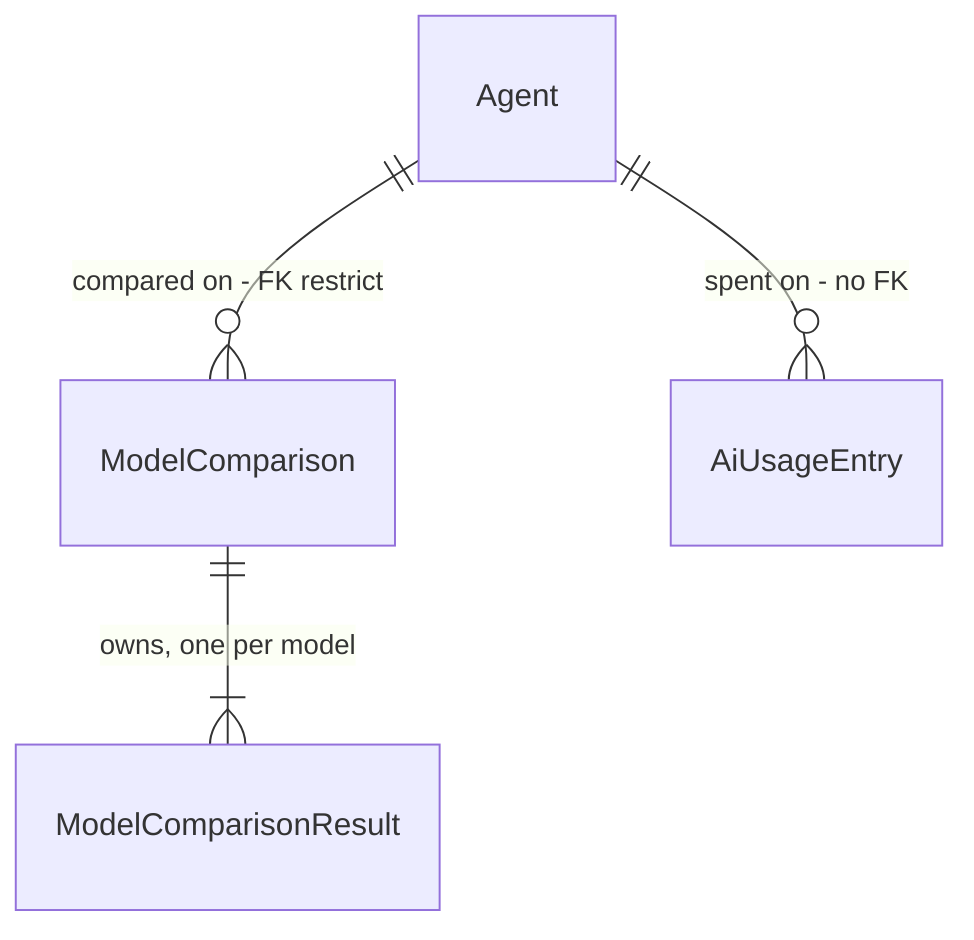

# Comparar modelos — API, modelo por agente e custo

> Build this with **tlc-implement** (`.claude/skills/tlc-implement`).
> Every criterion below becomes a check with a proof, referenced by its number. Nothing under
> `Unresolved` gets settled while building.

## Intent

Hoje o módulo Ai corre todos os agentes de um tenant com um único modelo global
(`Ai:Llm:Model`, `AgentContracts.cs:62`). O admin que quer saber qual modelo serve um agente tem de
trocar a config do servidor, reiniciar e comparar de memória. E não tem números: o
`NoOpAiUsageTracker` (`AiModule.cs:26`) descarta o registo de uso, só `total_tokens` é lido
(`OpenRouterLlmService.cs:47`), e nenhum custo é guardado, embora o OpenRouter devolva `usage.cost`
em todas as respostas. O LLM é real e gasta dinheiro desde o PR #3, e ninguém mede quanto.

Quando isto for entregue:
- cada agente tem modelo próprio, que o `agent-form` escolhe de um catálogo;
- cada chat grava uma linha de uso com tokens de entrada e saída e custo em USD;
- `POST /api/v1/ai/comparisons` corre o mesmo agente, prompt e anexos em 2 a 4 modelos em paralelo e
  grava o resultado de cada um: resposta, tokens, custo, latência e erro.

Os ecrãs de comparação ficam na task `.tasks/comparar-modelos-telas.md`. Aqui entram só os clientes
HTTP do front, que o `architecture.spec.ts` exige para cada rota nova.

46 critérios em 4 slices · 7 decisões difíceis de reverter · 3 perguntas em aberto, nenhuma bloqueia

## Criteria

### Modelo por agente

1. Quando `POST /api/v1/ai/agents` recebe `model` com um id que está no catálogo, então responde `201` e o `AgentOutput` traz `model` igual ao valor enviado.
2. Quando `POST` ou `PUT /api/v1/ai/agents/...` recebe `model` nulo ou ausente, então o agente é gravado com `model = null` e o `AgentOutput` traz `model: null`.
3. Se `model` não está no catálogo, então `POST` e `PUT` respondem `400` com title `Validation failed` e um erro no campo `Model`.
4. Se `model` passa de 200 caracteres, então a resposta é `400` com title `Validation failed`.
5. Dado um agente com `model = "x/y"`, quando `PUT` chega sem `model`, então o agente fica com `model = null`. É a substituição total que o `UpdateAgent` já faz para os outros campos.
6. Dado um agente com `model` preenchido, quando `POST /api/v1/ai/chat` corre com esse `agentId`, então o `ILlmService` recebe `LlmRequest.Model` igual ao `model` do agente em todas as chamadas do loop, incluindo a chamada de resumo depois das 5 iterações.
7. Dado um agente com `model = null`, quando o chat corre, então `LlmRequest.Model` é `null` e o OpenRouter envia `Ai:Llm:Model` no payload.
8. Quando o `OpenRouterLlmService` recebe `LlmRequest.Model = "a/b"`, então o JSON enviado para `chat/completions` tem `"model": "a/b"`.
9. Sempre: o agente seed criado por `DefaultAgentProvisioner` tem `model = null`.
10. Sempre: `GET /api/v1/ai/agents` e `GET /api/v1/ai/agents/{agentId}` devolvem o campo `model` em cada agente.
11. Quando o `agent-form` guarda um agente, o corpo do `POST`/`PUT` inclui `model` com o valor escolhido no selector, ou `null` se o selector estiver em `Padrão do sistema`.
12. Quando o `agent-form` abre um agente existente, o selector de modelo mostra o `model` desse agente, ou `Padrão do sistema` se for `null`.
13. Se `GET /api/v1/ai/models` falhar ao abrir o `agent-form`, então o selector mostra a mensagem `Catálogo de modelos indisponível` e o formulário continua a poder ser guardado com o `model` que o agente já tinha.

### Catálogo de modelos

14. Quando um utilizador com `ai.agent.read` chama `GET /api/v1/ai/models` com provider OpenRouter, então recebe `200` com `[{ id, name, contextLength, inputPricePerToken, outputPricePerToken }]`, só com os modelos cujo `supported_parameters` de `GET {BaseUrl}/models` inclui `"tools"`, ordenados por `id` asc.
15. Com `Ai:Llm:AllowedModels` não vazio, a lista de `GET /api/v1/ai/models` contém só os ids que estão nessa lista e no catálogo do provider.
16. Com provider `MicrosoftAgentFramework`, `GET /api/v1/ai/models` devolve `Ai:Llm:Model` junto com `AllowedModels`, com `inputPricePerToken` e `outputPricePerToken` a `null`.
17. Com o `StubLlmService` activo, `GET /api/v1/ai/models` devolve `Ai:Llm:Model`, `stub/model-a` e `stub/model-b`, com preços `0`.
18. Se o pedido a `{BaseUrl}/models` falhar (`HttpRequestException`, status fora de 2xx ou timeout), então `GET /api/v1/ai/models` responde `503` com title `Service unavailable`. Com o catálogo inacessível, `POST`/`PUT` de um agente com `model` não nulo e `POST /comparisons` também respondem `503`.
19. Enquanto uma resposta bem-sucedida do catálogo tiver menos de 1h, os pedidos a `GET /api/v1/ai/models` não voltam a chamar `{BaseUrl}/models`. Falhas não ficam em cache.
20. Se o caller estiver autenticado mas sem `ai.agent.read`, `GET /api/v1/ai/models` responde `403`.

### Uso e custo por chamada

21. Quando o OpenRouter responde, o `LlmResponse` traz `InputTokens = usage.prompt_tokens`, `OutputTokens = usage.completion_tokens` e `Cost = usage.cost`. Se `usage.cost` vier ausente, `Cost` fica `null`.
22. Quando o `MicrosoftAgentFrameworkLlmService` responde, o `LlmResponse` traz `InputTokens = Usage.InputTokenCount`, `OutputTokens = Usage.OutputTokenCount` e `Cost = null`.
23. O `AgentResult` traz `InputTokens` e `OutputTokens` somados sobre todas as chamadas do loop. `Cost` é a soma, ou `null` se alguma chamada devolveu `Cost = null`.
24. Quando `POST /api/v1/ai/chat` responde `200`, fica gravada exactamente uma linha `AiUsageEntry` no tenant corrente com `agentId` do agente resolvido, `operation = "chat"`, `model` igual ao modelo efectivo (o do agente, senão `Ai:Llm:Model`), os tokens de entrada e saída e o `cost` do `AgentResult`, `success = true` e `errorCode = null`.
25. Se o `AgentLoop` lançar uma excepção, então fica gravada uma linha com `success = false`, `errorCode` igual ao nome do tipo da excepção, tokens `0` e `cost = null`, e a mesma excepção sobe até ao caller.
26. Se a gravação da linha de uso falhar, então é escrito um `LogError` e o resultado do chat, ou a excepção original, fica inalterado.
27. Com o `StubLlmService`, a linha é gravada com `provider = "stub"`.
28. Sempre: uma linha `AiUsageEntry` guarda só metadados (`tenantId`, `agentId`, `provider`, `model`, `module`, `operation`, tokens, `cost`, latência, `success`, `errorCode`). Não guarda prompt, histórico nem resposta.
29. Sempre: o `IAiUsageRepository` oferece só adicionar, sem nenhum método de alterar ou apagar, e as leituras filtram pelo tenant corrente.
30. Sempre: a resposta de `POST /api/v1/ai/chat` continua `{ reply, iterationsUsed }`.

### Comparação

31. Quando um utilizador com `ai.agent.manage` chama `POST /api/v1/ai/comparisons` com `{ agentId, prompt, models, attachments }` válidos, então recebe `201` com `ComparisonOutput`, `Location: /api/v1/ai/comparisons/{comparisonId}` e um item em `results` por modelo, na ordem de `models`.
32. Cada modelo corre o `AgentLoop` com as `Instructions` e `ToolNames` do agente, `LlmRequest.Model` igual a esse modelo e a mesma `Temperature` (0.2) para todos.
33. Quando há anexos, o user prompt enviado a cada modelo é `prompt` seguido, para cada anexo em ordem, de `\n\n--- {name} ---\n{content}`, igual em todos os modelos.
34. Um resultado bem-sucedido tem `status = "Succeeded"`, `reply`, `inputTokens`, `outputTokens`, `cost`, `latencyMs`, `iterationsUsed` e `errorCode = null`.
35. Se o loop de um modelo lançar uma excepção (incluindo `HttpRequestException` de um 429), então esse resultado fica `status = "Failed"`, `reply = null` e `errorCode` igual ao nome do tipo da excepção, e os outros modelos terminam normalmente.
36. Se um modelo não terminar dentro de `Ai:Llm:CompareTimeoutSeconds` (default `60`), então o resultado dele fica `status = "TimedOut"` e `errorCode = "Timeout"`, e os outros não são afectados.
37. Se todos os modelos falharem, a resposta continua `201`, com todos os `results` em `Failed` ou `TimedOut`, e a comparação fica gravada.
38. Se o cliente fechar a ligação a meio, os modelos correm até ao fim e a comparação fica gravada, visível depois em `GET /api/v1/ai/comparisons`.
39. `ComparisonOutput.totalCost` é a soma dos `cost` não nulos, ou `null` se todos forem `null`.
40. Cada modelo executado grava uma linha `AiUsageEntry` com `operation = "compare"` e o `model` desse resultado.
41. Se `models` tiver menos de 2 ou mais de 4 entradas, ids repetidos ou um id fora do catálogo; se `prompt` estiver vazio ou passar de 4000 caracteres; ou se houver mais de 3 anexos, anexos com mais de 100 000 caracteres somados ou um `name` vazio ou com mais de 200: então a resposta é `400` com title `Validation failed`.
42. Se `agentId` não existir no tenant ou o agente estiver inactivo, a resposta é `404`.
43. Se o provider activo for `MicrosoftAgentFramework`, a resposta é `409` com title `Business rule violation` e detail `Comparação requer o provider OpenRouter`.
44. Quando um utilizador com `ai.agent.read` chama `GET /api/v1/ai/comparisons`, recebe `200` com uma página do tenant corrente ordenada por `createdAt` desc e estável por `id`, com `pageNumber` 1 e `pageSize` 20 por defeito. Cada item traz `comparisonId`, `agentId`, `agentName`, `promptPreview` (primeiros 200 caracteres), `models`, `totalCost` e `createdAt`.
45. Quando `GET /api/v1/ai/comparisons/{comparisonId}` pede uma comparação do tenant, recebe `200` com o `ComparisonOutput` completo. Um id de outro tenant ou inexistente dá `404`.
46. `POST /comparisons` sem `ai.agent.manage` responde `403`, e `GET /comparisons` e `GET /comparisons/{id}` sem `ai.agent.read` também. Com `FeatureFlags:EnableAI = false`, as quatro rotas novas respondem `404` com title `Feature disabled`.

## Out of scope

- Ecrãs `/ai/compare` e `/ai/comparisons`: estão em `.tasks/comparar-modelos-telas.md`.
- Anexos multimodais e PDF: este round aceita só texto (`.design/comparar-modelos.md` Boundary).
- Teto de custo por comparação: estimar o output antes de correr é impreciso.
- Temperatura e parâmetros editáveis: a comparação só é justa com os mesmos 0.2 para todos.
- Streaming, execução assíncrona com `202`, mais de 4 modelos.
- W1 S2 e S3 (spans OTel, ecrã `/ai/usage`), W2 (conversas), W8 (evaluations).
- Filtros na lista de comparações (por agente, por data).
- Apagar uma comparação, e retenção/purge.
- Tabela de preços para o provider MAF.

## Observable

| Surface | Decision | Landing |
| --- | --- | --- |
| API `GET /api/v1/ai/models` | response shape | 14, 15, 16, 17 |
| API `GET /api/v1/ai/models` | error shape and codes | 18, 20, 46 |
| API `GET /api/v1/ai/models` | who may call | 20 (`AiAgentsRead`) |
| API `GET /api/v1/ai/models` | versioning | n/a - rota nova em `/api/v1`, não versiona nada existente |
| API `GET /api/v1/ai/models` | rate limit | n/a - nenhuma rota Ai tem limiter; o limiter é W7 |
| API `POST /api/v1/ai/comparisons` | response shape | 31, 34, 39 |
| API `POST /api/v1/ai/comparisons` | error shape and codes | 35–37 (falha por modelo, não na resposta), 41, 42, 43, 46; 503 em 18 |
| API `POST /api/v1/ai/comparisons` | who may call | 46 (`AiAgentsManage`) |
| API `POST /api/v1/ai/comparisons` | rate limit | Unresolved 2 |
| API `POST /api/v1/ai/comparisons` | versioning | n/a - rota nova |
| API `GET /api/v1/ai/comparisons` | response shape | 44 |
| API `GET /api/v1/ai/comparisons` | error shape and codes | 46; `400` de paginação: existing - `ListQuery` partilhado |
| API `GET /api/v1/ai/comparisons/{id}` | response shape, codes | 45, 46 |
| API `POST/PUT /api/v1/ai/agents` | response shape | 1, 2, 10 |
| API `POST/PUT /api/v1/ai/agents` | error shape and codes | 3, 4, 18; resto existing - `409` de nome, `404` |
| API `POST /api/v1/ai/chat` | response shape | 30 (inalterada) |
| screen `agent-form` | selector de modelo: estado normal | 11, 12 |
| screen `agent-form` | selector de modelo: erro do catálogo | 13 |
| screen `agent-form` | selector de modelo: loading | Unresolved 3 |
| screen `agent-form` | empty / unauthorised / confirm | existing - `permissionGuard` nas rotas (`app.routes.ts:73-85`), `403` no submit sem manage, `ConfirmService` só para apagar ficheiro. Não há modo só de leitura, e o selector também não ganha um. Atenção: `agent-form.ts:174` já tem um signal chamado `model` (o do formulário) |
| document / copy | `Features/Ai/AGENTS.md`, `RBAC_MATRIX.md` | existing - regra do repo: rota nova actualiza os dois; nota de que o usage deixou de ser no-op e de que as tools correm N vezes na comparação (design Open 3) |

## Swept

- validation: 3, 4, 41
- failure modes: 25, 26, 35, 37
- idempotency and retry: n/a - cada `POST /comparisons` é uma execução paga nova e grava um registo novo; sem chave de deduplicação, de propósito, como W1 AC 9
- authorization: 20, 46; o resto é existing - `AiAgentsRead`/`AiAgentsManage` do módulo
- concurrency and ordering: 31 (resultados na ordem de `models`, qualquer que seja a ordem de fim), 35, 36; um scope DI por modelo (Decided "Execução paralela")
- data lifecycle: 5 (PUT limpa `model`), 29 (ledger append-only); retenção das comparações: Unresolved 1
- external-dependency failure: 18, 19, 35, 36
- state transitions: n/a - `ModelComparisonResult.Status` é escrito uma vez, quando o modelo termina, e nunca muda; o `Agent` não ganha estados novos
- observability: 24, 27, 40 (linha de uso por chamada e por modelo), 26 (`LogError` quando a gravação falha); spans ficam em W1 S2

## Impact

| Front | What changes |
|---|---|
| domain | termo novo: `ModelComparison`, uma execução de um agente com um prompt em N modelos; vive em `Features/Ai/ModelComparison.cs` |
| domain | termo novo: `ModelComparisonResult`, o resultado de um modelo dentro da comparação; owned por `ModelComparison` |
| domain | termo novo: `AiUsageEntry`, uma linha imutável por chamada paga; vive em `Features/Ai/AiUsageEntry.cs` |
| domain | termo novo: `IModelCatalog`, a lista de modelos que o provider activo aceita com tools; vive em `Features/Ai/ModelCatalog.cs` |
| domain | termo existente: `LlmResponse` ganha `InputTokens`, `OutputTokens` e `Cost`. Dependem dele os 3 `ILlmService`, o `AgentLoop`, os testes `LlmServiceTests` e o `RecordingLlmService` de `ChatAiHandlerTests` |
| domain | termo existente: `LlmRequest` ganha `Model`. O MAF ignora-o, porque o cliente fica preso a `llm.Model` na construção (`MicrosoftAgentFrameworkLlmService.cs:30`) |
| domain | termo existente: `AiUsageRecord` ganha `AgentId`, `InputTokens`, `OutputTokens` e `Cost`. Hoje só o `ChatAiHandler` o constrói |
| domain | termo existente: `IAiUsageTracker` deixa de ser no-op e passa de `AddSingleton` para `AddScoped` (depende do `AppDbContext`) |
| domain | termo existente: `PUT /api/v1/ai/agents/{id}` passa a substituir também `model`. Um cliente que não envie `model` apaga o modelo do agente. O único cliente hoje é `agent-form.ts`, que muda nesta task (11) |
| stored data | migration nova: coluna `AiAgents.Model` nullable (nenhum backfill, todas as linhas existentes ficam `null`) e tabelas novas vazias `AiUsageEntries`, `AiModelComparisons`, `AiModelComparisonResults` |
| contract | `features.json` ganha `ListModels`, `CompareModels`, `ListModelComparisons` e `GetModelComparison`; `openapi.json` é regenerado (`UPDATE_OPENAPI=1 dotnet test tests/E2ETests`); `AgentOutput` e os requests de agente ganham `model` |
| front | `ai.contracts.ts` ganha os tipos novos; os clientes das 4 rotas ficam em `src/web/src/app/features/ai/compare.ts`, sem componente de ecrã, que o `architecture.spec.ts` exige |
| config | chaves novas `Ai:Llm:AllowedModels` (lista, default vazia) e `Ai:Llm:CompareTimeoutSeconds` (default `60`) |
| plans | `.specs/features/observabilidade-agente/plan.md` S1 já está marcado como absorvido (AD-009) |

## Decided

| Decision | Shape | Alternative rejected |
|---|---|---|
| Modelo por agente | `Agent.Model string?`, `HasMaxLength(200)`, nullable; `null` = `Ai:Llm:Model`; `AgentOutput(..., string? Model)`; `CreateAgentCommand`/`UpdateAgentRequest` com `string? Model = null` | Coluna obrigatória: obrigaria a um backfill com o modelo global, e o seed perderia o "segue o default" |
| Uso e custo no contrato LLM | `LlmRequest(string UserPrompt, string? SystemPrompt = null, float Temperature = 0.2f, IReadOnlyList<LlmMessage>? History = null, IReadOnlyList<ToolDefinition>? Tools = null, string? Model = null)`; `LlmResponse(string Text, int TotalTokens, IReadOnlyList<ToolCall>? ToolCalls = null, int InputTokens = 0, int OutputTokens = 0, decimal? Cost = null)` | Custo como `0` quando ausente: confunde "grátis" com "não sabemos" (design, Journey "custo ausente") |
| Ledger de uso | `AiUsageEntry` append-only, tabela `AiUsageEntries`: `TenantId`, `AgentId` **sem FK**, `Provider`, `Model`, `Module`, `Operation` ∈ {`chat`, `compare`}, `InputTokens`, `OutputTokens`, `Cost decimal(18,8) null`, `LatencyMs`, `Success`, `ErrorCode`, `CreatedAt`; query filter por tenant em `AiTenantQueryFilters` | FK para `AiAgents`: apagar o agente levaria o histórico de custo (W1 door 1) |
| Agregado de comparação | `ModelComparison` (tabela `AiModelComparisons`: `TenantId`, `AgentId` FK restrict, `Prompt` ≤4000, `Attachments` JSON `[{name, content}]`, `CreatedByUserId Guid?`, `CreatedAt`) com `OwnsMany` `ModelComparisonResult` (tabela `AiModelComparisonResults`: `Position`, `Model` ≤200, `Status` string ∈ {`Succeeded`, `Failed`, `TimedOut`}, `Reply`, `InputTokens`, `OutputTokens`, `Cost decimal(18,8) null`, `LatencyMs`, `IterationsUsed`, `ErrorCode` ≤200) | Resultados como agregado próprio: só compensa se W8 precisar de actualizar células isoladas; hoje o resultado é escrito uma vez |
| Contrato de comparação | `POST /api/v1/ai/comparisons` com `{ agentId: Guid, prompt: string, models: string[], attachments: [{ name, content }] }` → `201` com `ComparisonOutput { comparisonId, agentId, agentName, prompt, attachments: [{ name }], createdAt, createdByUserId, totalCost, results: [{ model, status, reply, inputTokens, outputTokens, cost, latencyMs, iterationsUsed, errorCode }] }`; `GET /api/v1/ai/comparisons` e `GET /api/v1/ai/comparisons/{comparisonId}` | `202` assíncrono com worker: só ganha com lotes ou mais de 4 modelos (design Shape) |
| Contrato do catálogo | `GET /api/v1/ai/models` → `[{ id, name, contextLength, inputPricePerToken, outputPricePerToken }]` (preços em USD por token, `decimal?`) | Expor o JSON cru do OpenRouter: amarraria o contrato ao provider |
| `503` como padrão novo | `public sealed class ServiceUnavailableException(string message) : Exception(message)` em `Shared/Kernel.cs`, mapeada em `ExceptionHandlerExtensions` para `503` com title `Service unavailable` | `Results.Problem(503)` local em cada endpoint: seriam 4 pontos (models, create/update agent, compare) a repetir o mesmo `try/catch` |
| Execução paralela | `Task.WhenAll` com um `IServiceScopeFactory.CreateScope()` por modelo; no scope filho, `TenantContext.SetTenant(tenantId, tenantKey)` (padrão `DevBootstrapSeeder.cs:20-24`) e `IAgentRuntimeContext.Set(agentId)`; `CancellationTokenSource.CancelAfter(CompareTimeoutSeconds)` por modelo, **sem** ligar a `RequestAborted` | Correr no scope do pedido: o `AppDbContext` das tools não aceita chamadas concorrentes |

## Relations

## Surface

| Route | In | Out | Status | Criteria |
|---|---|---|---|---|
| `GET /api/v1/ai/models` | — | `id`, `name`, `contextLength`, `inputPricePerToken`, `outputPricePerToken` | `200`, `401`, `403`, `404`, `503` | 14–20 |
| `POST /api/v1/ai/comparisons` | `agentId`, `prompt`, `models`, `attachments` | `ComparisonOutput` | `201`, `400`, `401`, `403`, `404`, `409`, `503` | 31–43, 46 |
| `GET /api/v1/ai/comparisons` | `pageNumber`, `pageSize` | página de `comparisonId`, `agentId`, `agentName`, `promptPreview`, `models`, `totalCost`, `createdAt` | `200`, `401`, `403`, `404` | 44, 46 |
| `GET /api/v1/ai/comparisons/{comparisonId}` | — | `ComparisonOutput` | `200`, `401`, `403`, `404` | 45, 46 |
| `POST /api/v1/ai/agents`, `PUT /api/v1/ai/agents/{agentId}` | + `model` | `AgentOutput` + `model` | + `400` (modelo), `503` | 1–5, 18 |

Políticas: `AiAgentsRead`/`AiAgentsManage`; flag `EnableAI`.

## Sources

- `.design/comparar-modelos.md`: Decisions, Journey, Boundary (confirmado por Luis Soares, 2026-09-22).
- `.specs/features/observabilidade-agente/plan.md` S1 AC 1–9, doors 1, 3 e 6: reutilizados aqui (AD-009).
- https://openrouter.ai/docs/use-cases/usage-accounting: `usage.prompt_tokens`, `completion_tokens` e `cost` vêm em todas as respostas.
- https://openrouter.ai/docs/api/api-reference/models/get-models: `pricing.prompt`/`completion`, `supported_parameters` e `context_length`.
- Código: `UpdateAgent.cs:37` (PUT substitui tudo), `MicrosoftAgentFrameworkLlmService.cs:30` (modelo fixo), `ExceptionHandlerExtensions.cs:21-63` (sem 503 hoje), `DevBootstrapSeeder.cs:20-24` (tenant num scope filho).
- Corte em 2 tasks: decidido pelo utilizador, 2026-09-22.

## Unresolved

| # | Kind | Question | Until answered |
|---|---|---|---|
| 1 | open | Retenção das comparações, que guardam o prompt e as respostas | Sem purge; rever com W2 Q1 (90 dias) |
| 2 | open | Rate limit em `POST /comparisons`, que pode gastar 4× por pedido | Sem limiter, como o resto do módulo; W7 |
| 3 | open | Estado de loading do selector de modelo no `agent-form` | O selector fica desactivado até o catálogo responder; decide-se no diff |
