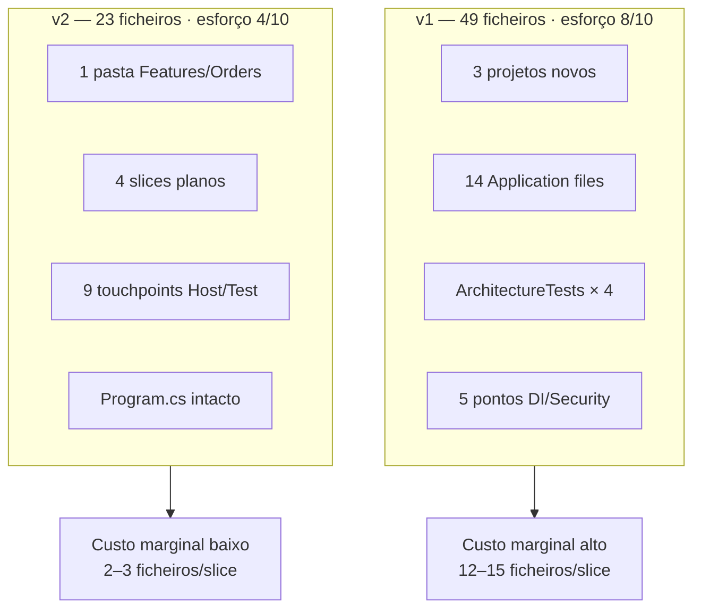

# Relatório comparativo — Eficiência LLM (Feature Order)

**Data:** 2026-08-03  
**Escopo fixo (ambos templates):** módulo Order mínimo — entidade multi-tenant, CreateOrder, UpdateOrderStatus, GetOrder, ListOrders (paginado), RBAC, testes, migration.

**Fontes:**
- v1: [Auditoria v1 Order](8fab1bdf-5461-422e-b9d4-232286bb6102)
- v2: [Auditoria v2 Order](1d10bd6e-e620-4d57-bb0c-c597381173b5)

---

## 1. Resumo executivo

| Dimensão | v1 (Clean Architecture) | v2 (VSA v2.1) | Δ |
|----------|-------------------------|---------------|---|
| **Arquivos totais** | **49** | **23** | **−53%** |
| Arquivos a criar | 33 | 14 | −58% |
| Arquivos a modificar | 16 | 9 | −44% |
| **Linhas manuais** | **~1.230–1.550** | **~830** | **−33–46%** |
| **Projetos novos** | **3** (+ solution) | **0** | **−100%** |
| Hops (ficheiros de referência) | 6–7 camadas | 9–11 leituras | Menos camadas, paths mais curtos |
| Token budget (sessão completa) | 8.000 – 14.000 | 14.000 – 22.000 | Ver §1.1 |
| Esforço relativo (1–10) | **8** | **4** | **−50%** |
| Ambiguidades para LLM | **15+** | **~14** | Similar na 1.ª vez |
| `Program.cs` editado? | N/A (controller) | **Não** | — |

**Conclusão:** o v2 vence em **superfície estrutural** (metade dos ficheiros, zero projetos novos, metade do esforço). O **token budget de sessão completa** pode ser comparable ou ligeiramente superior no v2 na **primeira implementação de um módulo novo**, porque ainda se geram ~830 linhas + migration + testes. O ganho real aparece nos **incrementos seguintes** (novo slice, novo campo).

### 1.1 Nota sobre tokens — comparar cenários equivalentes

| Cenário | v1 | v2 | Vencedor |
|---------|----|----|----------|
| **Módulo Order greenfield (sessão agente)** | 8k–14k | 14k–22k | Empate / v1 ligeiramente menor* |
| **Novo slice pós-módulo** (ex. CancelOrder) | 12–15 ficheiros, 5,5k–9k | **2–3 ficheiros**, 800–1,5k | **v2 (−70%+)** |
| **Adicionar campo** (ex. Notes) | 12–15 ficheiros, 5,5k–8k | **2–3 ficheiros**, 600–1,2k | **v2 (−80%+)** |
| **Ficheiros tocados (greenfield)** | 49 | 23 | **v2 (−53%)** |
| **Risco de erro / rework** | Alto (wiring, 3 csproj) | Médio (registo Host) | **v2** |

\*O v2 inclui na estimativa ~10k tokens de **output de geração** (~830 linhas × ~12 tok/linha) + 20% iteração build/test. O v1 subestima output relativo ao número de ficheiros pequenos. Em produção real, ambos convergem para **10k–20k** numa sessão longa de agente autónomo.

**Métrica que importa para template LLM:** não é só tokens da 1.ª feature — é **custo marginal por mudança**. Aí o v2 cumpre a meta do `RELATORIO-VSA-EFICIENCIA-TOKENS.md` (2–4 ficheiros vs 12–18).

---

## 2. v1 — Product.Template (Clean Architecture)

> [Auditoria v1 Order](8fab1bdf-5461-422e-b9d4-232286bb6102)

| Métrica | Valor |
|---------|-------|
| Arquivos criar / modificar / total | 33 / 16 / **49** |
| Linhas estimadas | ~1.230–1.550 |
| Projetos novos | 3 (Orders.Domain, Application, Infrastructure) |
| Endpoints HTTP | 4 |
| Hops de camada | 6–7 |
| Token budget greenfield | 8.000 – 14.000 |
| Esforço | **8/10** |

### Onde o custo se concentra

1. Scaffolding bounded context — 3 `.csproj`, solution, refs em 4 projetos de teste
2. Separação por camada — Command, Handler, Validator, Query, Output, Mapper em pastas distintas
3. Wiring — `CoreConfiguration`, `KernelConfigurations`, `SecurityConfiguration`, `PermissionCatalogAuthorizationConfigurator`, `AppDbContextDesignTimeFactory`
4. ArchitectureTests — `LayerDependencyTests`, `NamingConventionTests`, `CqrsConventionTests`
5. Migration em `Kernel.Infrastructure/Migrations/AppDb/` + `EfModelAssemblyRegistry`

### Ambiguidades críticas (v1)

- EF config: path inconsistente entre módulos
- `IUnitOfWork` vs `IHostUnitOfWork`
- Pastas Application diferentes (Identity vs Tenants)
- Unit vs Integration vs E2E para endpoint
- `module-design-example-orders.md` conflita com escopo mínimo

---

## 3. v2 — Product.Template v2.1 (VSA)

> [Auditoria v2 Order](1d10bd6e-e620-4d57-bb0c-c597381173b5)

| Métrica | Valor |
|---------|-------|
| Arquivos criar / modificar / total | 14 / 9 / **23** |
| Linhas manuais | **~830** (+ ~180 EF auto) |
| Projetos novos | **0** |
| Endpoints HTTP | 4 |
| Hops (leituras de referência) | **9–11** |
| Token budget sessão completa | **14.000 – 22.000** |
| Esforço | **4/10** |

### Ficheiros criados (12 manuais + 2 migration)

| Path | Linhas est. |
|------|-------------|
| `src/App/Features/Orders/Order.cs` | ~130 |
| `src/App/Features/Orders/OrdersModule.cs` | ~38 |
| `src/App/Features/Orders/OrderContracts.cs` | ~35 |
| `src/App/Features/Orders/OrdersPermissions.cs` | ~6 |
| `src/App/Features/Orders/CreateOrder.cs` | ~68 |
| `src/App/Features/Orders/UpdateOrderStatus.cs` | ~58 |
| `src/App/Features/Orders/GetOrder.cs` | ~38 |
| `src/App/Features/Orders/ListOrders.cs` | ~50 |
| `tests/App.Tests/Orders/*Tests.cs` (×4) | ~275 |
| `Shared/Migrations/{ts}_AddOrders*` | ~225 (auto) |

### Ficheiros modificados (9)

`FeatureModulesConfiguration.cs`, `SecurityConfiguration.cs`, `SecurityPolicies.cs`, `PermissionCatalog.cs`, `features.json`, `RBAC_MATRIX.md`, `TestServiceFactory.cs`, `SliceStructureTests.cs`, `AppDbContextModelSnapshot.cs`

**`Program.cs` — sem alteração** (auto-discovery `IEndpoint`).

### Checklist de registo v2

```
OrdersModule.cs → DI + policies + tenant filter
FeatureModulesConfiguration → .AddOrdersModule()
SecurityConfiguration → .AddOrdersModulePolicies()
SecurityPolicies + PermissionCatalog → orders.read / orders.manage
TestServiceFactory → AddOrdersModule + handlers
dotnet ef migrations add AddOrders
```

### Ambiguidades críticas (v2)

- Valores e transições de `OrderStatus`
- `CustomerEmail`: string vs value object `Email`
- Rotas de status (PUT vs PATCH)
- Escopo fixo omite `OrderContracts` / `OrdersPermissions` (obrigatórios pela rule VSA)
- `SliceStructureTests` — lista hardcoded de endpoints
- `TestServiceFactory` — registar handlers manualmente

---

## 4. Comparativo visual



---

## 5. Veredicto para escolha de template

| Critério | Recomendação |
|----------|--------------|
| **Produto novo (greenfield)** | **v2** — metade do esforço, metade dos ficheiros, zero scaffolding de projetos |
| **Agente autónomo recorrente** | **v2** — custo marginal 3–5× menor após 1.º módulo |
| **Primeira feature num repo vazio** | Empate em tokens; **v2** ganha em simplicidade e risco |
| **Enterprise multi-equipa 16 projetos** | v1 continua válido para humanos; não migrar v1→v2 |

### Melhorias v2 (reduzir 9–11 hops na 1.ª vez)

1. Skill `/new-module {Module}` — checklist único (Order.cs + Module + Host + migration + factory)
2. `SliceStructureTests` — scan reflexivo de `IEndpoint` em vez de lista hardcoded
3. Entrada `features.json` tipo `"moduleBootstrap": "Orders"` com todos os touchpoints

---

## 6. Referências

| Documento | Path |
|-----------|------|
| Metodologia tokens | `docs/architecture/RELATORIO-VSA-EFICIENCIA-TOKENS.md` |
| Relatório v1 | [Auditoria v1](8fab1bdf-5461-422e-b9d4-232286bb6102) |
| Relatório v2 | [Auditoria v2](1d10bd6e-e620-4d57-bb0c-c597381173b5) |
| Getting started v2 | `docs/guides/getting-started.md` |
| Harness | `AGENTS.md`, `features.json` |
